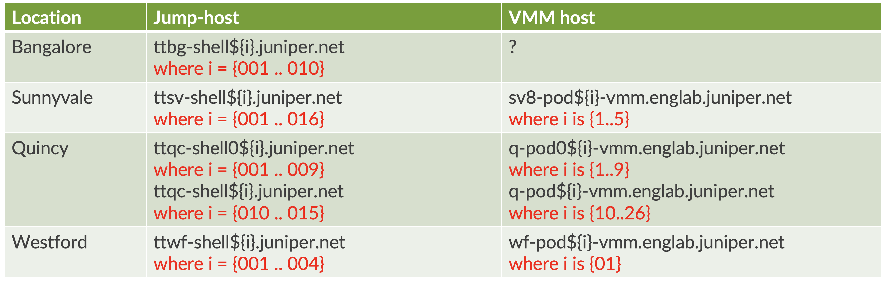

# How to use Juniper VMM

release 0.7
## Overview
This script is used to create configuration files, which will be used create and run VMs (Virtual Machines) on Juniper's VMM infastructure.
The scripts has been modified to work with VMM 3.0 

## update on the script
new features has been added into the scripts :
- allow access into the VMM lab using the jump host. Please edit the lab.yaml to specify which VMM lab that you want to use and the jump host to access that lab.
- using jinja2 template to create configuration for junos devices. Currently it support configuration for the following :
    * address family : inet, inet6  (work in progress), iso, mpls
    * protocols : isis, mpls, rsvp, ldp, pcep, bgp-ls
- topology of point-to-point connection between junos devices can be generated automatically, for both bridge assignment and address (ipv4/ipv6) allocation
- On VMM 3.0, configuration of PC's VM is no longer written to the disk image when the VM was started for the first time, so on this script, the configuration of the PC is pushed using ssh, therefore PC VMs must be assigned with IP address
- the IP address assignment to the PC VMs is done using dhcp with node GW as the dhcp server

## The supported VMs :
- vMX
- vQFX
- vSRX
- Apstra fabric controller
- VCenter Server
- ESXi running as VM with or without VSAN
- PC with ubuntu OS 
- PC with centos OS
- bridge using Alpine linux to provide Delay or packet loss between Nodes

## Requirement
This script requires the following :
- Python3 (this script requires Python3)
- passlib library (to install use `pip3 install passlib`)
- paramiko library (to install use `pip3 install paramiko`)
- yaml library

## VM images
Before the script is used, the VM images must be available on the VMM.

Please upload the VM images into directory /vmm/data/user_disks/<your_user_name>

If you are connecting to VMM Lab @ Quincy, then you can copy my images from /vmm/data/user_disks/irzan/images/.

If you are using different VMM lab, then you have to copy the file into it.

## Scripts

This tool consist of the following script
- [vmm.py](../vmm.py)
- [lib1.py](../lib1.py)
- [param1.py](../param1.py)
- lab configuration (lab.yaml)

## lib1.py
This script is the library with functions declaration used by the main scripts (`vmm.py`)

## param1.py
This script provide the parameters required by the library

## lab.yaml
This YAML file provide the definition of the lab topology

please edit this file for the following :
- the VMM pod which will be used
- the jump host to access the VMM lab
- the ssh key to access jumphost and vmm server
- the VM, its type, its OS, management IP address and network interfaces (and its bridge) for connection to other devices.

Please refer to the sample configuration under directory [Lab](Lab/)

## vmm.py
This script is the user interface, which will read the configuration `lab.yaml` and call the library from `lib1.py1

There are different arguments required by this script
- argument `upload` : to create VMM configuration files and upload them into VMM pod
- argument `start` : to start the topology inside the VMM
- argument `stop` : to stop the topology inside the VMM
- argument `get_serial` :  to get serial console information of the active VMs in the VMM
- argument `get_vga` :  to get the VNC port to access into Video console of the VM (if vnc is enabled)
- argument `get_ip` :  to get external IP address assigned to the VM (if VM is connected to bridge external)    
- argument `list` :  to get the list of running VMs
- argument `set_gw`: to send configuration of gateway (ip address on other interface (em1,em2, etc) and DHCP server configuration)
- argument `set_host`: to send configuration to PC VMs

## Caution

- when the script is used to start the topology, any existing running topology will be stopped and unbound. Please backup the existing topology if needed.
- on one pod location, only one VMM topology can run. If you need to run multiple topology, then you need to run tthose topology on different VMM pod.

## Accessing the VMM Lab

As for now, VMM servers are not accessible directly from Juniper's intranet, jumphost is required to access the VMM server.

The following table are the available jump host for each location. There are multiple jump hosts and each jump host has maximumm number of users that can login.

To access jump host and VMM server, use your active directory username/password.

Unix password is no longer required.

You can also use ssh key to have passwordless access into the jump host and vmm server, although it may not work for all jump hosts, since not all jump hosts provide the home directory for your user-ID.

## Step by Step guide on how to use the script

1. Create configuration file for the lab **lab.yaml**. You can refer to the sample under directory lab.
2. Run the script with argument `upload`, to upload the configuration files into VMM server. The script will ctreate the configurations under directory `./tmp`. Files inside these directory will be uploaded into VMM server.

        ../../vmm.py upload

3. Run the script with argument `start`, to start the topology on VMM. Remember any active topology will be stop and destroyed. Remember to backup the configuration of any existing running topology

        ../../vmm.py start

4. Add the content of `./tmp/ssh_config` into your ssh config file `~/.ssh/config`, to allow easy access into the VM that you have created in the VMM. Any previous configuration for `/.ssh/config` from previouss lab must be removed before you add the new ssh config.

        cat ./tmp/ssh_config >> ~/.ssh/config

5. Verify that node GW is up and running, by initiating ssh session into it. The username to access node GW is **pass01**

        ssh gw

6. Run the script with argument `set_gw`, to configure other interfaces of node gw (interface em1, em2, etc), upload ssh key and dhcp server configuration. Node **GW** will be acting as DHCP server for on ubuntu/centos VM in the topology

        ../../vmm.py set_gw

7. Run the script with argument `set_host`, to configure ubuntu/centos VM, such has hostname, change interface configuration from dhcp to static, and upload ssh key.

        ../../vmm.py set_host

9. Now the lab is ready and can be used

