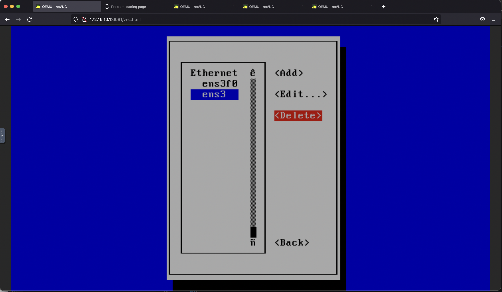
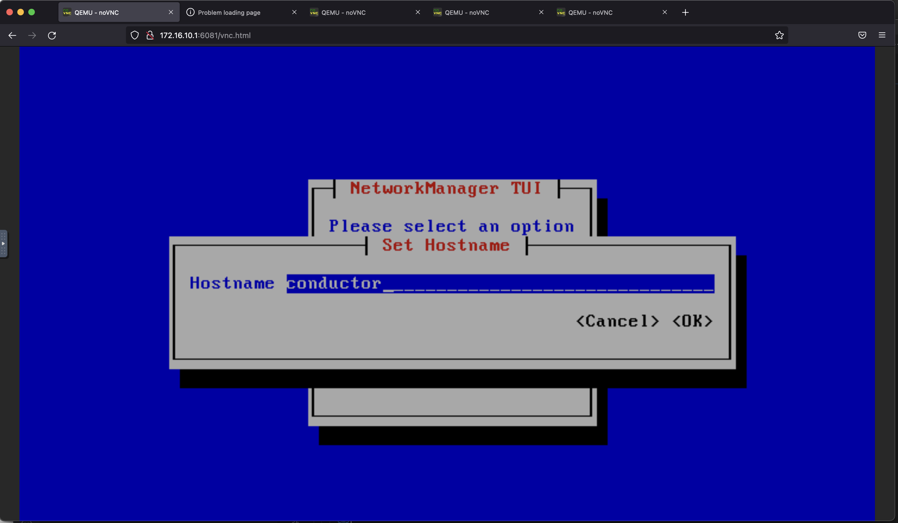
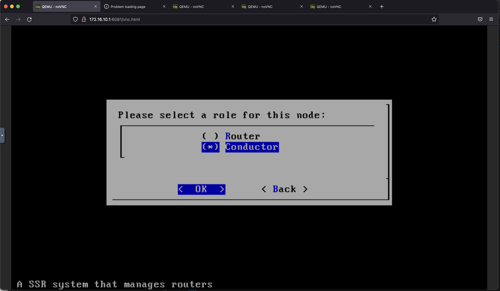
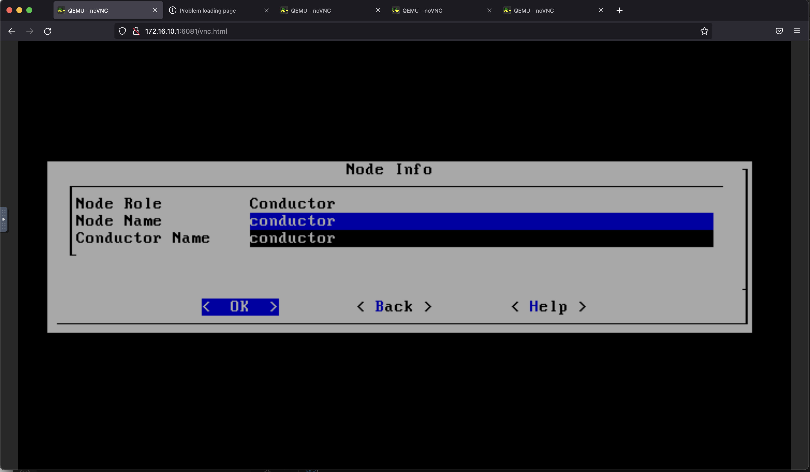
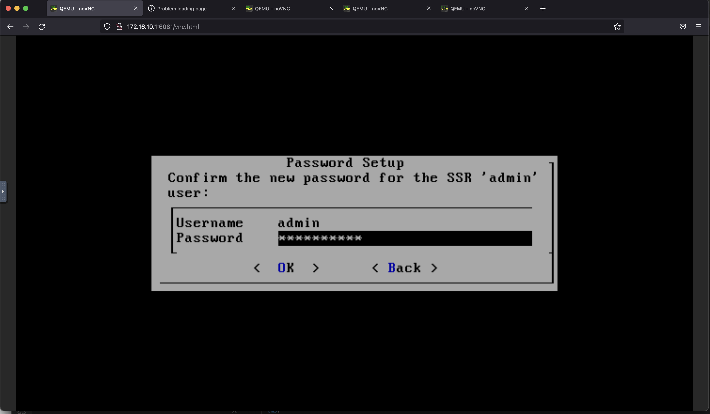
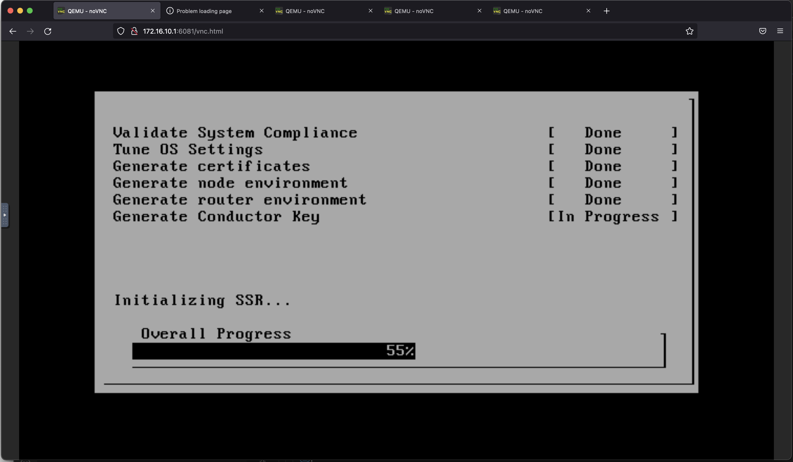
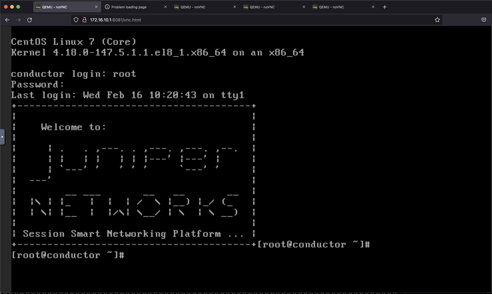
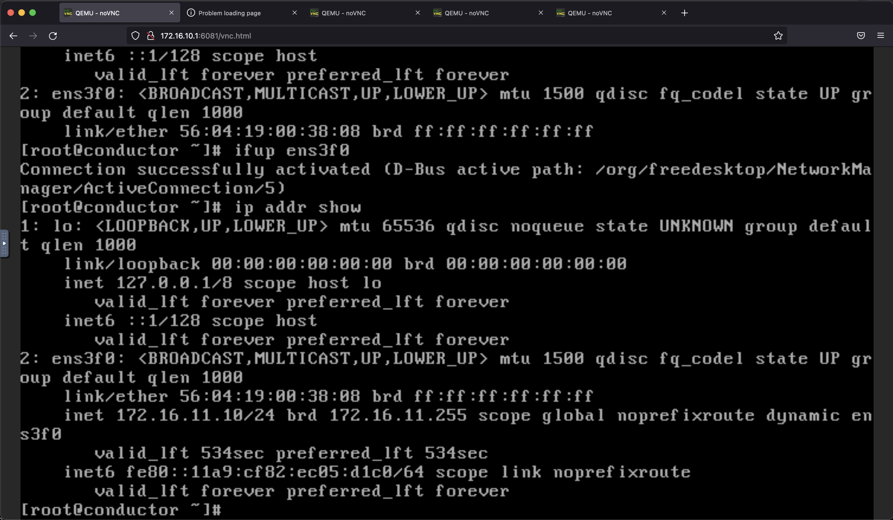
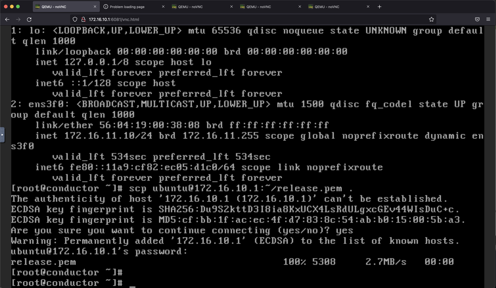
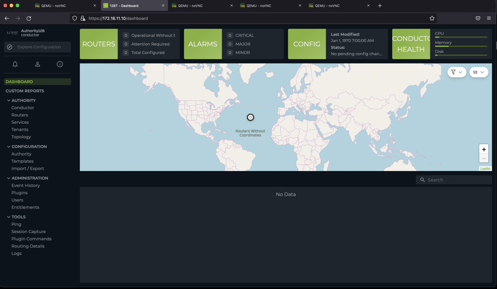

# How setup the lab, SDWAN using 128T
## topology

## note
Tested with : 
- 128T Software version 5.4

## Documentation
[how to install ](https://www.juniper.net/documentation/us/en/software/active-assurance3.2/paa-install/index.html)

## disk image 
you can copy the disk image that I used in this lab from my home directory at VMM server, it is located under directory ~/images/

## Devices in the lab

- 128T conductor : conductor
- 128T router : r1, r2, dc
- client : c1, c2, c3, c4, dcserver
- WAN SP : sp1, sp2

## Credential to access devices
- Ubuntu linux
    - user: ubuntu
    - password: pass01

## To create the lab topology and initial configuration of VMs
1. Go to directory [128T Lab](./)
2. Edit file [lab.yaml](./lab.yaml). Set the following parameters to choose which vmm server that you are going to use and the login credential:
    - vmmserver 
    - jumpserver
    - user 
    - adpassword
    - ssh_key_name ( please select the ssh key that you want to use, if you don't have it, create one using ssh-keygen and put it under directory **~/.ssh/** on your workstation )
    - the image files for the nodes (vmx, ubuntu, test agent, bridge, etc)
3. If you want to add devices or change the topooogy of the lab, then edit file [lab.yaml](lab.yaml)
4. use [vmm.py](../../vmm.py) script to deploy the topology into the VMM. Run the following command from terminal

        ../../vmm.py upload  <-- to create the topology file and the configuration for the VMs and upload them into vmm server
        ../../vmm.py start   <-- to start the topology in the vmm server

5. Verify that you can access node **gw** using ssh (username: ubuntu,  password: pass01 ). You may have to wait for few minutes for node **gw** to be up and running
7. Run script [vmm.py](../../vmm.py) to send and run initial configuration on node **gw**. This will configure ip address on other interfaces (such ase eth1, eth2, etc) and enable dhcp server on node gw

        ../../vmm.py set_gw

8. Verify that you can access other nodes (linux and junos VM), such **sp1**, **sp2**, etc. Please use the credential to login.

        ssh sp1

9. Run script [vmm.py](../../vmm.py) to send and run initial configuration on linux nodes. This script will also reboot the VM. So wait before you test connectivity into the VM

        ../../vmm.py set_host

10. Verify that you can access linux and junos VMs, such **sp1**, **sp2**, without entering the password. You may have to wait for few minutes for the nodes to be up and running

        ssh sp1
        ssh sp2

## configure SP1 and SP2
SP1 and SP2 are simulating service provider network, and requires additional configurations

1. upload script [setup_sp1.sh](./setup_sp1.sh) into sp1

        scp setup_sp1.sh sp1:~/

2. open ssh session into sp1, and run the script

        ssh sp1
        ./setup_sp1.sh

3. upload script [setup_sp2.sh](./setup_sp2.sh) into sp1

        scp setup_sp2.sh sp2:~/

2. open ssh session into sp1, and run the script

        ssh sp2
        ./setup_sp2.sh

        

## Accessing Web Interface of the lab (128T conductor dashboard, and 128T console)
1. From your workstation, open ssh session to node **proxy** and keep this session open if you need to access the web dashboard of Paragon Automation platform

        ssh -f -N proxy 

2. If you are using Firefox as web browser, set proxy with the following parameters
    - manual proxy configuration
    - SOCKS host : 127.0.0.1
    - PORT : 1080
    - type: SOCKS v4    
    

3. If you are using Chrome as web browser, install extension Foxy Proxy and configure it with the following parameters
    - manual proxy configuration
    - SOCKS host : 127.0.0.1
    - PORT : 1080
    - type: SOCKS v4    
    
    

## Setup 128T conductor
Do the following steps to setup 128T conductor
1. Open another tab on the web browser, and access the URL to console of the 128T conductor. Information about the URL can found when you open ssh session into node **gw** (it is part of the banner)

        -------------------------
        URL access to VNC:
        console conductor : http://172.16.10.1:6081/vnc.html
        console r1 : http://172.16.10.1:6082/vnc.html
        console r2 : http://172.16.10.1:6083/vnc.html
        console r3 : http://172.16.10.1:6084/vnc.html
        console c1 : http://172.16.10.1:6085/vnc.html
        console c2 : http://172.16.10.1:6086/vnc.html
        console c3 : http://172.16.10.1:6087/vnc.html
        console c4 : http://172.16.10.1:6088/vnc.html
        console c5 : http://172.16.10.1:6089/vnc.html
        -------------------------
        -------------------------

2. Login into 128T conductor, then you can start the initialization proccess. 

3. Setup the interface, it can be set to dhcp (default configuration) or static, and activate the interface.

  The script of the lab will create dhcp mapping for node conductor to use ip address 172.16.11.10/24, so node conducter will get ip address 172.16.11.10/24

4. Set the hostname

5. Select quit from network configuration, then it will go into 128T initialization process
6. Select role as conductor

7. Upload file [FieldEng_Release_011420.pem](./FieldEng_Release_011420.pem) to gw as release.pem

        scp FieldEng_Release_011420.pem gw:~/release.pem

8. From the console for node conductor, login using user/password : root/128tRoutes

9. Verify that network interface is up, if it is not, then bring it up using command ifup <nic>

9. From the shell, download file release.pem from gw (172.16.10.1). Use user ubuntu, password pass01

        scp ubuntu@172.16.10.1:~/release.pem .

10. make directory /etc/pki/128technology, and move file release.pem into this directory

        mv release.pem /etc/pki/128technology

11. Enable 128T services, and reboot

        systemctl enable 128T
        reboot

12. Login into the dashboard of 128T Conductor

Now you can start playing around with the lab.

you can refer to [this document](LAB_EXERCISE.md) for guidelines

