# Installing kubernetes and CN2 early release
## Introduction 

This document provide guide on how to install kubernetes and CN2 (cloud native contrail networking) early release

## note
1. This installation is using CRI-O version 1.21.4, kubernetes version 1.21.4 and ubuntu 20.04 (kernel 5.4.0-90) as the OS for the nodes
2. there is an issue of contrail networking with the latest version of kubernetes (1.23)
4. The CN2 installation is using single kubernetes manifest file.
5. If internet connection is very slow (it happens), then the software installation may fail. all you have to do just redo the installation proccess.
6. Lens version 5.1.4 is working fine... the latest version, 5.3.4 may not work properly.
7. This document is created based on [CN2-early.doc](https://junipernetworks.sharepoint.com/:w:/r/sites/ladakh/Shared%20Documents/General/Alpha%20Trial%20and%20Demos/CN2%20Early%20Trial%20Guide.docx?d=wa26491d661694029ac85a1845a6f721a&csf=1&web=1&e=RkG56q)
8. Tested with CN2 Early version master-3835. Use [this manifest file](./cn2-deployer-master-3835.yaml). It must use kernel 5.4.0-100
8. Tested with CN2 Early version R22.1-88. Use [this manifest file](./cn2-deployer-R22.1-88.yaml). It must use kernel 5.4.0-109

## Topology
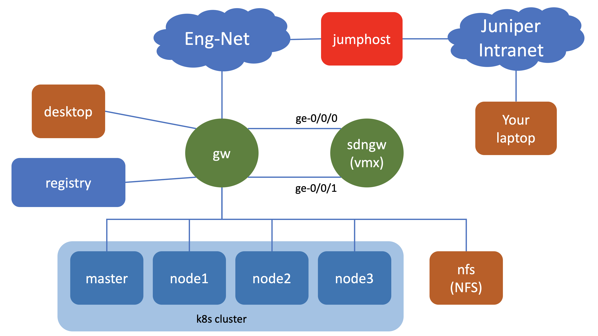

## Devices in the lab
- VMX: SDNGW , SDN gateway 

- kubernetes cluster :

        * master node: master
        * worker nodes: node1, node2, node3
        * NFS share for shared storage : nfs

- External node:

        * registry : it will be used as private registry and external server
        * desktop : external host to test connectivity to services provided by the k8s cluster

## To create the lab topology and initial configuration of VMs

Screenshot recording for these steps, can be found [here](https://asciinema.org/a/0IxJ47VXhkylmxQDU0ETJqxdx)

1. Go to directory [cn2_early](./)
2. Edit file [lab.yaml](./lab.yaml). Set the following parameters to choose which vmm server that you are going to use and the login credential:
    - vmmserver 
    - jumpserver
    - user 
    - adpassword
    - ssh_key_name ( please select the ssh key that you want to use, if you don't have it, create one using ssh-keygen and put it under directory **~/.ssh/** on your workstation )
3. If you want to add devices or change the topooogy of the lab, then edit file [lab.yaml](lab.yaml)
4. use [vmm.py](../../vmm.py) script to deploy the topology into the VMM. Run the following command from terminal

        ../../vmm.py upload  <-- to create the topology file and the configuration for the VMs and upload them into vmm server
        ../../vmm.py start   <-- to start the topology in the vmm server

5. Add the content of file [tmp/ssh_config](tmp/ssh_config) into your ssh config file, ~/.ssh/config. If you have run the previous lab, please remove entries on file ~/.ssh/config from the previous lab (Any entries after "### the following lines are added by vmm-v3-script" must be deleted)

        cat tmp/ssh_config >> ~/.ssh/config

6. Verify that you can access node **gw** using ssh (username: ubuntu,  password: pass01 ). You may have to wait for few minutes for node **gw** to be up and running
7. Run script [vmm.py](../../vmm.py) to send and run initial configuration on node **gw**

        ../../vmm.py set_gw

8. Verify that you can access other nodes (linux and junos VM), such **master**, **node1**, **node2**, etc. Please use the credential to login.

        ssh master

9. Run script [vmm.py set_host](../../vmm.py) to send and run initial configuration on linux VMs. This script will also reboot the VM. So wait before you test connectivity into the VM

        ../../vmm.py set_host

11. Verify that you can access linux and junos VMs, such **master**, **node1**, **sdngw**, without entering the password. You may have to wait for few minutes for the nodes to be up and running

        ssh master
        ssh node0
        ssh node1

## Install kernel version

Screenshot recording for these steps, can be found [here](https://asciinema.org/a/whOdc4p3GOdR7TwuS6oiKs7k0)

1. Use the web browser, and open web session to https://hub.juniper.net/v2/_catalog (it requires login credentials (username/password))
2. Check what is the available supported kernel version for ubuntu 20.04. For example on the following screenshot, it is version 5.4.0-90.  If the CN2 deployer is using version  master-3835, then it requires kernel version 5.4.0-100 on ubuntu.
        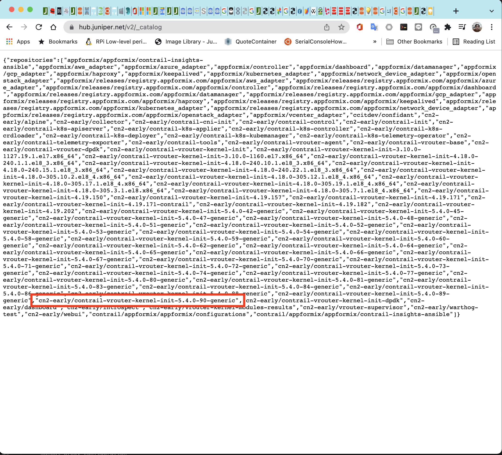
3. if the current version of kernel on node master, node1, node2, and node3 match with the available kernels on hub.juniper.net, then the following steps can be skipped (you can go to install kubernetes and CN2)
        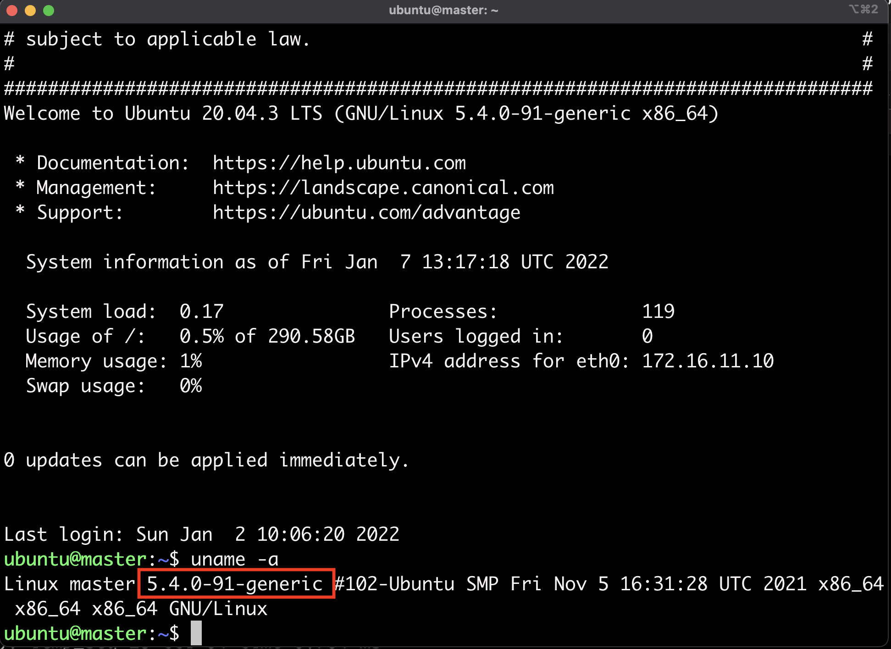
3. Edit script [install0.sh](./installk8s/install0.sh), change variable VERSION to the version that is found on previous step.
        
4. Upload this script to all nodes (master, node1, node2, node3)

        for i in master node{1..3}; do scp ./installk8s/install0.sh ${i}:~/; done

5. open ssh session to node **master** and run script install0.sh, and wait until it finish

        ssh master
        tmux
        ./install0.sh

   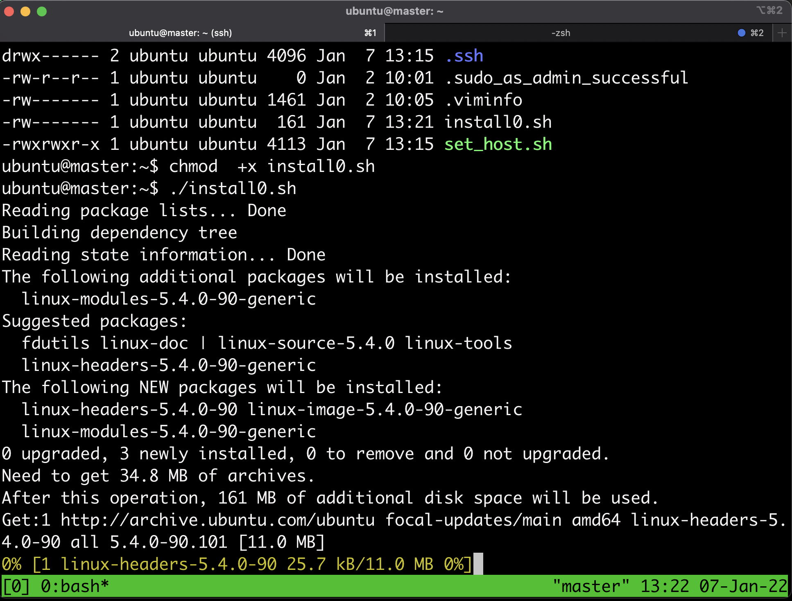
6. After the kernel is install, run the following command to get the list of entry from /boot/grub/grub.cfg, and copy the highlighted text to the text editor (just the text, the single quote is not included)

        grep -A100 submenu  /boot/grub/grub.cfg | grep menuentry 

   

7. edit /etc/default/grub, and change entry GRUB_DEFAULT. Remember there is separator **>** between the field
   

8. Run the following commands to update /boot/grub/grub.cfg and reboot the node

        sudo grub-mkconfig -o /boot/grub/grub.cfg
        uuidgen | sed -e 's/-//g' | sudo tee /etc/machine-id
        sudo reboot
9. Repeat step 5 - 8 on node1, node2, and node3
10. When the nodes are up, verify that it run with the required kernel version

  

## Kubernetes cluster installation

Screenshot recording for these steps, can be found [here](https://asciinema.org/a/9JYrQrkJQKLEsdvWIRCGT6Ni2)

1. copy files in directory[installk8s/](installk8s/) to node master, node1, node2, and node3

        for i in master node{1..3}; do scp installk8s/* ${i}:~/; done

2. open ssh session into node **master**
3. Run script install1.sh 
  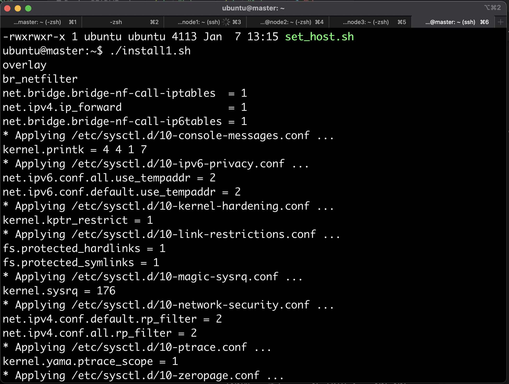
4. Run script install2.sh
  
5. Run script install3.sh
  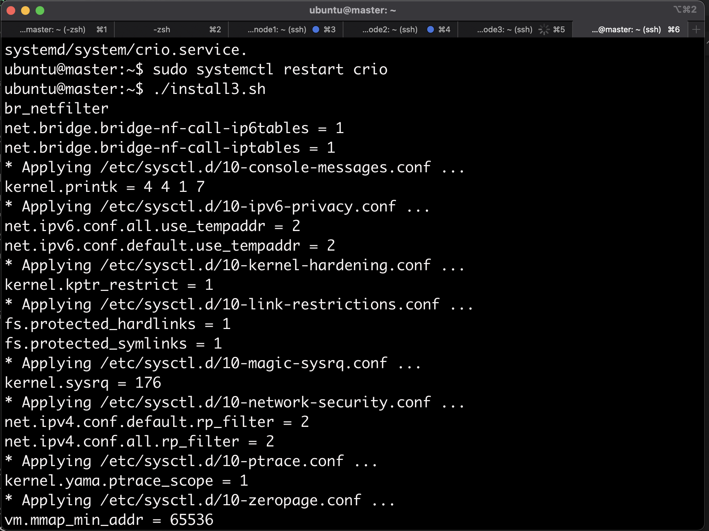
6. Repeat step 2 - 5 on node **node1**, **node2**, and **node3**
7. on node **master**, initialize kubernetes cluster using kubeadm, and wait until it finish

        sudo kubeadm init --config kube_init.yaml

  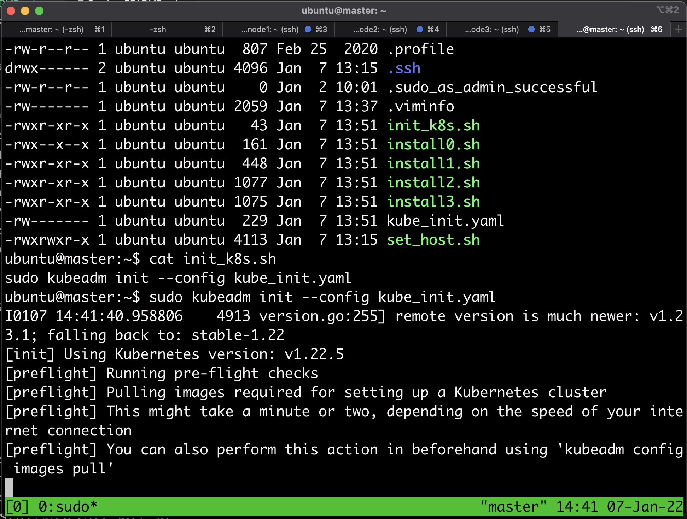

8. When the kubeadm is finish, at the end, there is kubeadm join script, copy it and run it on node1, node2 and node3
  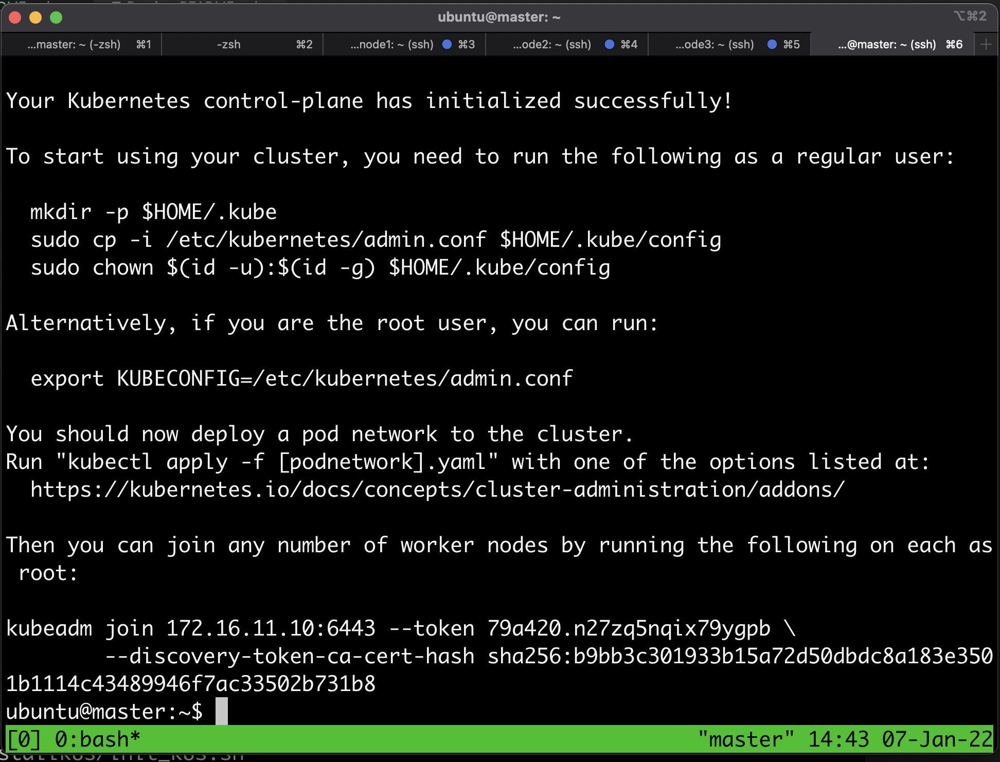
  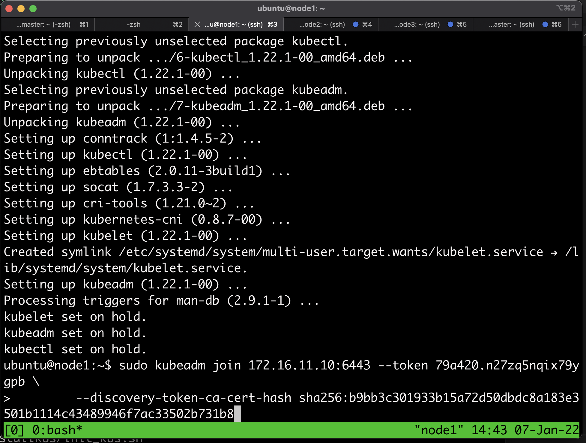
9. on node master, run the following command to verify that node1, node2 and node3 has join the k8s cluster

        kubectl get nodes
        kubectl get pods -A
 
   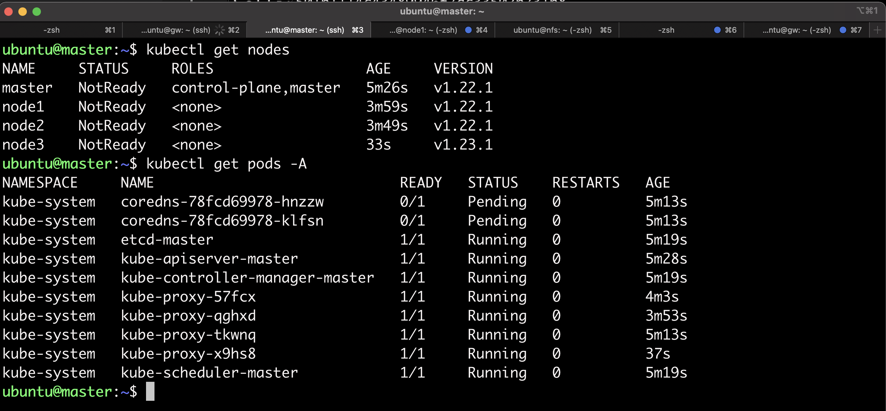

## CN2 installation

Screenshot recording for these steps, can be found [here](https://asciinema.org/a/mXB3l6MpAZCtHGXtbCN5hYeDc)

1. upload kubernetes manifest file [cn2-deployer.yaml](./cn2-deployer.yaml) into node **master**
        
        scp cn2-deployer.yaml master:~/

2. open ssh session into node master, and run kubectl to execute the manifest file

        kubectl apply -f cn2-deployer.yaml
   
   

3. Wait until it finish. To verify the progress of CN2 installation, you can run the following script. The installation is finish when all pods are running

        kubectl get pods -A
   
   
   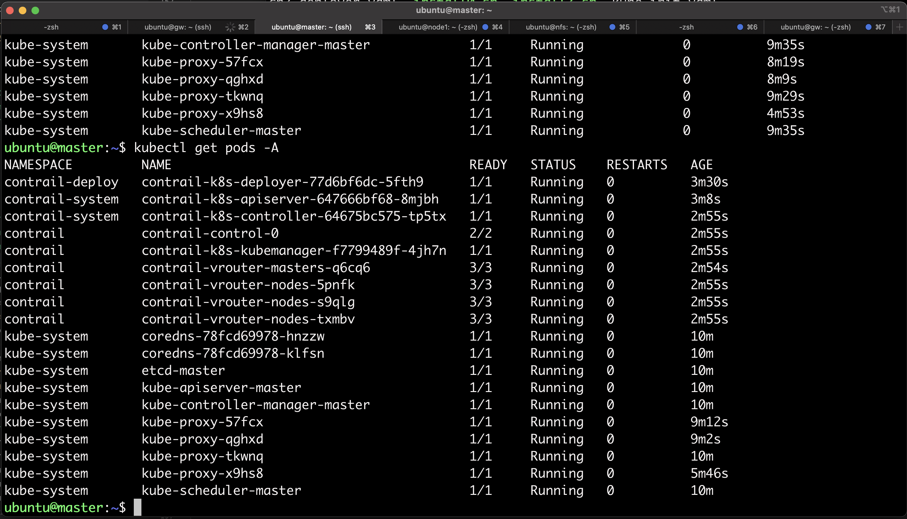
   

4. Now installation of kubernetes cluster with CN2 is done

## How to set kubectl over ssh tunnel

Information on how to set kubectl over ssh, can be found here [reference](https://blog.scottlowe.org/2019/07/30/adding-a-name-to-kubernetes-api-server-certificate/)

This is required if you want to run kubectl command from your workstation/laptop.

Screenshot recording for these steps, can be found [here](https://asciinema.org/a/MhG7mlJTPKY6C3P0dPYAPe8q1)

1. on Master, run 

        kubectl -n kube-system get configmap kubeadm-config -o jsonpath='{.data.ClusterConfiguration}' > kubeadm.yaml
2. edit file kubeadmin, under **apiServer:** add the following:

        certSANs:
        - "127.0.0.1"
        - "172.16.11.10"
        - "10.96.0.1"
  
   

3. Move the existing API server certificate to different directory

        mkdir ~/certs
        sudo mv /etc/kubernetes/pki/apiserver.{crt,key} ./certs

4. run kubedm to just generate a new certificate

        sudo kubeadm init phase certs apiserver --config kubeadm.yaml

5. Restart the API server container :
    - run **sudo crictl ps | grep kube-apiserver | grep -v pause** to get the containerID of the kubernetes API server
    - run **sudo crictl update <containerID>** to restart it.

   

6. copy kubectl config from node **master** to your local workstation

        mkdir ~/.kube
        scp master:~/.kube/config ~/.kube/config
        
7. On your workstation, edit file ~/.kube/config. Change the URL from https://172.16.11.10:6443 to https://127.0.0.1:6443

 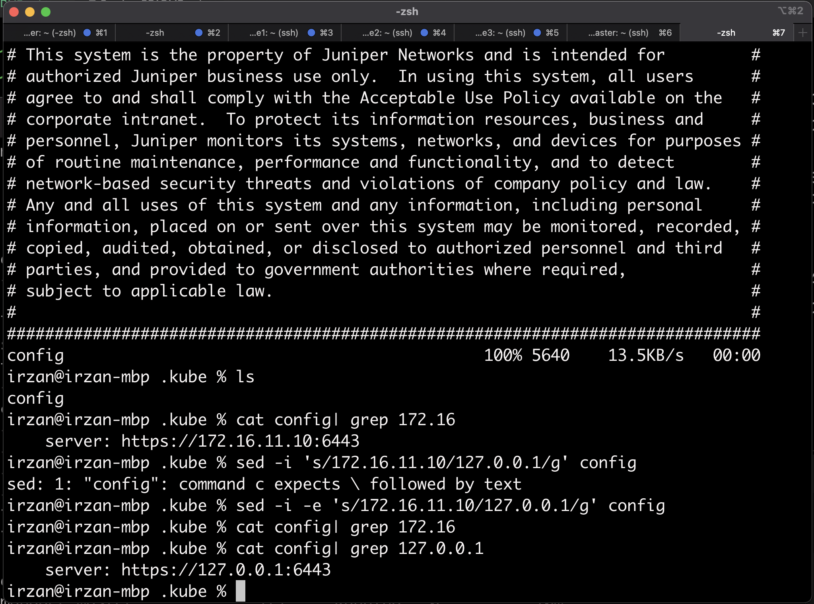

7. Open ssh session with port forwarding on 6443 to node **proxy** (and keep the session alive)

        ssh -L 6443:172.16.11.10:6443 proxy

8. Install kubectl on your workstation, and test kubectl command

        kubectl get nodes
        kubectl get pods -A

 

 

9. Now you can run kubectl on your workstation to access the kubernetes cluster in the lab.

## Installing kubernetes IDE Lens

## Monitoring using Promotheus and Grafana
1. Install helm on your workstation
2. download contrail-analytics.tgz package from [this url](https://svl-artifactory.juniper.net/artifactory/atom-helm/cn2/)
3. install contrail-analytics package using the following command

        helm install analytics <filename> -n contrail --create-namespace --set contrail-collector.install=false --set contrail-dashboard.install=false --set contrail-introspect.install=false --set contrail-portal.install=false --set elasticsearch.install=false --set fluent-bit.install=false --set fluentd.install=false --set influxdb2.install=false --set kibana.install=false --set grafana.install=false 

        helm install analytics /Users/irzan/Downloads/contrail-analytics-0.1.0-revb334dbc8b.tgz -n contrail --create-namespace --set contrail-collector.install=false --set contrail-dashboard.install=false --set contrail-introspect.install=false --set contrail-portal.install=false --set elasticsearch.install=false --set fluent-bit.install=false --set fluentd.install=false --set influxdb2.install=false --set kibana.install=false --set grafana.install=false 