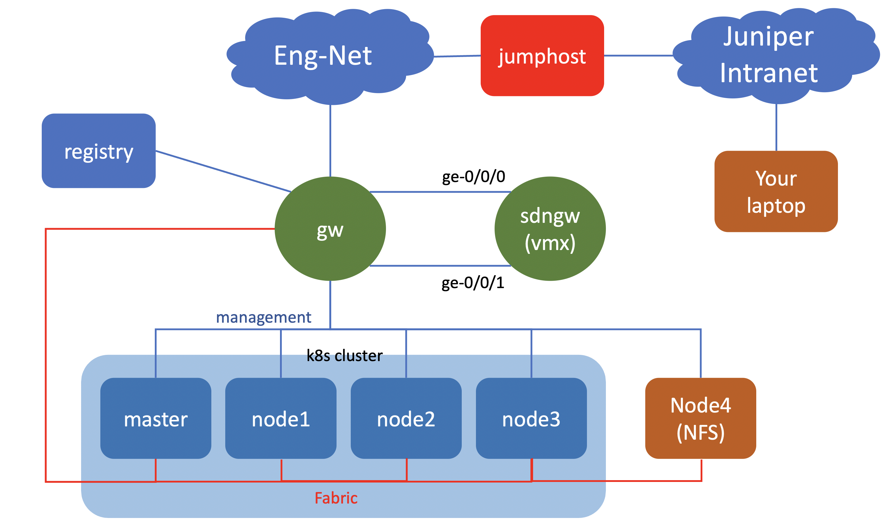

# Installing kubernetes and CN2 (Cloud native Contrail networking) (Under heavy construction)
## Introduction 

This document provide guide on how to install kubernetes and cloud native contrail networking (CN2).

it is based on CN2 (cloud native contrail networking) [version 22.1](https://www.juniper.net/documentation/us/en/software/cn-cloud-native22/release-notes/22.1/cn-cloud-native-release-notes-22.1/topics/concept/cn-cloud-native-22.1-supported-platforms.html)

The official documentation on how to install CN2 with kubernetes cluster can be found [here](https://www.juniper.net/documentation/us/en/software/cn-cloud-native22/cn-cloud-native-k8s-install-and-lcm/index.html)

## Topology

## Devices in the lab
- VMX: SDNGW/SDN gateway 

- kubernetes cluster :
  - master node: master
  - worker nodes: node1, node2, node3
  - NFS share for shared storage : node4

- External node:
  - registry : it will be used as private registry, external server, and kubespray node

## To create the lab topology and initial configuration of VMs
1. Go to directory [cn2](./)

2. Edit file [lab.yaml](./lab.yaml). Set the following parameters to choose which vmm server that you are going to use and the login credential:
    - vmmserver 
    - jumpserver
    - user 
    - adpassword
    - ssh_key_name ( please select the ssh key that you want to use, if you don't have it, create one using ssh-keygen and put it under directory **~/.ssh/** on your workstation )
3. If you want to add devices or change the topooogy of the lab, then edit file [lab.yaml](lab.yaml)
4. use [vmm.py](../../vmm.py) script to deploy the topology into the VMM. Run the following command from terminal

        ../../vmm.py upload  <-- to create the topology file and the configuration for the VMs and upload them into vmm server
        ../../vmm.py start   <-- to start the topology in the vmm server

5. Add the content of file [tmp/ssh_config](tmp/ssh_config) into your ssh config file,`~/.ssh/config`. If you have run the previous lab, please remove entries on file `~/.ssh/config` from the previous lab (Any entries after "### the following lines are added by vmm-v3-script" must be deleted)

        cat tmp/ssh_config >> ~/.ssh/config

8. Verify that you can access node **gw** using ssh (username: ubuntu,  password: pass01 ). You may have to wait for few minutes for node **gw** to be up and running
9. Run script [vmm.py](../../vmm.py) to send and run initial configuration on node **gw**

        ../../vmm.py set_gw

10. Verify that you can access other nodes (linux and junos VM), such **master**, **node1**, **node2**, etc. Please use the credential to login.

        ssh master

11. Run script [vmm.py](../../vmm.py) to send and run initial configuration on linux nodes. This script will also reboot the VM. So wait before you test connectivity into the VM

        ../../vmm.py set_host

11. Verify that you can access linux and junos VMs, such **master**, **node1**, **sdngw**, without entering the password. You may have to wait for few minutes for the nodes to be up and running

        ssh master
        ssh node0
        ssh node1

## kubernetes cluster installation.

There are two options to install kubernetes cluster
- option 1 : using kubeadm
  
  With this method, kubernetes cluster installation will be done manually using kubeadm on each nodes (master and worker nodes).
  
  Please refer to this [document](install_k8s_using_kubeadm.md) on how to install kubernetes cluster using kubeadm

- option 2 : using kubespray

  With this method, ansible playbook will be used to automate kubernetes installation.

  Please refer to this [document](install_k8s_using_kubespray.md) on how to install kubernetes cluster using kubespray.

  kubespray is using some container image, such as nginx, which is hosted on hub.docker.com, and as you know, Mirantis (As the owner docker.com) has put rate limit to free access to hub.docker.com. So when you have reach the maximum limit, then kubernetes deployment using kubespray may fail, and you may have to wait for 24 hours before doing another deployment.

  so far, I haven't figure out on how to use authenticated access to hub.docker.com for kubespray. once I know, I'll update the documentation.

## Installing CN2 into kubernetes cluster
please refer to [this document](cn2_installation.md) on how to install CN2 into kubernetes cluster

## Installing private local registry

If you want to use local registry, then you can install private local registry, so you don't have to use public registry such as quay.io or hub.docker.com

please refer to [this document](private_registry_installation.md) on how to install local private registry

## How to setup kubectl over ssh tunnel

Please refer to [this document](kubectl_over_ssh.md) on how to setup kubectl over ssh tunnel

## Lab Exercise

Please refer to [this document](lab_exercise/README.md) on various lab exercise that can be done on the k8s + CN2 lab.

