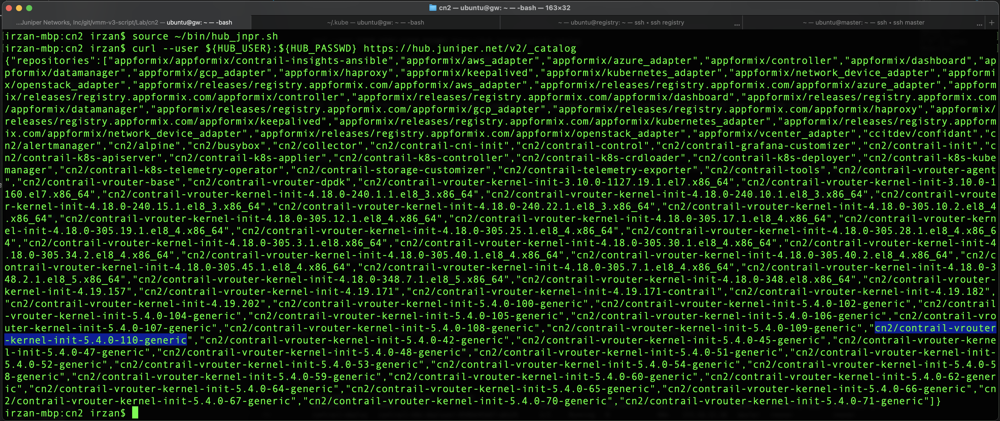
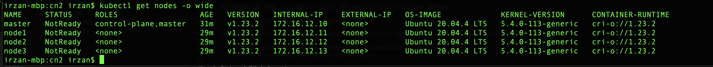
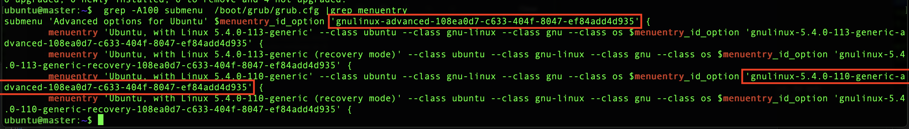
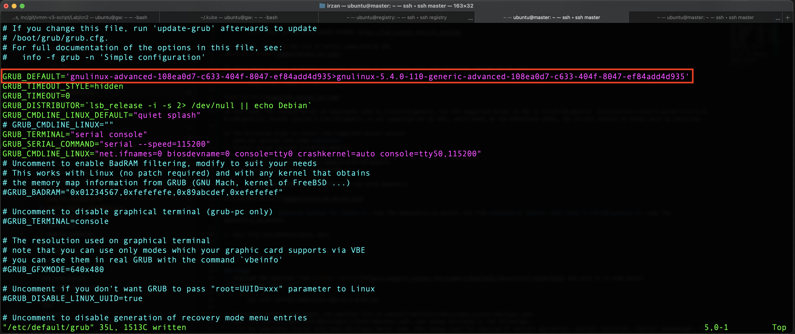
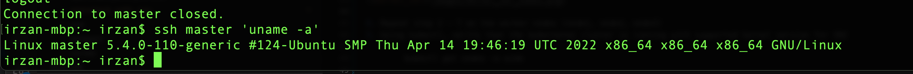
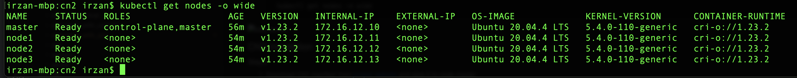

# This document provide information on how to install CN2 on kubernetes cluster

## kernel verion on kubernetes nodes
Before installing CN2, verify that the linux kernel version on kubernetes nodes match with kernel version supported by CN2.

To check kernel version which are supported by CN2, the following command can be used. Credentials (username and password) to access hub.juniper.net is required.

        curl --user ${HUB_USER}:${HUB_PASSWD} https://hub.juniper.net/v2/_catalog
        
For example, here are the list of kernel supported by CN2

To check which version of kernel currently running on kubernetes node, the following command can be used

        kubectl get nodes -o wide

In this case, the running kernel on kubernetes node is 5.4.0-113-generic, but the supported kernel on CN2 is 5.4.0-110-generic  (cn2/contrail-vrouter-kernel-init-5.4.0-110-generic) (kernel version 5.4.0-113-generic is not supported yet by CN2), which means on the kubernetes nodes, the correct version of kernel must be installed.

do the following steps to install the supported kernel version
1. open ssh session into node **master**
2. Install kernel version 5.4.0-110-generic

        sudo apt -y install linux-image-5.4.0-110-generic
3. List the installed kernel on the node

        grep -A100 submenu  /boot/grub/grub.cfg |grep menuentry

4. From **submenu 'Advanced options for Ubuntu'**, copy the $menuentry_id_option, and from **menuentry 'Ubuntu, with Linux 5.4.0-110-generic'**, copy the  $menuentry_id_option. 

5. Edit file /etc/default/grub, and change the value of GRUB_DEFAULT to the value from step 4

6. update grub configuration using this command

        sudo update-grub
7. Reboot node master, and verify after reboot that it run the supported kernel version for CN2

        uname -a

8. Repeat step 2 - 7 on the worker nodes (node1, node2, node3)
9. Using kubectl, verify that the kubernetes cluster is running with supported kernel version for CN2

        kubectl get nodes -o wide

10. Now, we can proceed with CN2 installation

## CN2 installation

### Steps
1. Download CN2 manifest from [juniper website](https://support.juniper.net/support/downloads/?p=contrail-networking) and save it to node master
2. extract the files

        tar xvfz contrail-manifests-k8s-22.1.0.93.tgz

3. For single cluster deployment, the manifest file is contrail-manifests-k8s/single_cluster/deployer.yaml
4. Edit file contrail-manifests-k8s/single_cluster/deployer.yaml, and change according to the followings:
   - if the kubernetes cluster only have one/single master node, then change count for replicas of contrail api-server, contrail controller, contrail kubemanager, contrail control, from 3 to 1
   - if separate interface is used for fabric, for example management interface is using interface eth0 and fabric interface is using eth1, then vrouter object, for both master and worker node, set the gateway of virtualHostInterface to the default gateway of the subnet connected to interface eth1. For example interface eth1 is connected to subnet 172.16.12.0/24 and the default gateway is 172.16.12.1, the set the following for vrouter master node and worker nodes

                agent:
                  virtualHostInterface:
                    gateway: 172.16.12.1

5. Deploy the manifest file using kubectl command

        kubectl apply -f contrail-manifests-k8s/single_cluster/deployer.yaml

6. Run kubectl get pods -A -o wide, to verify that pods for contrail has been deployed

        watch -n 5 kubectl get pods -A -o wide

7. copy file contrail-tools/kubectl-contrailstatus into directory /usr/local/bin. This tool is to verify CN2 status

        sudo cp contrail-tools/kubectl-contrailstatus /usr/local/bin
        sudo chmod +x /usr/local/bin/kubectl-contrailstatus 

8. Status of CN2 deployment

        ubuntu@master:~$ kubectl get pods -A -o wide
        NAMESPACE         NAME                                        READY   STATUS    RESTARTS      AGE    IP             NODE     NOMINATED NODE   READINESS GATES
        contrail-deploy   contrail-k8s-deployer-858bb45dd7-q9s29      1/1     Running   0             48m    172.16.12.10   master   <none>           <none>
        contrail-system   contrail-k8s-apiserver-6577c79c87-pqzsl     1/1     Running   0             48m    172.16.12.10   master   <none>           <none>
        contrail-system   contrail-k8s-controller-7777877b44-2nzqr    1/1     Running   0             47m    172.16.12.10   master   <none>           <none>
        contrail          contrail-control-0                          2/2     Running   0             47m    172.16.12.10   master   <none>           <none>
        contrail          contrail-k8s-kubemanager-869dc9c546-j4lw5   1/1     Running   0             47m    172.16.12.10   master   <none>           <none>
        contrail          contrail-vrouter-masters-k6zqx              3/3     Running   0             47m    172.16.12.10   master   <none>           <none>
        contrail          contrail-vrouter-nodes-6hghj                3/3     Running   1 (47m ago)   47m    172.16.12.13   node3    <none>           <none>
        contrail          contrail-vrouter-nodes-twczb                3/3     Running   0             47m    172.16.12.12   node2    <none>           <none>
        contrail          contrail-vrouter-nodes-zslbv                3/3     Running   1 (47m ago)   47m    172.16.12.11   node1    <none>           <none>
        kube-system       coredns-76b4fb4578-b57lj                    1/1     Running   4             112m   10.233.64.2    master   <none>           <none>
        kube-system       coredns-76b4fb4578-pkbbb                    1/1     Running   4             56m    10.233.67.0    node1    <none>           <none>
        kube-system       dns-autoscaler-7979fb6659-dd68l             1/1     Running   1             112m   10.233.64.3    master   <none>           <none>
        kube-system       kube-apiserver-master                       1/1     Running   2             114m   172.16.12.10   master   <none>           <none>
        kube-system       kube-controller-manager-master              1/1     Running   3             114m   172.16.12.10   master   <none>           <none>
        kube-system       kube-proxy-2zwfq                            1/1     Running   1             113m   172.16.12.13   node3    <none>           <none>
        kube-system       kube-proxy-nzcrt                            1/1     Running   1             113m   172.16.12.12   node2    <none>           <none>
        kube-system       kube-proxy-qcw9v                            1/1     Running   1             113m   172.16.12.10   master   <none>           <none>
        kube-system       kube-proxy-v222n                            1/1     Running   1             113m   172.16.12.11   node1    <none>           <none>
        kube-system       kube-scheduler-master                       1/1     Running   3             114m   172.16.12.10   master   <none>           <none>
        kube-system       nginx-proxy-node1                           1/1     Running   1             113m   172.16.12.11   node1    <none>           <none>
        kube-system       nginx-proxy-node2                           1/1     Running   1             113m   172.16.12.12   node2    <none>           <none>
        kube-system       nginx-proxy-node3                           1/1     Running   1             113m   172.16.12.13   node3    <none>           <none>

        ubuntu@master:~$ kubectl-contrailstatus --all
        PODNAME(CONFIG)                          	STATUS	NODE  	IP          	MESSAGE 
        contrail-k8s-apiserver-6577c79c87-pqzsl  	ok    	master	172.16.12.10	       	
        contrail-k8s-controller-7777877b44-2nzqr 	ok    	master	172.16.12.10	       	
        contrail-k8s-kubemanager-869dc9c546-j4lw5	ok    	master	172.16.12.10	       	

        PODNAME(CONTROL)  	STATUS	NODE  	IP          	MESSAGE 
        contrail-control-0	ok    	master	172.16.12.10	       	

        LOCAL BGPROUTER	NEIGHBOR BGPROUTER	ENCODING	STATE         	POD                
        master         	master            	XMPP    	Established ok	contrail-control-0	
        master         	node1             	XMPP    	Established ok	contrail-control-0	
        master         	node2             	XMPP    	Established ok	contrail-control-0	
        master         	node3             	XMPP    	Established ok	contrail-control-0	

        PODNAME(DATA)                 	STATUS	NODE  	IP          	MESSAGE 
        contrail-vrouter-masters-k6zqx	ok    	master	172.16.12.10	       	
        contrail-vrouter-nodes-6hghj  	ok    	node3 	172.16.12.13	       	
        contrail-vrouter-nodes-twczb  	ok    	node2 	172.16.12.12	       	
        contrail-vrouter-nodes-zslbv  	ok    	node1 	172.16.12.11	       	

        ubuntu@master:~$

9. Now CN2 installation for kubernetes cluster is done.