# Installing kubernetes using Kubeadm

## Kubernetes cluster installation

1. copy files in directory [installk8s/](installk8s/) to node master, node1, node2, and node3

        #!/usr/bin/env bash
        for i in master node{1..3}
        do
        scp install*.sh ${i}:~/
        done
        scp ./init_k8s.sh master:~/
        scp ./kube_init.yaml master:~/

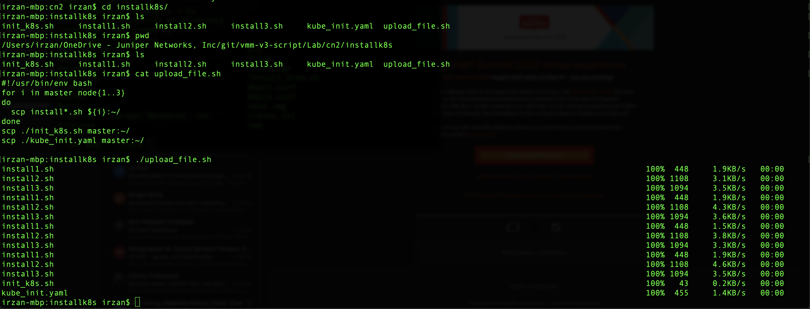

2. open ssh session into node **master**
3. Run scripts install1.sh , install2.sh and install3.sh

        ./install1.sh && ./install2.sh && ./install3.sh

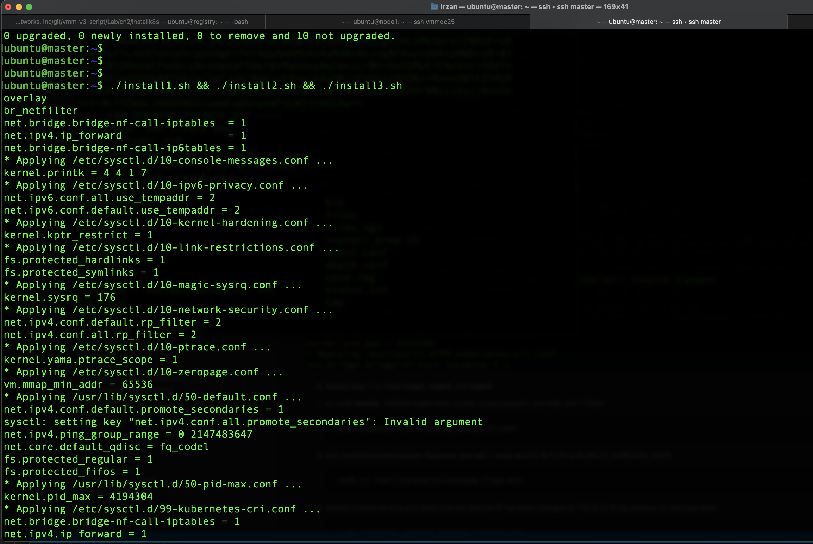

4. Repeat step 3 on node **node1**, **node2**, and **node3**
5. on node **master**, initialize kubernetes cluster using kubeadm, and wait until it finish

        sudo kubeadm init --config kube_init.yaml

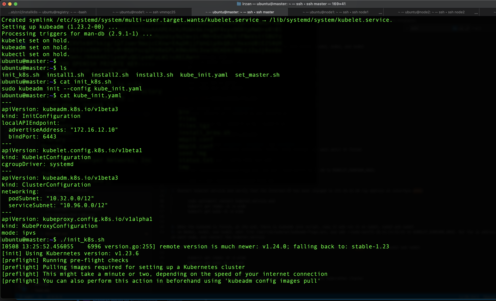

6. From **kubectl get nodes -A -o wide** and **kubectl get pods -A -o wide**, it can be seen that the ip address assign to kubernetes services is 172.16.11.10 (ip address of eth0 (management interface). To change the ip address for the kubernetes services to 172.16.12.10 (ip address of eth1 (fabric interface)), do the following steps

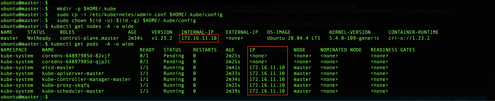

7. Edit /var/lib/kubelet/kubeadm-flags.env, and add --node-ip=172.16.12.10 to KUBELET_KUBEADM_ARGS.

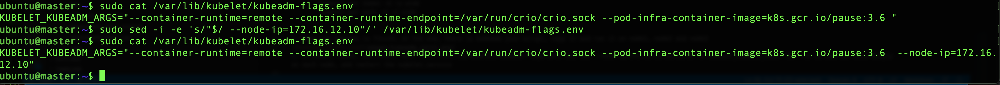

8. Restart kubelet service and verify that the Internal-IP has been changed to 172.16.12.10 (ip address on interface eth1)
        
        sudo systemctl restart kubelet.service
        kubectl get nodes -A -o wide
        kubectl get pods -A -o wide

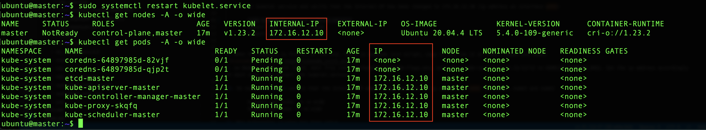

9. When the kubeadm is finish, at the end, there is kubeadm join script, copy it and run it on node1, node2 and node3
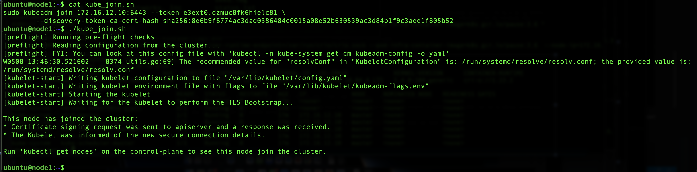
10. After worker nodes join the kubernetes cluster, it still use management ip address (eth0).
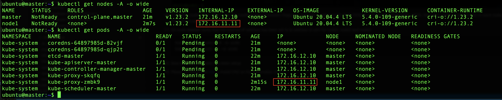
9. On Node1, node2, and node3, to change the kubernetes to use ip address of eth1, then do the following
   - edit file /var/lib/kubelet/kubeadm-flags.env
   - add --node-ip=172.16.12.11/12/13 to KUBELET_KUBEADM_ARGS (Set the ip address accordingly on each node)
   - restart the kubelet.service, sudo systemctl restart kubelet.service

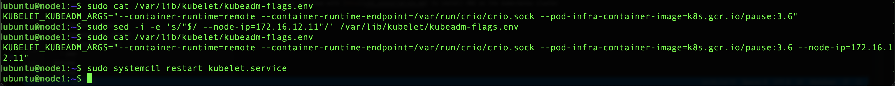

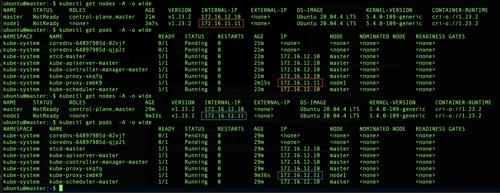

10. On node **master** verify that the Internal-IP address has been set to ip address of eth1 for node1, node2 and node3

        kubectl get nodes -A -o wide
        kubectl get pods -A -o wide

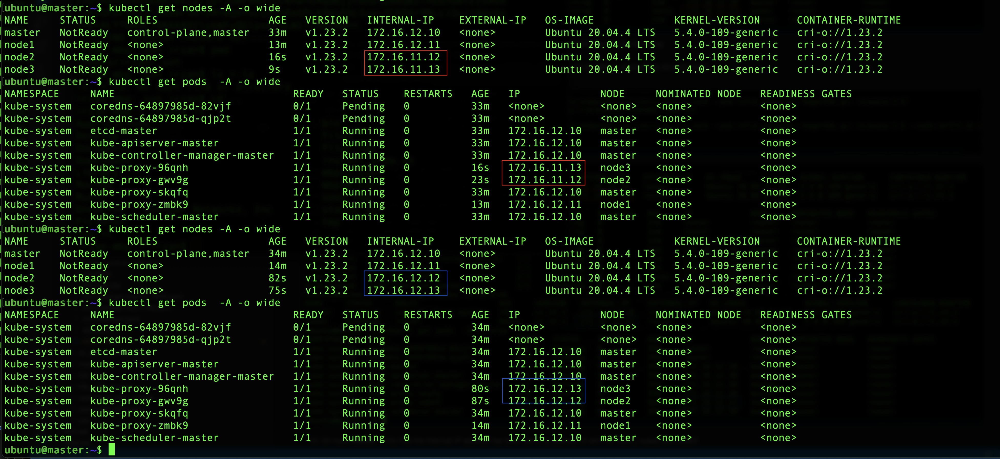
11. Now kubernetes cluster has been setup
12. Please continue with [this](cn2_installation.md) to install CN2 on the kubernetes cluster
