# Lab 1

##  Deploying pods
In this exercise, multiple independent pods will be deployed to multiple worker node.

The manifest file used with this lab exercise is [lab1_client.yaml](lab1_client1.yaml)

### Steps
1. Deploy pods using manifest file

        kubectl apply -f lab1_client.yaml

2. Verify that pods has been deployed on multiple worker node

        kubectl get pods -o wide

3. Access one of the pod, for example client1 using kubectl exec 

        kubectl exec -it client1 -- sh

4. Verify that from pod **client1** it can reach other pod (client2 and client3)

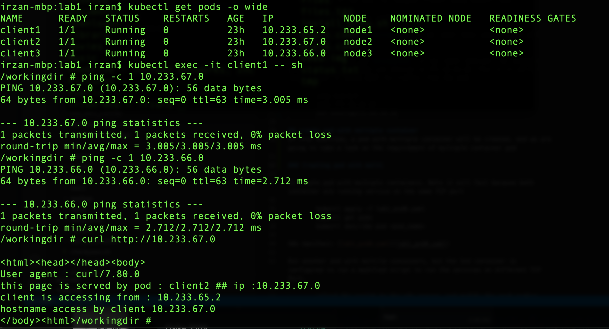

5. verify that from pod **client1**, it can reach internet, for example ping to  8.8.8.8 or open ssh session to 172.16.14.10. This is to verify that vrouter is doing SNAT for traffic from the pods

        ping 8.8.8.8
        ping 172.16.14.10
        ssh ubuntu@172.16.14.10

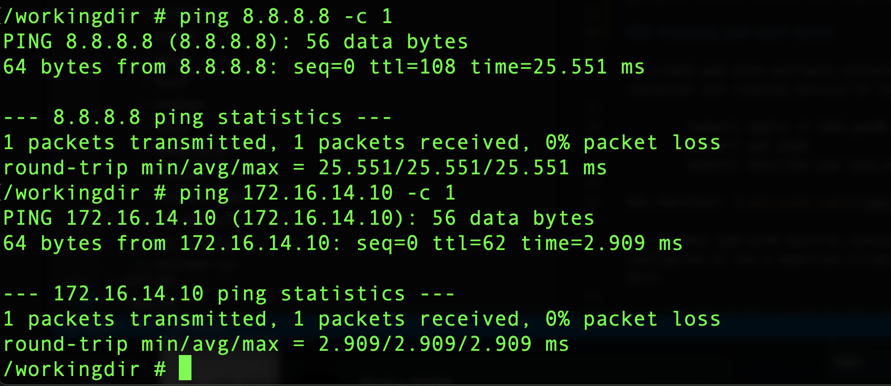

## Deploying multi-container pods

In this exercise, a pod with multiple container will be created, and we are going to take a look on the requirement of multiple container pod

### exercise 1
1. Deploy a pod with multiple container using manifest file [lab1_pod0.yaml](lab1_pod0.yaml). A pod called `pod0` will be created and it has two container `c1` and `c2`, and both container are running the same image.

        kubectll apply -f lab1_pod0.yaml

2. Check the status of the pod, and you will notice that for pod0 the status is Error or CrashLoopBackOff and from kubectl describe pods pod0, the state of one of the container is `Waiting` because of CrashLoopBackOff

        kubectl get pods
        kubectl describe pods pod0

It happens because both container, c1 and c2 are running the same code, which start http services on TCP port 80, and since both container are sharing the network (Because they are running on the same pod), then one of the service will crash.

### exercise 2
1. In this exercise, we are going to run another pod with multiple container, but we are going to used different image.
2. first, we are going to create another image
3. From your workstation, open ssh session into node `registry` and enter directory `webserver`

        ssh registry
        cd webserver
4. inside directory webserver, you will find the python scrypt webserver.py, and by default it use port 80

5. We are going to create a new container image, running tcp service on different port, for example 8080
6. Edit file `webserver.py`, and change `port=80` to `port=8080`

        cat webserver.py | grep port=80
        sed -i -e 's/port=80/port=8080/' webserver.py

7. Create a new container image using `podman build`, and the new image will be called webserver8080:0.1

        podman image ls
        podman build -t 172.16.14.10:5000/webserver8080:0.1 .
        podman image ls

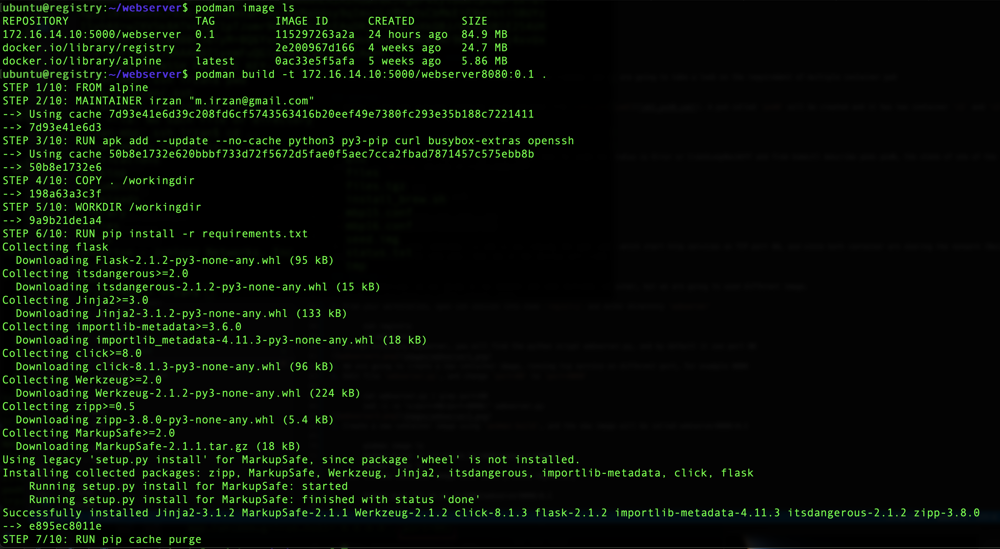
8. Push the new container image into local private repository

        podman push 172.16.14.10:5000/webserver8080:0.1 

9. Verify that the new container image has been push into local private repository

        curl -k https://172.16.14.10:5000/v2/_catalog
        curl -k https://172.16.14.10:5000/v2/webserver8080/tags/list
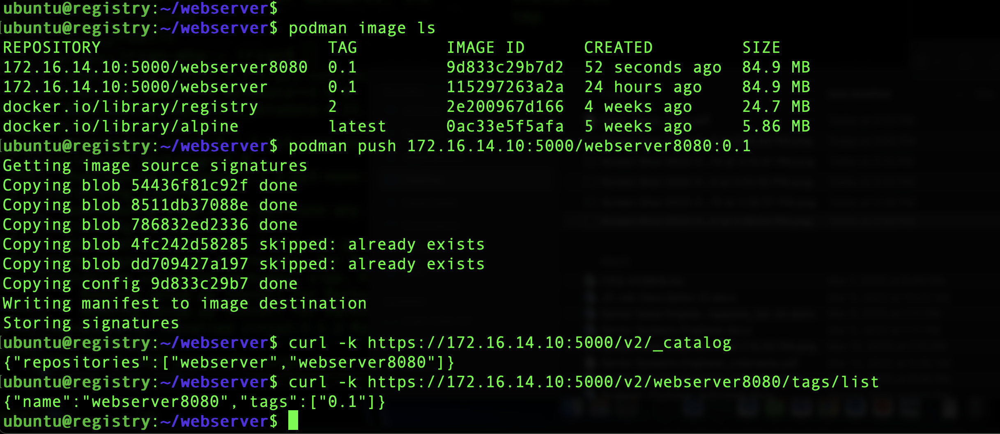

10. Deploy another multiple container pod using manifest file [lab1_pod1.yaml](lab1_pod1.yaml), and verify that that pod `pod1` status is `RUNNING`

        kubectl apply -f lab1_pod1.yaml
        kubectl get pods
        kubectl describe pods pod1

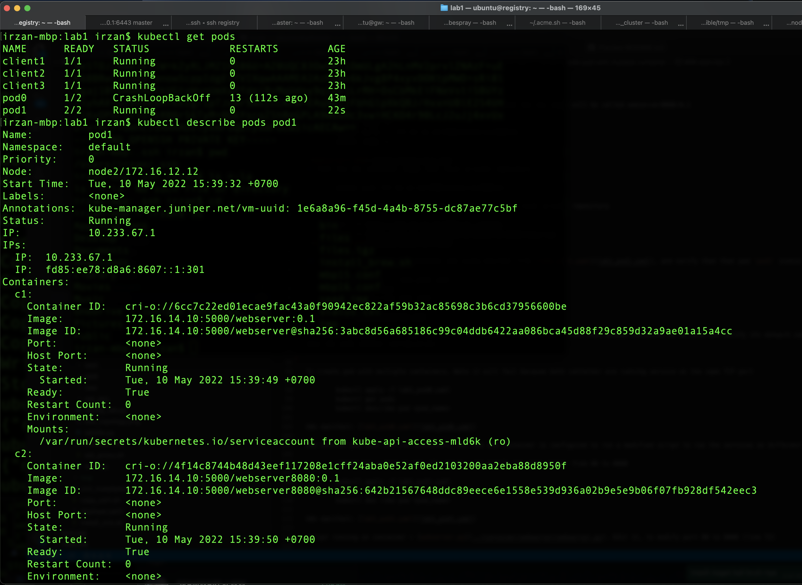

11. Access container c1 on pod1 and verify its network configuration, after that access container c2 on pod1 and verify its network configuration. Container c1 and c2 will have the same network configuration

12. From pod `client1`, test connectivity to pod `pod1` on tcp port 80 and tcp port 8080
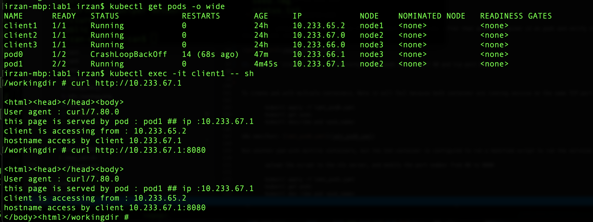

### exercise 3
1. In this exercise, we are going to run another pod with multiple container, both container will run the same image, but the 2nd container will run the script from another storage, in this case run the script from nfs
2. Before deploying the pod, verify that nfs client is installed on worker node. if nfs client is not install, install it first

        ssh node1 "sudo apt -y install nfs-client"
        ssh node2 "sudo apt -y install nfs-client"
        ssh node3 "sudo apt -y install nfs-client"
3. open ssh session into nfs server (`node4`) and verify that nfs server has been enabled and the nfs share has beed configured. if nfs server and nfs share are not configured, upload script [upgrade_node4.sh](../../upgrade_node4.sh) to `node4` and run it to install nfs server and create the nfs share. The script will reboot `node4`
4. From node `registry`, upload script `webserver.py` into `node4`, put it on nfs share directory `/media/nfsshare/webserver`, and set the mode for file /media/nfsshare/webserver/webserver.py to rx for user, group, and other

        ssh registry
        scp webserver/webserver.py node4:~/
        ssh node4 
        sudo cp webserver.py /media/nfsshare/webserver
        sudo chmod ugo+rx /media/nfsshare/webserver/webserver.py

5. On `node4`, verify that file `/media/nfsshare/webserver/webserver.py` is using port 8080 for its service

6. Deploy another multiple container pod using manifest file [lab1_pod2.yaml](lab1_pod2.yaml). This manifest will create a pod with two container, both container will run the same image, but one of the container, container `c2` will run the script from the nfs storage, where we have stored the modified script that run services on TCP port 8080, instead of TCP port 80

7. verify that that pod `pod2` status is `RUNNING`

        kubectl apply -f lab1_pod2.yaml
        kubectl get pods
        kubectl describe pods pod2

8. From pod `client1`, test connectivity to pod `pod2` on tcp port 80 and tcp port 8080

## Deploying services with nodeport

In this exercise, services with nodeport will be deployed on kubernetes cluster.

1. Deploy services with nodeport using manifest file [lab1_nodeport.yaml](lab1_nodeport.yaml)
2. Verify that pods, services and nodeport has been deployed

        kubectl get pods -o wide
        kubectl get services

3. From node `registry`, send curl request to the ip address of the worker nodes (172.16.12.11, 172.16.12.12, or 172.16.12.13) on port 32001, to verify that services is accessible from external

        ssh registry 
        curl http://172.16.12.11:32001

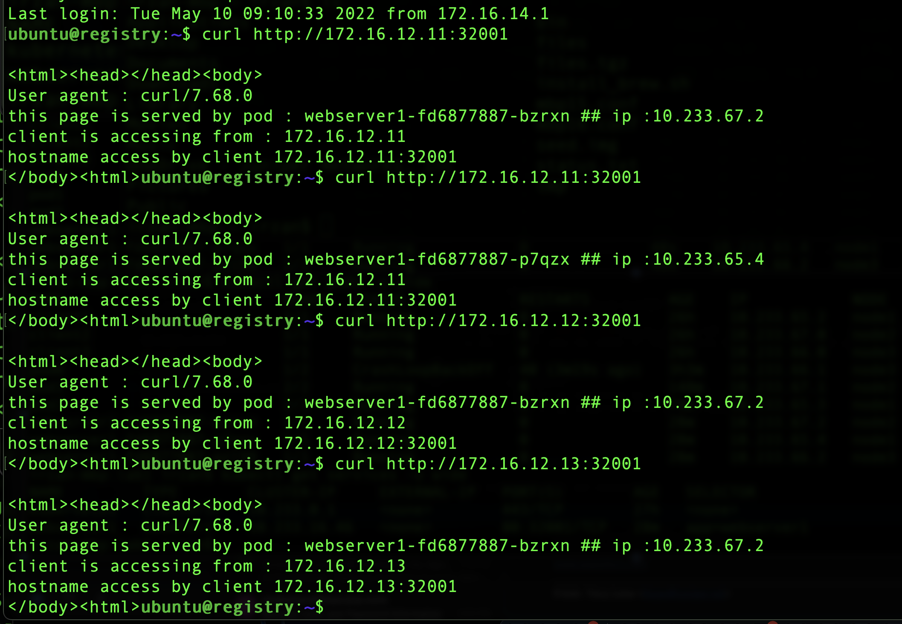

4. Upload script [hit_url.py](hit_url.py) to node `registry`, and run it to send multiple http request. By default it will generate 300 request, and at the end of the script, it will show the number of request being handled by the backend pods

        scp hit_url.py registry
        ssh registry
        ./hit_url.py target=172.16.12.11 port=32001 
        ./hit_url.py target=172.16.12.11 port=32001 count=999

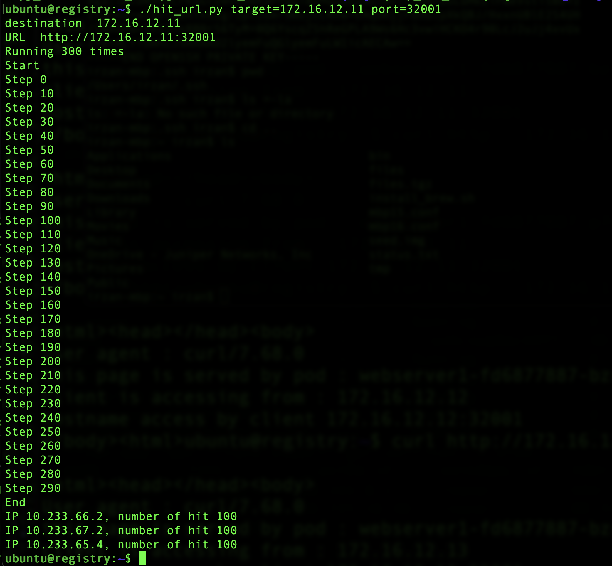

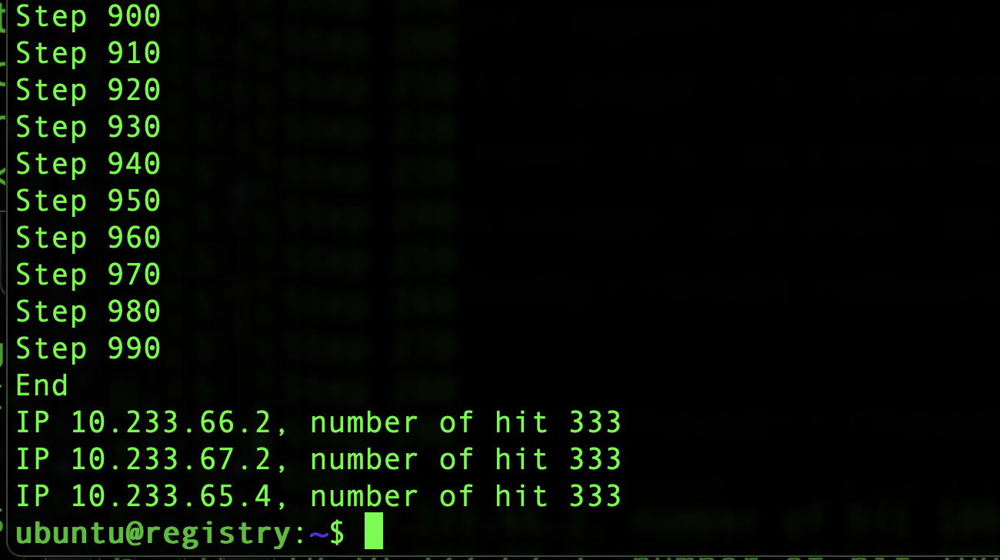

## configuring SDN Gateway (vMX/MX)

There will be multiple BGP peers on SDNGW: 
- between SDN gateway (MX) and node GW
- between SDN gateway (MX) and contrail controller

Therefore, there are three BGP configuration :
- SDN Gateway configuration 
- BGP Router configuration on contrail controller
- BGP configuration on node **gw**

### SDN gateway configuration
1. n this lab exercise, Juniper MX/vMX will be used as SDN Gateway.

2. The configuration of vMX as SDN gateway is this [file](sdngw.conf). Upload this file to node `sdngw` and apply it 

        scp sdngw.conf sdngw:~/
        ssh sdngw.conf
        edit 
        load merge relative sdngw.conf 
        commit

3. node `sdngw` has two bgp peer, one to node `gw` (172.16.12.130) for connection to external  network and one is to contrail controller (node `master`) (172.16.12.10)

4. Verify that BGP peer has been configured, but BGP connection has not been established

        show bgp summary
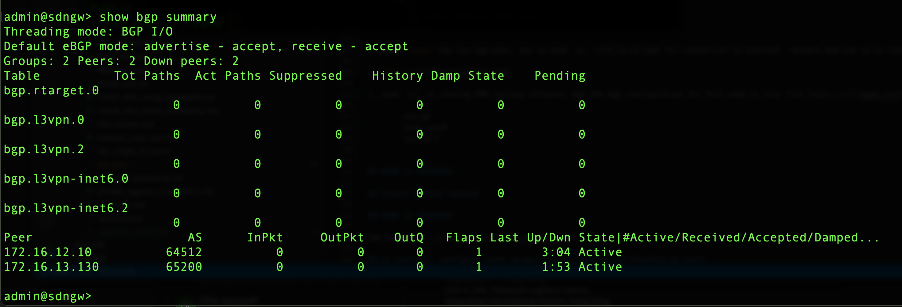

### BGP configuration on node gw
1. open ssh session to node **gw**
2. install frr routing software

        apt -y install frr
3. enable BGP on FRR by editing file /etc/frr/daemons, and restart 

        sudo cat /etc/frr/daemons | grep bgp
        sudo sed -i -e 's/bgpd=no/bgpd=yes/' /etc/frr/daemons
        sudo cat /etc/frr/daemons | grep bgp
        sudo systemctl restart frr

4. Edit frr configuration, and copy n paste the following configuration

        sudo vtysh 
        config t
        router bgp 65200
        neighbor 172.16.13.131 remote-as 64512
        !
        address-family ipv4 unicast
        network 0.0.0.0/0
        exit-address-family
        !
        exit
        exit
        write mem
5. Open ssh session into node **sdngw** and verify that bgp peer between node **gw** and **sdngw** are established

        ssh sdngw "show bgp sum"

### BGP router configuration on contrail controller
1. Apply manifest file [lab1_sdngw.yaml](lab1_sdngw.yaml) to configure BGP peer between contrail controller and node **sdngw** 

        kubectl get bgprouters -A
        kubectl apply -f lab1_sdngw.yaml
        kubectl get bgprouters -A

2. on node `sdngw` verify that bgp peer to node `gw` (172.16.13.130) and node `master` (172.16.12.10) are up

        ssh sdngw "show bgp sum"

## Configuring kubemanager

On CN2, to automatically assign ExternalIP to services, label service.contrail.juniper.net/externalNetwork with tag default-external needed to be configured on kubemanager.  By default this is not configured on kubemanager

To modify the kubemanager, do the following steps

1. Get the kubemanager name

        kubectl get kubemanager -A

2. Edit the kubemanager

        kubectl -n contrail edit kubemanager <kubemanager_name>

3. Under **kind: Kubemanager** > **spec**, add externalNEtworksSelectors configuration.

        apiVersion: configplane.juniper.net/v1alpha1
        kind: Kubemanager
        metadata:
          name: contrail-k8s-kubemanager
          namespace: contrail
        spec:
          externalNetworkSelectors:
            default-external:
               networkSelector:
                 matchLabels:
                   service.contrail.juniper.net/externalNetwork: default-external

4. To verify, do the following command

        kubectl -n contrail describe kubemanager <kubemanager_name>

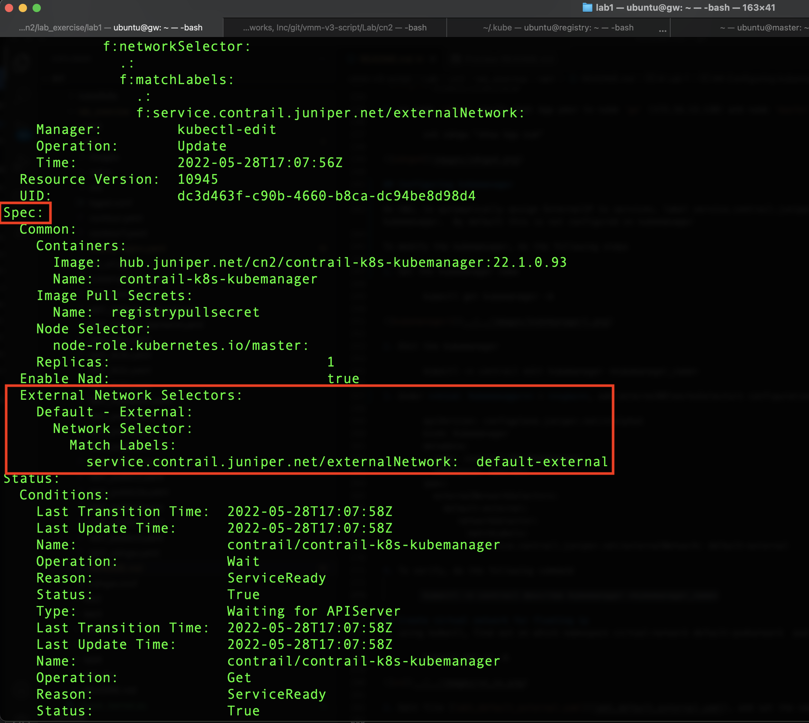

## Create virtual network for floating ip
1. using kubectl, find out on which namespace virtual-network default-podnetwork  and default-servicenetwork  are configured

        kubectl get vn -A

2. Edit file [lab1_public1.yaml](lab1_public1.yaml), and set the namespace to the same as found on previous step
3. Note: the parameter required for the virtual network are the following:
   - subnet for the virtual network
   - export and import route target. These RT is used to export and import route information with SDN gateway. the export/import route target used must match with the ones configured on the SDN gateway
   - namaspace (it has to be the same with the namespace where default-podnetwork and default-servicenetwork are configured)
   - labels service.contrail.juniper.net/externalNetwork with tag default-external

4. Apply manifest file [lab1_public1.yaml](lab1_public1.yaml). 

## Deploying services with load balancer
1. Currently there is no services with load balancer configured on the cluster.
        
        kubectl get services -A

2. on node **SDNGW**, on the routing table external1.inet.0, currently there is no route information advertised by contrail controller

        ssh sdngw "show route table external1.inet.0"
3. On node **gw**, verify that no routing update received from SDNGW

        ssh gw "ip route show"

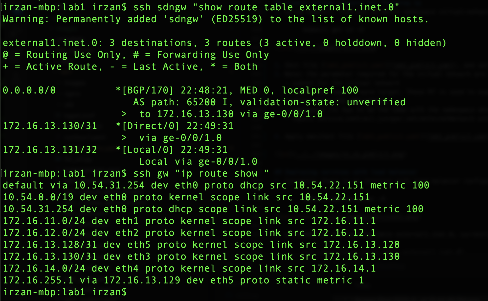

3. Deploy service with loadbalancer using manifest file [lab1_lb2a.yaml](lab1_lb2a.yaml).

        kubectl apply -f lab1_lb2a.yaml

4. Verify that pods and services are configured, external floating ip are assigned and advertised to the SDN Gateway, and MPLSoUDP are created

        kubectl get services
        kubectl get pods

        ssh sdngw "show route table external1.inet.0"
        ssh gw "ip route show"
        
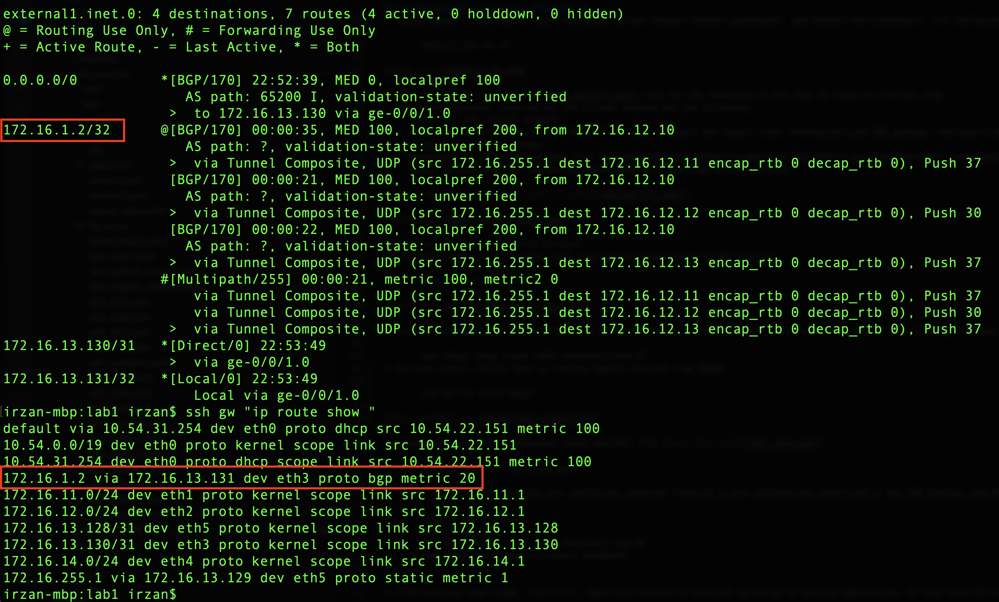

        ssh sdngw "show dynamic-tunnels database"

5. From external node (node `registry`), open http session to external ip assign to service webserver2a, in this case 172.16.1.2

        ssh registry
        curl http://172.16.1.2
        ./hit_url.py target=172.16.1.2

6. Deploy another services with loadbalancer using manifest file [lab1_lb2b.yaml](lab1_lb2b.yaml), and verify that pods and services are up, external ip address is assigned to the services and it is reachable from external node.

        kubectl apply -f lab1_lb2b.yaml
        kubectl get pods
        kubectl get services
        ssh sdngw "show route table external1.inet.0"
        ssh sdngw "show dynamic-tunnels database"

## Deploying services with ingress
### installing NGINX ingress controller

in this exercise, we are going to deploy NGINX ingress controller

1. Documentation can be found [here](https://kubernetes.github.io/ingress-nginx/deploy/)
2. Download manifest file to install NGINX ingress controller

        curl -O -L  https://raw.githubusercontent.com/kubernetes/ingress-nginx/controller-v1.2.0/deploy/static/provider/cloud/deploy.yaml

3. Apply NGINX ingress controller manifest deploy.yaml

        kubectl apply -f deploy.yaml
        
4. Verify that nginx ingress controller are installed

        kubectl  -n ingress-nginx get pods -o wide
        kubectl -n ingress-nginx get services -o wide
        kubectl get services -A

5. Deploy pods and deployment for the backend, [lab1_ingress_backend.yaml](lab1_ingress_backend.yaml)
6. Deploy ingress1, [lab1_ingress_nginx.yaml](lab1_ingress_nginx.yaml)
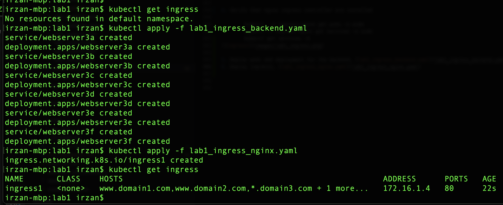

7. From node registry, use curl to open http session to ingress1 ( in this case 172.16.1.4), and try different url to match the rule on ingress1, and verify that the http request is processed by ingress1 according the rule, by looking into from which pod the http request is responded.

        curl http://172.16.1.4 
        curl --header "Host:www.domain1.com" http://172.16.1.4
        curl --header "Host:data.domain1.com" http://172.16.1.4
        curl --header "Host:www.domain2.com" http://172.16.1.4
        curl --header "Host:data.domain2.com" http://172.16.1.4
        curl --header "Host:www.domain3.com" http://172.16.1.4
        curl --header "Host:data.domain3.com" http://172.16.1.4
        curl --header "Host:www.domain1.com" http://172.16.1.4
        curl http://172.16.1.4/foo
        curl http://172.16.1.4/bar
        curl --header "Host:www.domain1.com" http://172.16.1.4/foo
        curl --header "Host:www.domain1.com" http://172.16.1.4/bar

