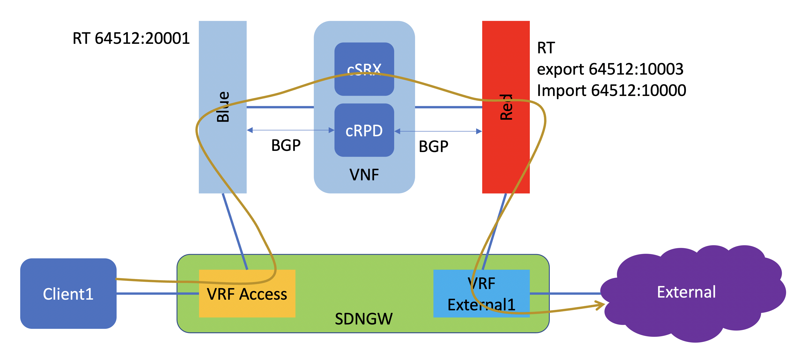

# Testing service chaining using BGPaaS 

## Simple topology 

Currently CN2 doesn't support service chaining using policy like in the legacy contrail networking, but CN2 support BGPaaS (BGP as a service), where BGP peer can be configured between pods and CN2 controller.

Inn this lab exercise, we are going to configure service chaining by using BGP to steer traffic from one virtual network to another virtual network.

Object to be configured in this lab exercise:
1. namespace: to run the topology
2. VNF: it is pod consist of cSRX and cRPD. cRPD will provide BGP routing function to exchange routing information with CN2 controller, cSRX is used to process packet when it transverse from one virtual network to another virtual network
3. BGPaaS : CN2 feature, to establish BGP peer between CN2 and VNF (in this case cRPD)
4. Pod1 and Pod2: to test traffic between virtual networks
5. Virtual networks : where pods are connected to.

## Documentation
Documentation on how to configure BGPaaS can be found [here](https://www.juniper.net/documentation/us/en/software/cn-cloud-native22/cn-cloud-native-feature-guide/cn-cloud-native-network-feature/topics/task/cn-cloud-native-bgp-as-service.html)

## Steps/Lab exercise

1. Use manifest file [lab4_network.yaml](lab4_network.yaml), to create namespace and virtual network

        kubectl apply -f lab4_network.yaml
        kubectl get ns
        kubectl -n lab4 get net-attach-def
        kubectl -n lab4 get vn
        kubectl -n lab4 get sn

2. Use manifest file [lab4_vnf1_config.yaml](lab4_vnf1_config.yaml) to create configmap vnf1 which will provide initial configuration to cSRX and cRPD

        kubectl apply -f lab4_vnf1_config.yaml
        kubectl -n lab4 get configmap
        kubectl -n lab4 describe configmap vnf1

3. use manifest file [lab4_nvf1.yaml](lab4_vnf1.yaml) to create pod NVF1 which consist of cSRX and cRPD
        
        kubectl apply -f lab4_vnf1.yaml
        kubectl -n lab4 get pods
        kubectl -n lab4 describe pods vnf1      ## to get ip address information on interface eth1 and eth2 of pod vnf1

4. use manifest file [lab4_bgpaas1.yaml](lab4_bgpaas1.yaml) to create BGPaaS object on CN2

        kubectl apply -f lab4_bgpaas1.yaml
        kubectl -n lab4 get bgpaas
        kubectl -n lab4 describe bgpaas bgpaas1

5. use kubectl to verify the BGPaaS primary and secondary IP address for VN **blue** and **red**

        kubectl -n lab4 describe subnet blue-v4
        kubectl -n lab4 describe subnet red-v4

6. use manifest file [lab4_pod.yaml](lab4_pod.yaml) to create pods pod1 and pod2 to test traffic between virtual network

        kubectl apply -f lab4_pod.yaml
        kubectl -n lab4 get pods

7. From pod1 try to ping to interface eth1 of vnf1, and from pod2 try to ping interface eth2 of vnf1

        kubectl -n lab4 exec -it pod1 -- ping -c 1 192.168.101.2
        kubectl -n lab4 exec -it pod2 -- ping -c 1 192.168.101.2
   if pod1 or pod2 or both are not able to ping interface eth1/eth2 of vnf1, you may have to recreate pod vnf1

8. From pod1, try to ping ip address of interface eth1 of pod2, it should fail because BGP peers between cRPD and CN2 controller are not established yet

9. open session into container **crpd1** on pods **vnf1**, load the license, load configuration, and commit the configuration

        kubectl -n lab4 exec -it vnf1 -c crpd1 -- cli
        show bgp summary
        request system license add /src/crpd_license
        edit
        load merge relative /src/crpd_config
        commit
        run show bgp sum

10. open session into pod **pod1**, test connectivity to ip address of eth1 of pod **pod2**, open another session to container csrx1 and verify that sessions are active 

        kubectl -n lab4 exec -it pod1 -- sh
        ping 192.168.102.5
        ./hit_url.py target=192.168.102.5 count=9999

        kubectl -n lab4 exec -it vnf1 -c csrx1 -- sh
        show securiy flow session 
        show securiy flow session summary

## edge computing topology

In this lab exercise, the service will be extended to the external client. so in this case cSRX will provide security services to external user

the topology is  the following

1. on SDN Gateway create two routing instances, access and external2.
    - VRF Access for connection to client
    - VRF external for connection to external network/internet
2. VRF access configuration

        set interfaces ge-0/0/2 unit 0 family inet address 172.16.201.1/24
        set routing-instances access instance-type vrf
        set routing-instances access routing-options multipath vpn-unequal-cost
        set routing-instances access interface ge-0/0/2.0
        set routing-instances access vrf-target target:64512:20013
        set routing-instances access vrf-table-label
3. VRF external2 configuration

        set routing-instances external2 instance-type vrf
        set routing-instances external2 protocols bgp group to_gw neighbor 172.16.13.132 peer-as 65200
        set routing-instances external2 interface ge-0/0/0.2
        set routing-instances external2 vrf-target target:64512:20012
        set routing-instances external2 vrf-table-label
        set interfaces ge-0/0/0 unit 2 vlan-id 2
        set interfaces ge-0/0/0 unit 2 family inet address 172.16.13.133/31

4. on contrail, configure the following
    - set route target for export and import route between :
        * vn-left and VRF access
        * vn-right and VRF external1
    - configure vn-left and vn-right to allow-transit

5. Verify the content of the routing table
    - on SDN Gateway
        * VRF access routing table
        * VRF external2 routing table
    - on Contrail controller
        * vn-left routing table
        * vn-right routing table

6. Test connectivity between client and external and verify that the traffic is being forwarded through service instance csrx

