# CUPS BNG 
this lab is about juniper solution for CUPS BNG

## Topology
The topology for this lab
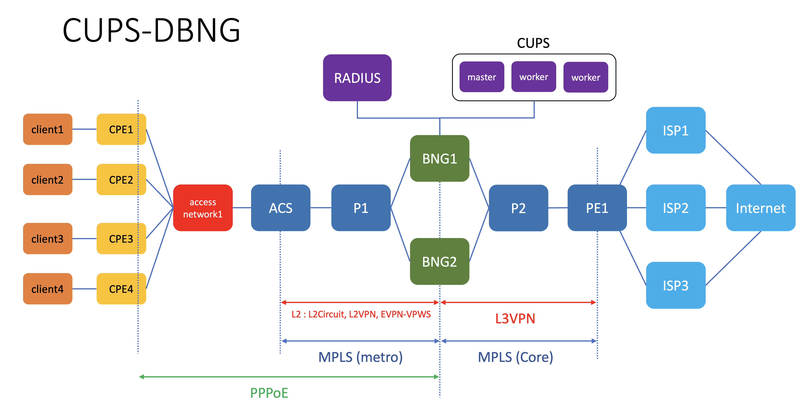

[Documentation](https://www.juniper.net/documentation/us/en/software/bng-cups22.1/cups_controller_installation_guide/bng-cups-install-migrate/topics/topic-map/cups_install.html)

## deploying configuration into existing junos devices 
1. go to directory junos_config
2. Run ansible-playbook [junos_config/upload_config.yaml](junos_config/upload_config.yaml). It will upload BNG standalone configuration into node **vbng1**, **vbng2**, **acs** and **pe1**

        cd junos_config
        ansible-playbook upload_config.yaml
3. Node vbng1 and vbng2 may need to be rebooted because of the new configuration for subscriber management.

        ssh vbng1 
        edit
        commit
        run request system reboot

        ssh vbng2
        edit
        commit
        run request system reboot

## installing freeradius software 
1. open ssh session into node **radius**
2.  from your workstation, upload file [clients.conf](radius/clients.conf) and [authorize](radius/authorize)

        cd radius
        scp clients.conf radius:~/
        scp authorize radius:~/

3. install freeradius software on node **radius**

        ssh radius
        sudo apt -y update 
        sudo apt -y upgrade
        sudo apt -y  install freeradius

4.  On node **radius**, copy file authorize into directory /etc/freeradius/3.0/mods-config/files/ , and file clients.conf to directory /etc/freeradius/3.0/. Just overwrite the existing file. Restart the freeradius services

        sudo cp ~/clients.conf /etc/freeradius/3.0/
        sudo cp ~/authorize /etc/freeradius/3.0/mods-config/files/
        sudo systemctl restart freeradius

## installing FRR into node gw
1. upload file [03_net.yaml](gw/03_net.yaml) and [set_bgp.sh](gw/set_bgp.sh) into node gw

        scp gw/03_net.yaml gw:~/
        scp gw/set_bgp.sh gw:~/

2. copy file 03_net.yaml into directory /etc/netplan, reactivate the network configuration, and verify that interface vlan1, vlan2, and vlan3 are configured

        ssh gw 
        sudo cp 03_net.yaml /etc/netplan
        sudo netplan apply
        ip addr show dev vlan1
        ip addr show dev vlan2
        ip addr show dev vlan3

3. Install frr routing software on node **gw**
        
        ssh gw
        sudo apt -y install frr

4. Edit the the frr configuration to enable BGP, and restart frr service

        sudo cat /etc/frr/daemons | grep bgp
        sudo sed -i -e 's/bgpd=no/bgpd=yes/' /etc/frr/daemons
        sudo cat /etc/frr/daemons | grep bgp
        sudo systemctl restart frr

5. Run script set_bgp.sh to configure frr 

        ./set_bgp.sh

6. Enter cli of frr, and verify that the configuration is loaded, and bgp peer to node **pe1** is up

        sudo vtysh 
        enable
        show run
        show ip bgp summary

## configure ovs switch on node 
1. open ssh session into node **acs1**
2. bring down interface bracs and delete interface bracs

        sudo ip link show dev bracs
        sudo ip link set dev bracs down
        sudo ip link del dev bracs
        sudo ip link show dev bracs

3. verify that node **acs1** is able to access internet
4. Install openvswitch on node **acs1**

        sudo apk add openvswitch
        sudo rc-update add ovs-modules
        sudo rc-update add ovsdb-server
        sudo rc-update add ovs-vswitchd
        sudo c-service ovs-modules start
        sudo rc-service ovsdb-server start
        sudo rc-service ovs-vswitchd start

5. Configure openvswitch

        sudo ovs-vsctl add-br access
        sudo ovs-vsctl add-port access eth1 tag=101
        sudo ovs-vsctl add-port access eth2 tag=102
        sudo ovs-vsctl add-port access eth3 tag=111
        sudo ovs-vsctl add-port access eth4 tag=112
        sudo ovs-vsctl add-port access eth5 
        sudo ovs-vsctl show

## Test subscriber management configuration
1. Open ssh session into node **proxy** and keep this session open
2. From the console, URL to access console of client1, client2, client3 and client4 are displayed

        ssh proxy

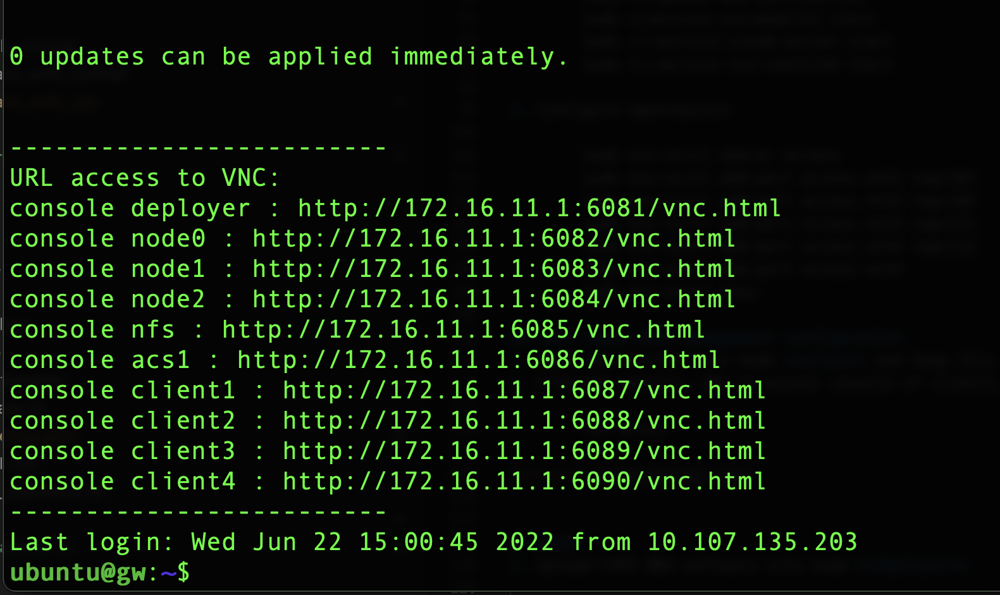

3. on the web browser, set the proxy to manual with socks proxy on ip address 127.0.0.1 and port 1080. This is the sample of configuration on firefox
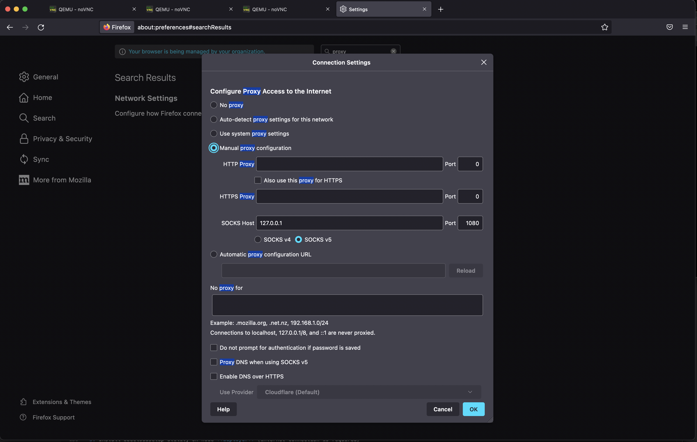

4. To access console of node **client1**, type in the url found on step 2, and click connect to open console of node **client1**. Username and password to access node **client1** is ubuntu/pass01

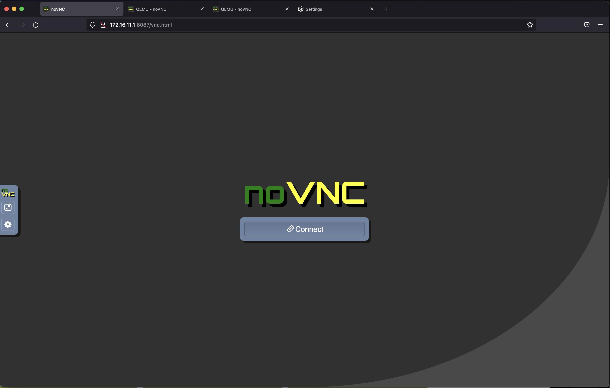
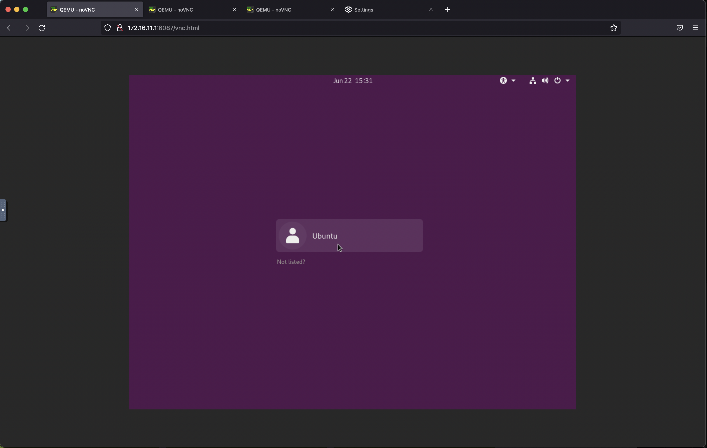

5. Open terminal on node **client1**, and verify that it has received ip address from node **cpe1**

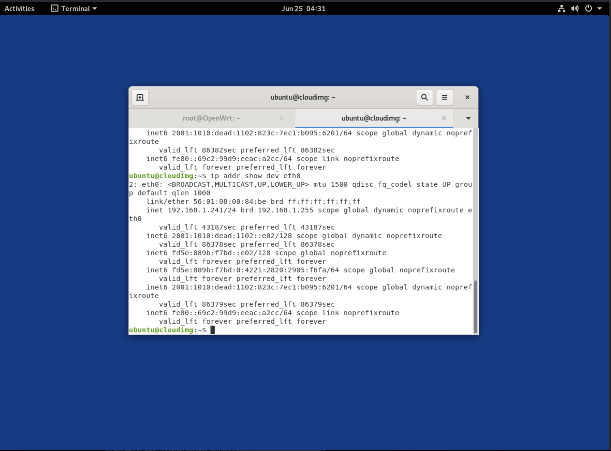

6. open ssh session into node **cpe1**

        ssh root@192.168.1.1

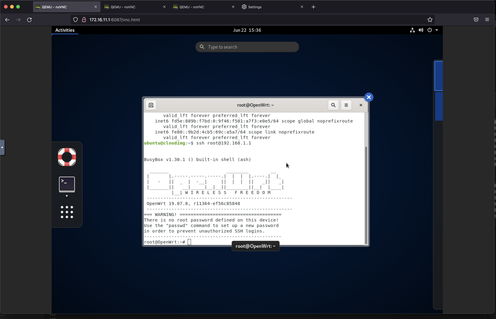

7. Change the configuration on node **cpe1**, by editing file /etc/config/network, put the following configuration for interface wan, and delete configuration for interface wan6

        config interface wan
                option ifname 'eth1'
                option proto 'pppoe'
                option username 'cpe1'
                option password 'pass01'
                option ipv6 'auto'

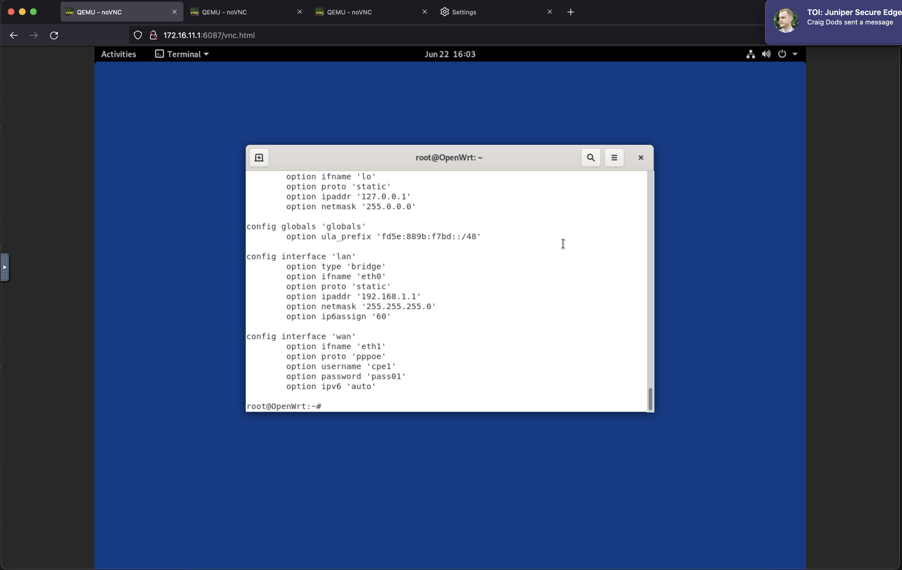
8. on the cli of node **cpe1**, bring up interface wan and verify that interface ppp0 is up

        ifup wan
        ip addr show

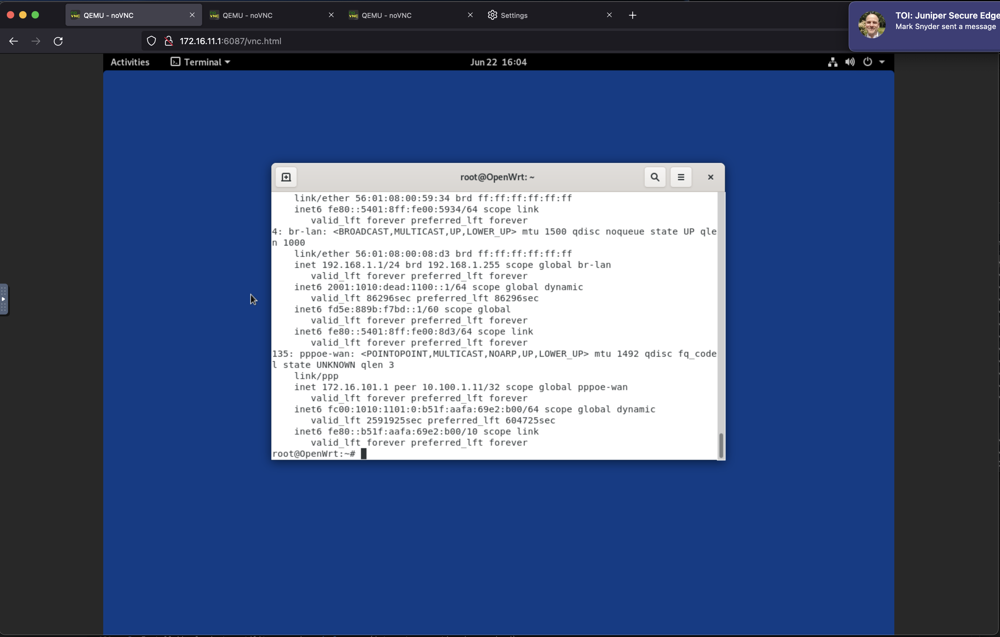

9. open ssh session into node **vbng1**, and verify that client cpe1 is connected
10. on Client1, open another terminal windows, and verify that interface eth0 has been assigned with ipv4 and ipv6 addresses

        ip addr show dev eth0

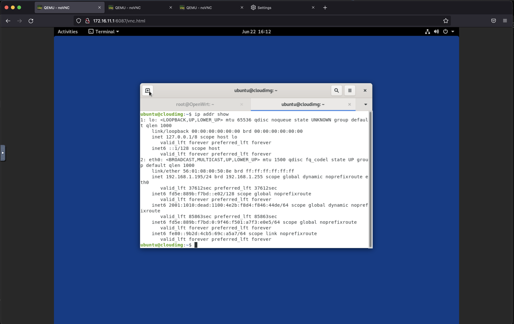

11. Test connectivity to 172.16.255.255 and 2001:1010:dead:beef:ffff:ffff:ffff:1. These ip addresses are on node **gw**

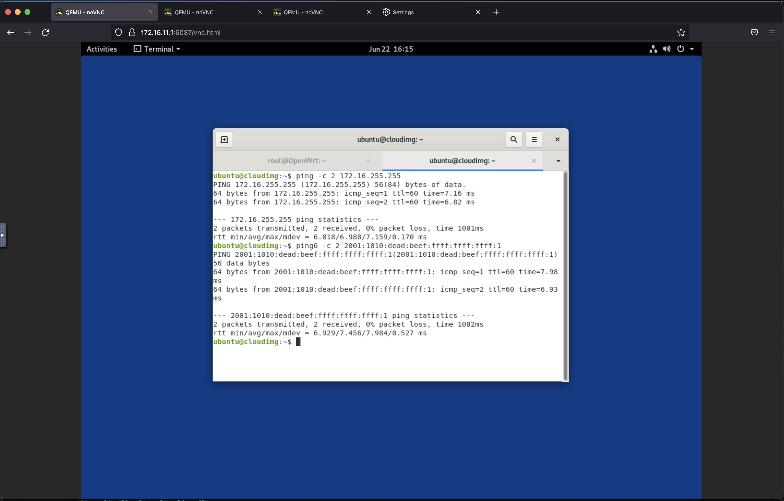

10. for other CPE configuration, please use the following table

Client node | CPE | BNG that terminate the L2Circuit | username/password for CPE
-|-|-|-
client1|cpe1|vbng1|cpe1/pass01
client2|cpe2|vbng1|cpe2/pass01
client3|cpe3|vbng2|cpe3/pass03
client4|cpe4|vbng2|cpe4/pass01

## Installing CUPS BNG software: creating k8s cluster

1. Upload CUPS BNG software into node **deployer** 

        scp jnpr-bng-cups-controller-pkg-<version>.tar.gz deployer:~/

2. open ssh session into node **deployer** and extract the file

        tar xvfz jnpr-bng-cups-controller-pkg-<version>.tar.gz

3. Install bbecloudsetup utility on node **deployer** (internet connection is required)

        sudo apt -y update && sudo apt -y upgrade
        sudo apt install -y ./bbecloudsetup_<version>_all.deb

4. Upload file [setup_k8s_node.sh](setup_k8s_node.sh) to node0, node1, node2

        for i in node{0..2}; do scp ./setup_k8s_node.sh ${i}:~/; done

5. Open ssh sesssion into node0, and run script setup_k8s_node.sh, and repeat this for node1, and node2

        ssh node0
        tmux
        ./setup_k8s_node.sh
        sudo reboot

6. On node **deployer**, copy /home/ubuntu/.ssh into /root/.ssh

        sudo cp /home/ubuntu/.ssh/* /root/.ssh

7. on Node **deployer**, test ssh to node0, node1, and node2 using user root

        ssh root@node0
        ssh root@node1
        ssh node@node2

8. On node **deployer**, run the bbecloudsetup, it will install the k8s cluster and the dbng software

        ssh deployer
        tmux
        bbecloudsetup
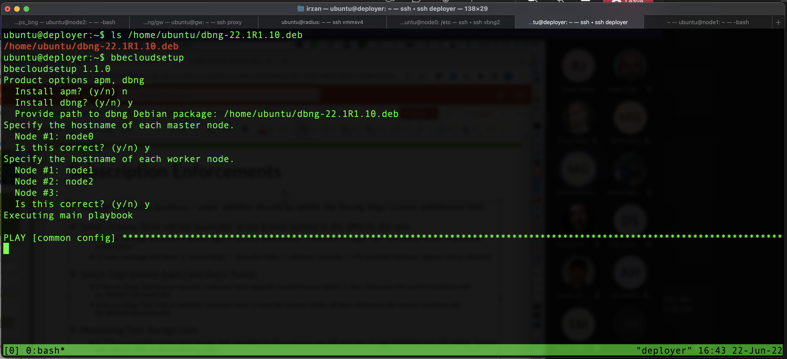        

9. If the installation failed, open ssh session into **node0** , copy the kubebelet configuration and repeat previous step (run bbecloudsetup)

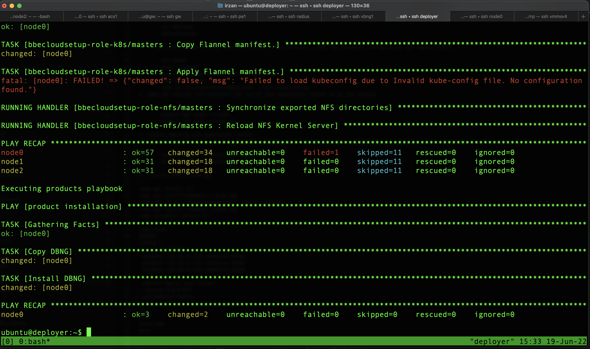

        ssh node0
        mkdir ~/.kube
        sudo cp /etc/kubernetes/admin.conf  ~/.kube/config
        sudo mkdir /root/.kube
        sudo cp /etc/kubernetes/admin.conf  /root/.kube/config

        ssh deployer
        tmux
        bbecloudsetup

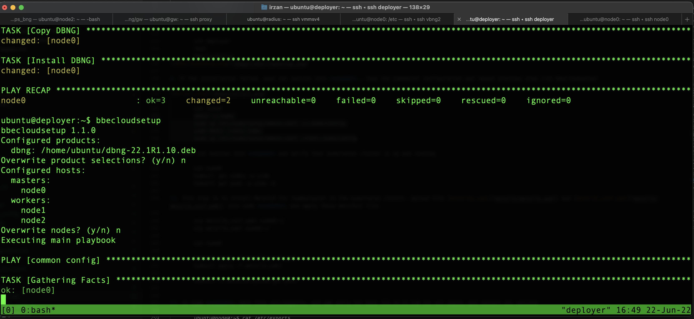 

10. open ssh session into **node0** and verify that kubernetes cluster is up and running

        ssh node0
        kubectl get nodes -o wide
        kubectl get pods -o wide -A

11. this step is to install MetalLB for loadbalancer on the kubernetes cluster. Upload file [metallby.yaml](metallb/metallb.yaml) and [metallb_conf.yaml](metallb/metallb_conf.yaml) into node **node0**, and apply these manifest file. 

        scp metallb_conf.yaml node0:~/
        scp metallb.yaml node0:~/

        ssh node0
        
        kubectl apply -f metallb_conf.yaml
        kubectl apply -f metallb.yaml

        kubectl -n metallb-system get pods

12. on node **node0**, edit file /etc/exports, and add entry for host 172.16.11.110 for all share, and restart nfs service

        ubuntu@node0:~$ cat /etc/exports
        /mnt/sharedfolder/dbng-core  172.16.11.110(no_subtree_check,rw,sync)
        /mnt/sharedfolder/dbng-core  172.16.11.111(no_subtree_check,rw,sync)
        /mnt/sharedfolder/dbng-core  172.16.11.112(no_subtree_check,rw,sync)
        /mnt/sharedfolder/dbng-db  172.16.11.110(no_subtree_check,rw,sync)
        /mnt/sharedfolder/dbng-db  172.16.11.111(no_subtree_check,rw,sync)
        /mnt/sharedfolder/dbng-db  172.16.11.112(no_subtree_check,rw,sync)
        /mnt/sharedfolder/dbng-opcfg  172.16.11.110(no_subtree_check,rw,sync)
        /mnt/sharedfolder/dbng-opcfg  172.16.11.111(no_subtree_check,rw,sync)
        /mnt/sharedfolder/dbng-opcfg  172.16.11.112(no_subtree_check,rw,sync)
        sudo systemctl restart nfs-server
        sudo exportfs

## Install CUPS-BNG
1. open ssh session into node0, setup CUPS-BNG, leave all parameter to default except for external IP, set it to 172.16.1.1

        ssh node0
        sudo dbng setup

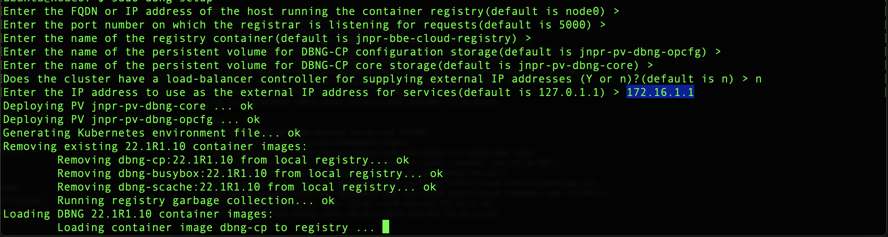

2. start the CUPS-BNG

        dbng start

3. Verify that CUPS-BNG is install and running

        dbng status
        kubectl -n jnpr-dbng get pods -o wide
        kubectl -n jnpr-dbng get services

## Configuring control plane

1. open ssh into node0 and open dbng cli

        ssh node0
        dbng cli

2. Upload configuration for the CUPS Control plane

3. open ssh session into node vbng1, and change the apply-group configuration

        edit
        delete apply-group
        set apply-group [pw_b l2c cups_up bng_common ri_b]
        commit
        run request system reboot
4. On CUPS cli, verify that connection to UP vbng1 is up

        ssh node0
        dbng cli
        show system service subscriber-management control-plane association

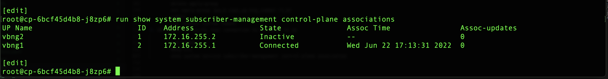

