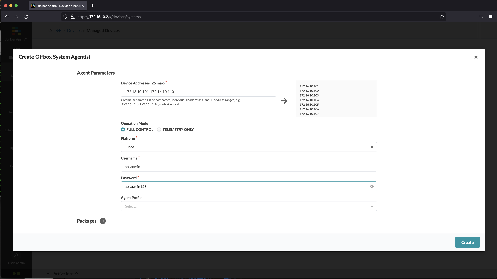

# Lab exercise 1, Device Discovery

## Steps
1. Open Apstra Web Dashboard
2. Select **Device**>**Managed Devices**
3. Click **Create offbox agent(s)**
4. Enter the following parameters
    - Device addresses : 172.16.10.101 - 172.16.10.110
    - Operation mode: full control
    - Platform: Junos
    - username: aosadmin
    - password: aosadmin123

    
    

5. Select all devices, and click **acknowledge selected system**
    
6. Now the devices can be used in the blueprint

[back to Lab Exercise](README.md)

