# Lab exercise 3, Resources
In this lab exercise, the following object will be created:
- ASN Pools
- IP Pools
- IPv6 pools

## Creating ASN Pools
1. Open Apstra Web Dashboard
2. Select **Resources**>**ASN Pools**
3. Click **Create ASN Pool**
4. Enter the following parameters
    - Name: ASN_Spine
    - Ranges: 65001 to 65099

    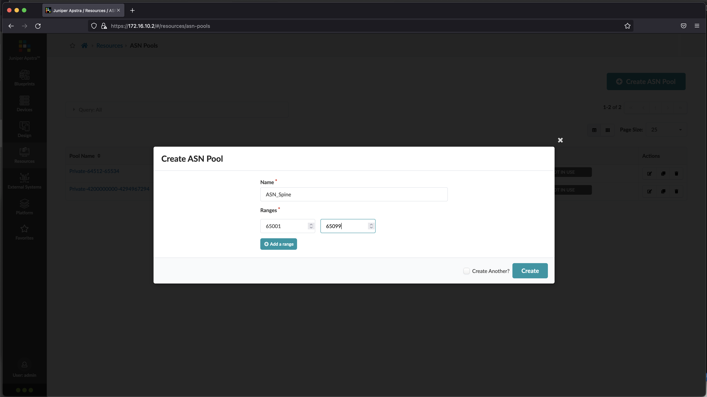
5. Click **Create ASN Pool**
6. Enter the following parameters
    - Name: ASN_Leaf
    - Ranges: 65101 to 65199

    
7. Click **Create ASN Pool**
8. Enter the following parameters
    - Name: ASN_Collapsed
    - Ranges: 65201 to 65299

    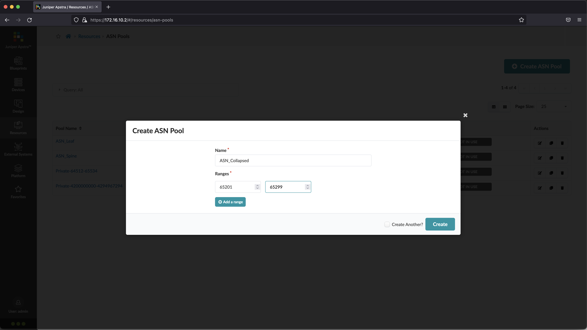
9. Verify that three ASN pools been created
    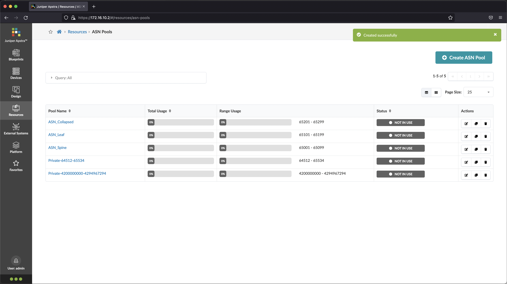

## Creating IP Pools
1. Open Apstra Web Dashboard
2. Select **Resources**>**IP Pools**
3. Click **Create IP Pool**
4. Enter the following parameters
    - Name: Fabric_Link
    - Subnets: 10.100.0.0/24

    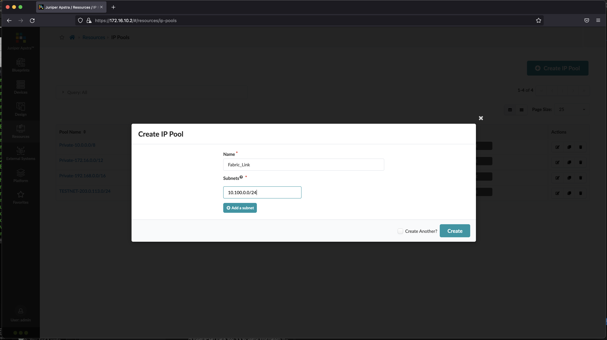

5. Click **Create IP Pool**
6. Enter the following parameters
    - Name: Spine_loopback
    - Subnets: 10.100.1.0/24

    

7. Click **Create IP Pool**
8. Enter the following parameters
    - Name: Leaf_loopback
    - Subnets: 10.100.2.0/24

    

9. Click **Create IP Pool**
10. Enter the following parameters
    - Name: VRF_loopback
    - Subnets: 10.100.3.0/24

    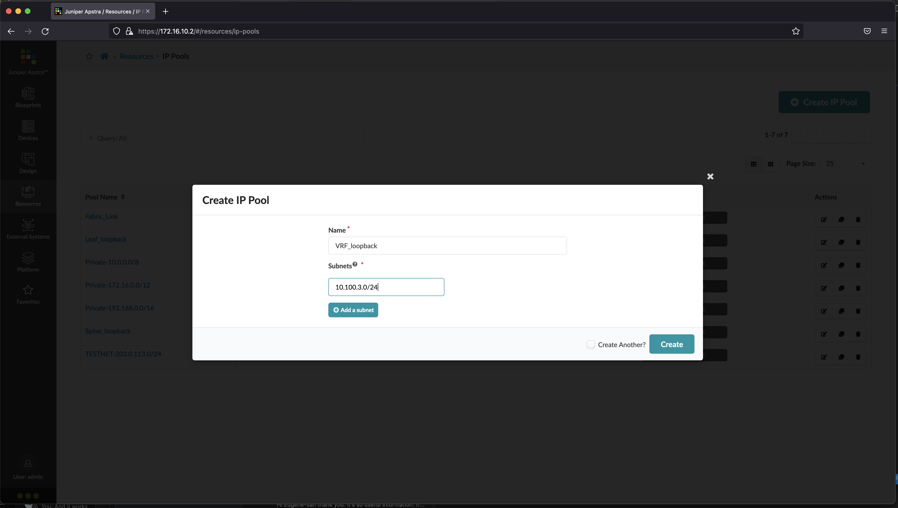

11. Click **Create IP Pool**
12. Enter the following parameters
    - Name: Fabric_link_collapsed
    - Subnets: 10.100.4.0/24
     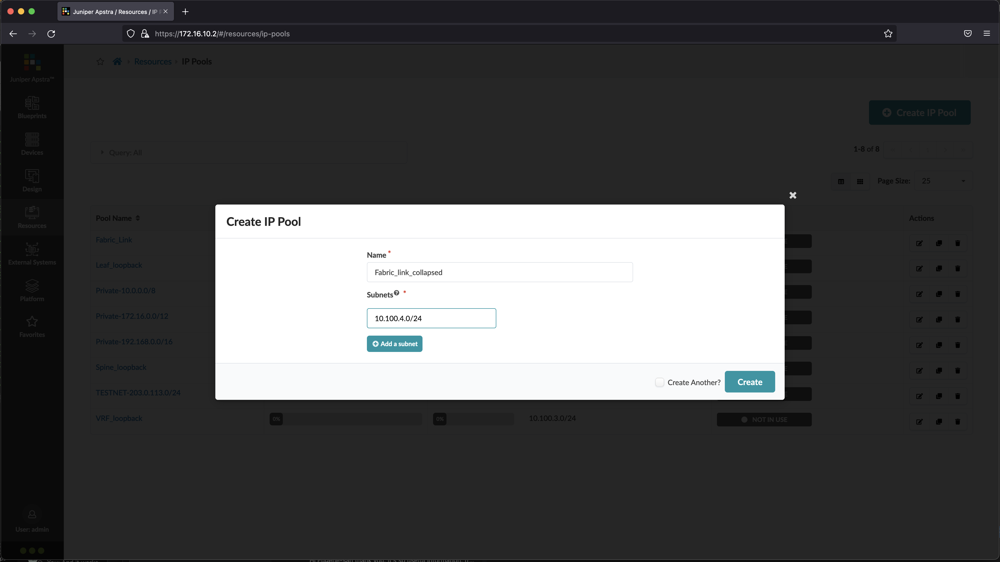

13. Click **Create IP Pool**
14. Enter the following parameters
    - Name: Collapsed_loopback
    - Subnets: 10.100.5.0/24

    

15. Click **Create IP Pool**
16. Enter the following parameters
    - Name: VRF_Collapsed_loopback
    - Subnets: 10.100.6.0/24

    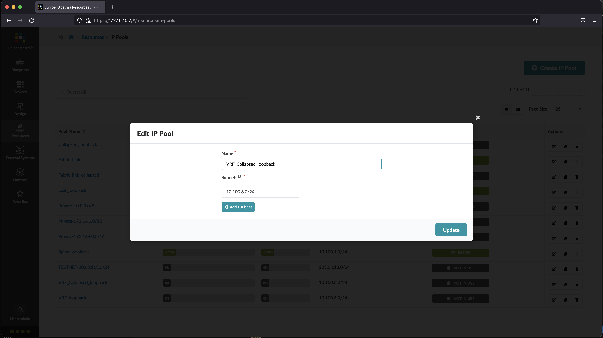
    

16. Verify that seven IP pools been created
    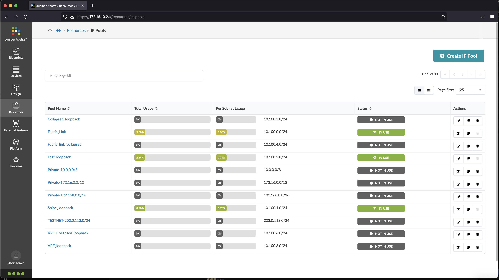

## Creating IPv6 Pools
1. Open Apstra Web Dashboard
2. Select **Resources**>**IPv6 Pools**
3. Click **Create IPv6 Pool**
4. Enter the following parameters
    - Name: Fabric_Link
    - Subnets: fd00:dead:beef:1000::/64

    
5. Click **Create IPv6 Pool**
6. Enter the following parameters
    - Name: Spine_loopback
    - Subnets: fd00:dead:beef:1001::/64

    

7. Click **Create IPv6 Pool**
8. Enter the following parameters
    - Name: Leaf_loopback
    - Subnets: fd00:dead:beef:1002::/64

    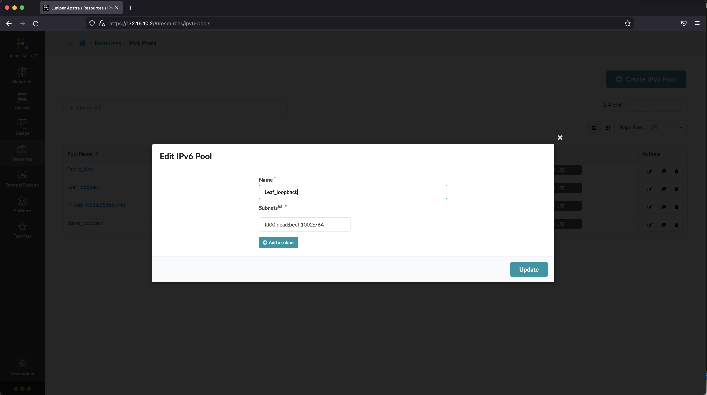

9. Click **Create IPv6 Pool**
10. Enter the following parameters
    - Name: VRF_loopback
    - Subnets: fd00:dead:beef:1003::/64

    

11. Click **Create IPv6 Pool**
12. Enter the following parameters
    - Name: Fabric_link_collapsed
    - Subnets: fd00:dead:beef:1004::/64

    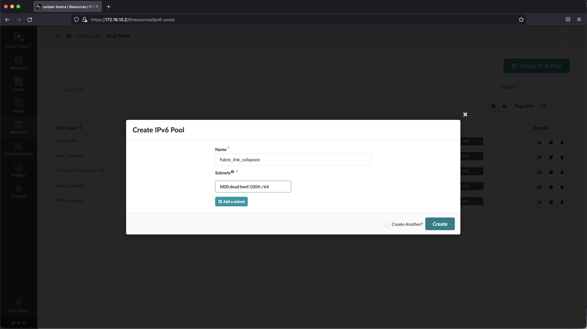

13. Click **Create IPv6 Pool**
14. Enter the following parameters
    - Name: VRF_Collapsed_loopback
    - Subnets: fd00:dead:beef:1005::/64

    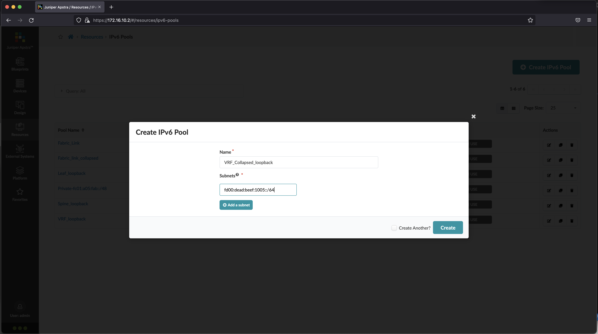

15. Verify that six IPv6 pools been created
    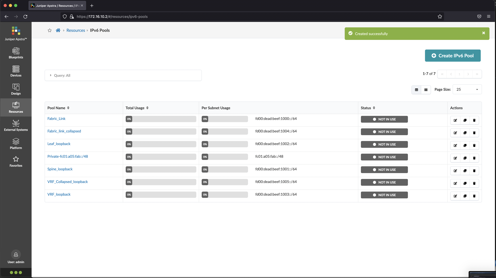

[back to Lab Exercise](README.md)
