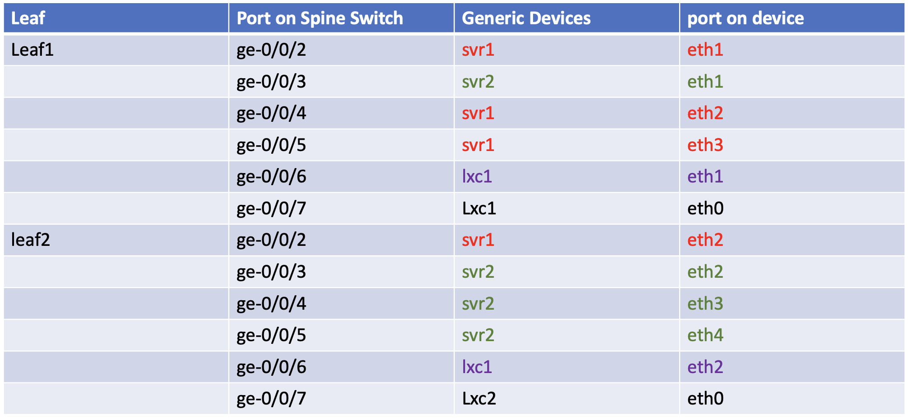
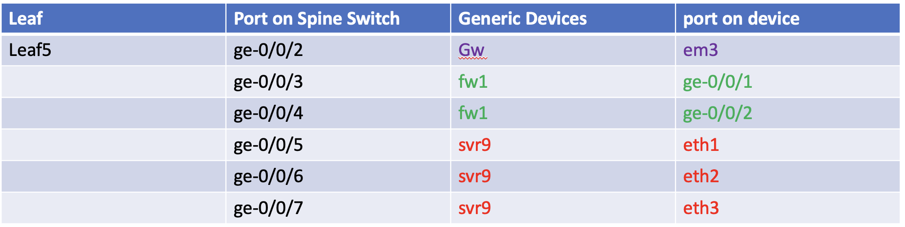
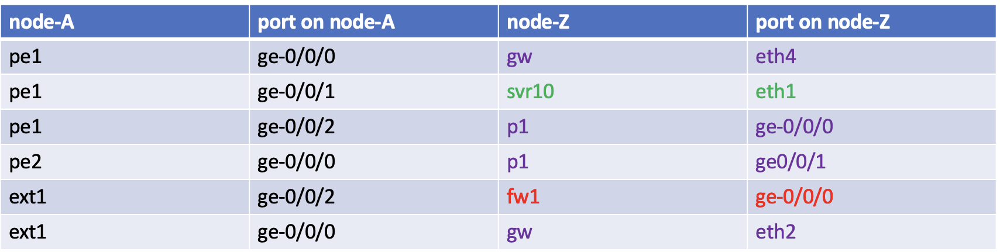
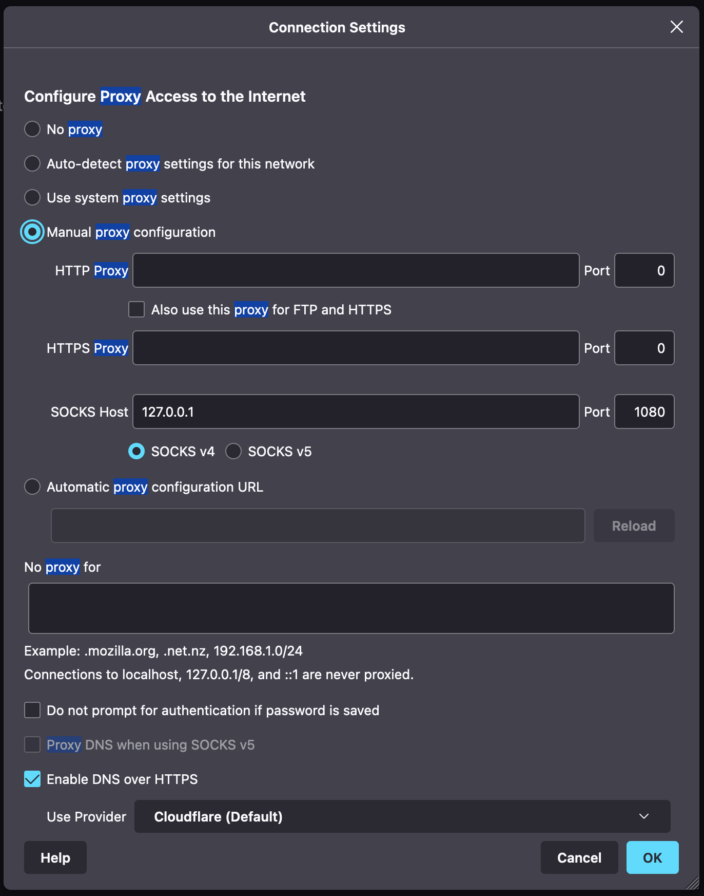
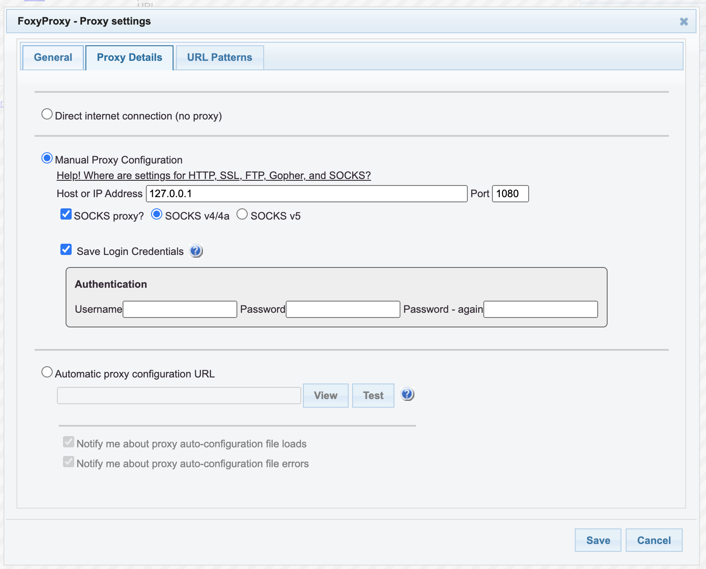
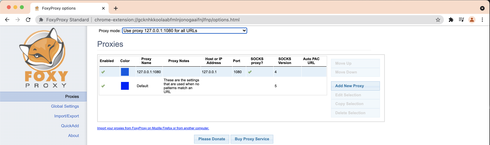

# Running Juniper Apstra 4.1.1 and vEX
this script is to run Juniper Apstra 4.1.1, Apstra ZTP server and vEX (21.2R3-S1.7) on juniper's VMM

## Topology
The logical topology of the testbed is as follows :

### DC1

### DC2

### DC1, Spine-Leaf connection

### DC1, Connection on Leaf

### DC1, External Devices

### DC2, Collapsed DC

## Devices in the lab

- DC1:
    - spine : Spine1, Spine2 (vEX)
    - leaf : leaf1, leaf2, leaf3, leaf4, leaf5 (vEX)
    - BMS : svr1, svr2, svr3, svr4, svr9 (linux())
    - BMS with hypervisor (KVM) : lxc1, lxc2 (linux)
- DC2
    - collapsed switches: sw1, sw2 (vEX)
    - BMS : svr7, svr8 (linux)
    - BMS with hypervisor (KVM) :  svr5, svr6 (linux)
- External
    - ext1 : external router (VMX)
    - fw1 : firewall (vSRX)
    - BMS : svr10 ,  desktop  (linux)
    - GW: Linux router that provide connection to internet
    - vxlangw   
- IP/Wan Backbone :
    - Router : PE1, PE2, P1 (vMX )
- Apstra
    - Juniper Apstra 4.1.1
    - ZTP server 4.1.1

## Credential to access devices
- Ubuntu linux
    - user: ubuntu
    - password: pass01
- Alpine linux
    - user: ubuntu
    - password: pass01
- vMX and vSRX
    - user: admin
    - password: admin
- vEX
    - user: aosadmin
    - password: aosadmin123

# To create the lab topology and initial configuration of VMs
1. Go to directory [dc_with_vEX](./)
2. Edit file [lab.yaml](./lab.yaml). Set the following parameters to choose which vmm server that you are going to use and the login credential:
    - vmmserver 
    - jumpserver
    - user 
    - adpassword
    - ssh_key_name ( please select the ssh key that you want to use, if you don't have it, create one using ssh-keygen and put it under directory **~/.ssh/** on your workstation )
3. If you want to add devices or change the topooogy of the lab, then edit file [lab.yaml](lab.yaml)
4. use [vmm.py](../../vmm.py) script to deploy the topology into the VMM. Run the following command from terminal

        ../../vmm.py upload  <-- to create the topology file and the configuration for the VMs and upload them into vmm server
        ../../vmm.py start   <-- to start the topology in the vmm server

5. Verify that you can access node **gw** using ssh (username: ubuntu,  password: pass01 ). You may have to wait for few minutes for node **gw** to be up and running
6. Run script [vmm.py](../../vmm.py) to send and run initial configuration on node **gw**

        ../../vmm.py set_gw

7. Run script [vmm.py](../../vmm.py) to send and run initial configuration on linux nodes. This script will also reboot the VM. So wait before you test connectivity into the VM

        ../../vmm.py set_host

## Setup Juniper Apstra
1. Open console of VM of juniper Apstra. Open ssh session into node vmm, and run command **vmm serial -t apstra**

        ssh vmm
        vmm serial -t apstra

2. Login into AOS using the default username/password : admin/admin, and change the default password
 

5. Currently node **AFC** is configured with dhcp for Ip address assignment. If you want change the ip address to static, change it to the following:
    - ip address : 172.16.10.2/24
    - gateway : 172.16.10.1
    - dns : 66.129.233.81, 66.129.233.81

6. Restart AOS services
7. Enter the command line of apstra server
8. on the home directory /home/admin, create directory .ssh

        mkdir /home/admin/.ssh

9. from node **gw (ip 172.16.10.1)**, copy directory /home/ubuntu/.ssh into /home/admin/.ssh on node **apstra**. username/password to access 172.16.10.1 is ubuntu/pass01

        on node apstra

        scp ubuntu@172.16.10.1:~/.ssh/* ~/.ssh/

## Accesing Web UI of AOS

1. From your workstation, open ssh session to node **proxy** and keep this session open if you need to access the web dashboard of Paragon Automation platform

        ssh proxy 

2. If you are using Firefox as web browser, set proxy with the following parameters
    - manual proxy configuration
    - SOCKS host : 127.0.0.1
    - PORT : 1080
    - type: SOCKS v4    
    

3. If you are using Chrome as web browser, install extension Foxy Proxy and configure it with the following parameters
    - manual proxy configuration
    - SOCKS host : 127.0.0.1
    - PORT : 1080
    - type: SOCKS v4    
    
    

4. Open http session to https://172.16.10.200, and login using default credential, user/password: admin/admin
  
  

5. Check the status of the devices. Select **Devices**>**Managed devices**. It should be empty, since we haven't discovered any devices yet.

    

6. Check the status of ztp of the  devices. Select **Devices**>**ZTP Status**>**devices**. It should be empty, since we haven't discovered any devices yet.

    

6. Check the status of ztp services. Select **Devices**>**ZTP Status**>**Services**. It should be empty, since we haven't configured ZTP yet.

    

7. Create one user with the following parameter. On the Apstra dashboard, select **Platform**>**User Management**>**Users**

        user: ztp
        global roles:  device_ztp
        password: <set the password>
    
    
    

## Setup of Apstra ZTP server
1. Open console of VM of Apstra ZTP. Open ssh session into node vmm, and run command **vmm serial -t ztp**

        ssh vmm
        vmm serial -t ztp
2. Login into AOS using the default username/password : admin/admin
3. Edit the network configuration of the VM, by editing file /etc/netplan/01-netcfg.yaml
4. Set the network configuration with the following parameter
    - ip address/netmask : 172.16.10.3/24
    - gateway : 172.16.10.1
    - DNS server: 66.129.233.81, 66.129.233.82

5. or make the content of file /etc/netplan/01-netcfg.yaml into the following

        network:
          version: 2
          # renderer: networkd
          ethernets:
            eth0:
              dhcp4: false
              addresses: [ 172.16.10.3/24]
              gateway4: 172.16.10.1
              nameservers:
                addresses: [ 66.129.233.81, 66.129.233.82 ]

6. Verify that from node **ztp**, it can reach other node, such **gw**/172.16.10.1 and **apstra**/172.16.10.2

        ping 172.16.10.1
        ping 172.16.10.2

6. Apply network configuration using the following command

        ip addr show dev eth0
        sudo netplan apply
        ip addr show dev eth0

7. on the home directory /home/admin, create directory .ssh

        mkdir /home/admin/.ssh

9. from node **gw (ip 172.16.10.1)**, copy directory /home/ubuntu/.ssh into /home/admin/.ssh on node **aztp**

        on node ztp

        scp ubuntu@172.16.10.1:~/.ssh/* ~/.ssh/

10. From your workstation, under directory [home directory]/git/vmm-v3-script/Lab/dc_with_vEX/tmp, there is a file ztp_config.txt. Upload this file into node **ztp**
    

11. open ssh session into node **ztp**, enter admin mode, and change directory to /containers_data/dhcp

    ssh ztp
    sudo -s
    cd /containers_data/dhcp

12. add the content of file ~/ztp_config.txt into file /containers_data/dhcp/dhcpd.conf

        cat ~/ztp_config.txt >>  /containers_data/dhcp/dhcpd.conf

13. Edit file  /containers_data/dhcp/dhcpd.conf

        vi  /containers_data/dhcp/dhcpd.conf

14. Edit section **Step 2**, delete stanza **group {}**

    
    
    

15. Move the entry from filel ~/ztp_config.txt to **Step 2**
16. Entries from ztp_config.txt should be located at the end of the file. on the screenshot, these entries are located on line 71 to 117

    
    

17. Move this entries (line 71-117 to section **step 2** (line 9)) using vi command **71,117m9**

    
    

18. Under section **step 3**, edit the dns information, such as domain name, dns-search, and dns servers

    
    

19. Save the file, ESC :wq!

20. On node **ztp**, edit file /containers_data/tftp/ztp.json

        vi /containers_data/tftp/ztp.json

21. for entry **junos-versions** add the current version of Junos being used in the lab.  21.2R3-S1.7

    
    
    

22. Save the file /containers_data/tftp/ztp.jzon
23. Edit file /containers_data/status/app/aos.conf

        vi /containers_data/status/app/aos.conf

24. Change the entries to the following:
    
        ip: 172.16.10.2          ## Ip address of apstra server
        user: ztp                ## ztp user that you have created on apstra server
        password: <password>     ## password that you set for user ztp   

     

25. Save the file.
26. Reboot ztp server

27. On Apstra UI Dashboard, go to **Devices**>**ZTP Status**>**Services**, to verify that ZTP services is up and running

    

28. On Apstra UI Dashboard, go to **Devices**>**ZTP Status**>**Devices**, to verify that network devices (swithes) are discovered through ZT6

    

29. Wait until the **ZTP status** is **completed**

    

## Lab exercise

You can refer to [this document](LabExercise/README.md) for lab exercise

