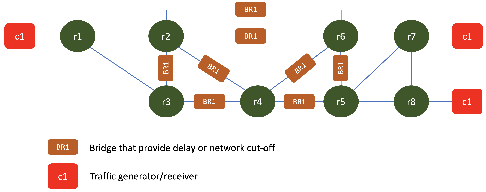
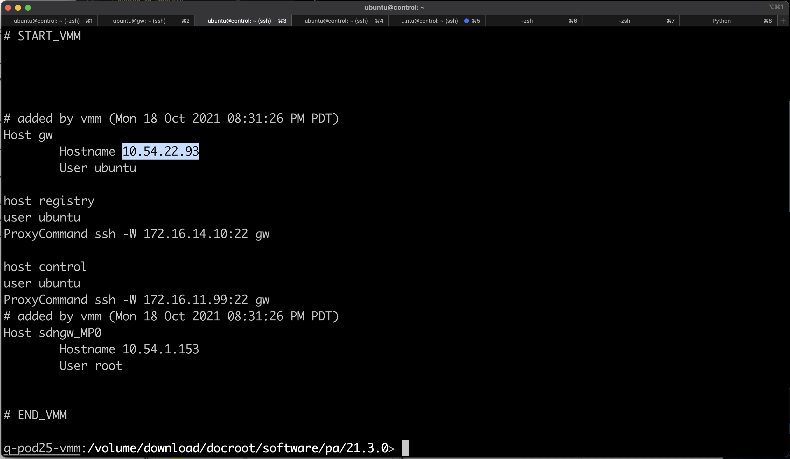
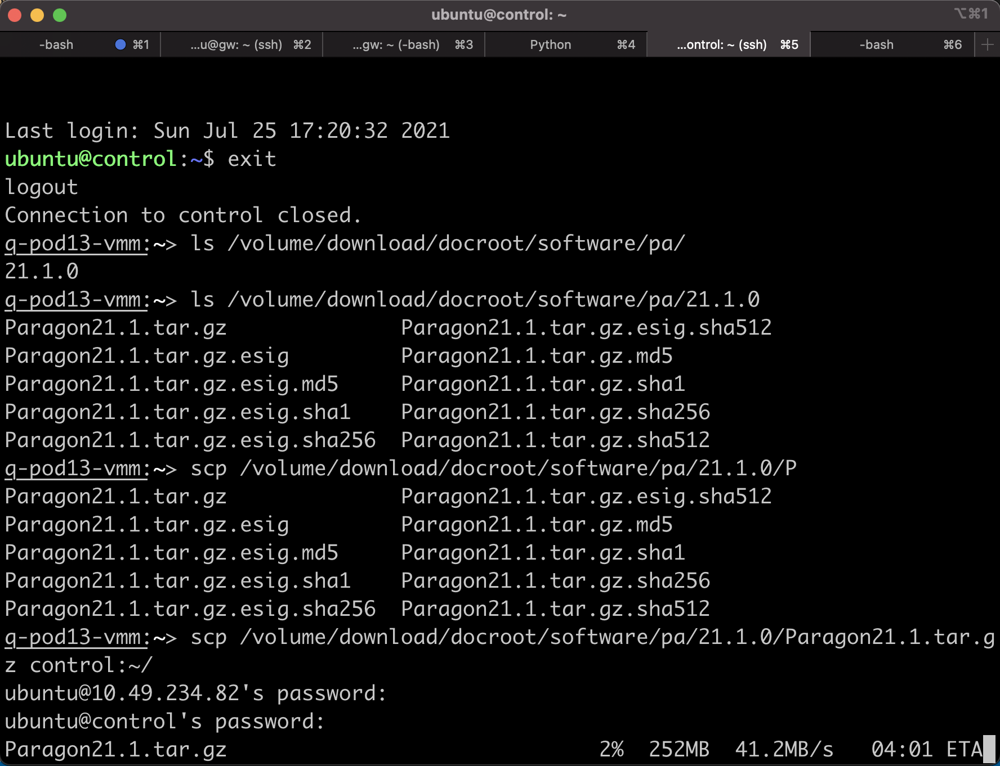
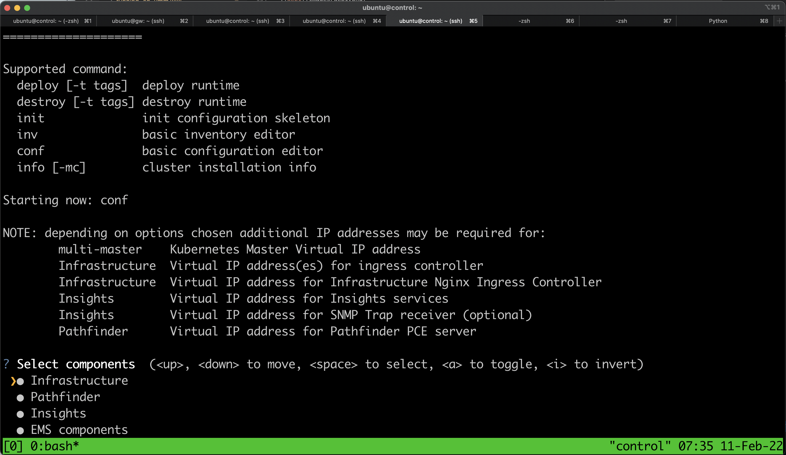
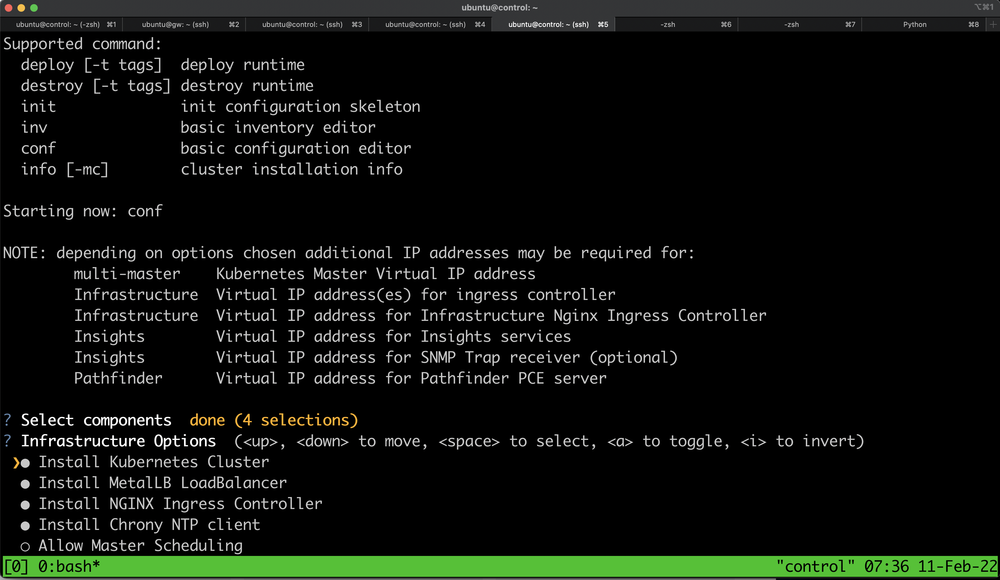
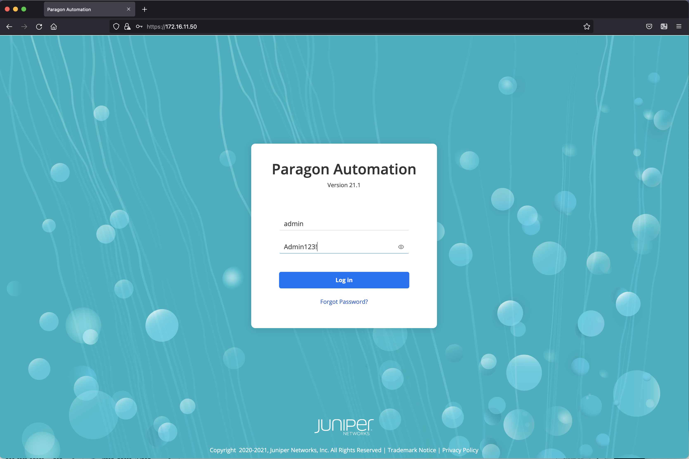
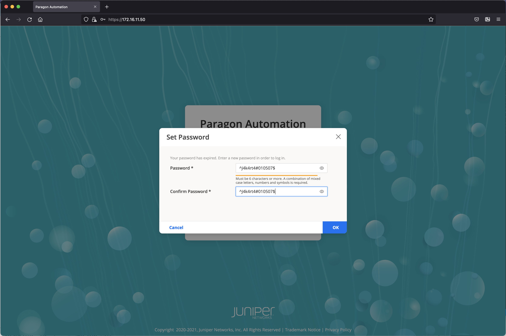
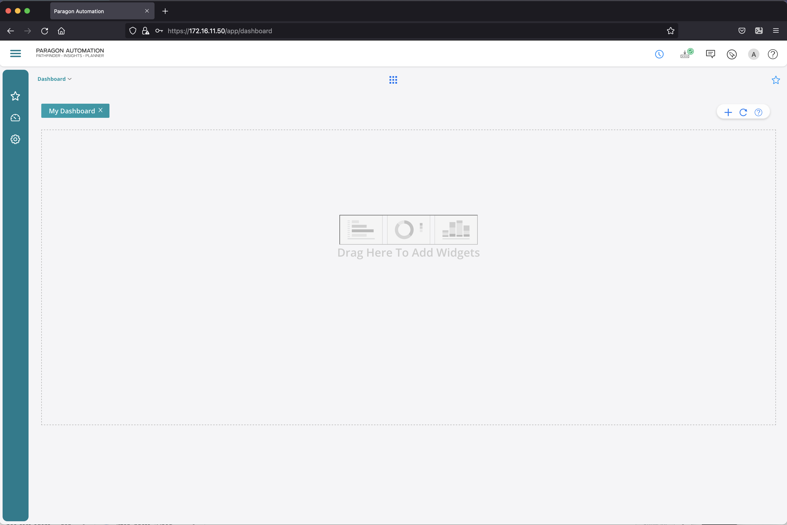
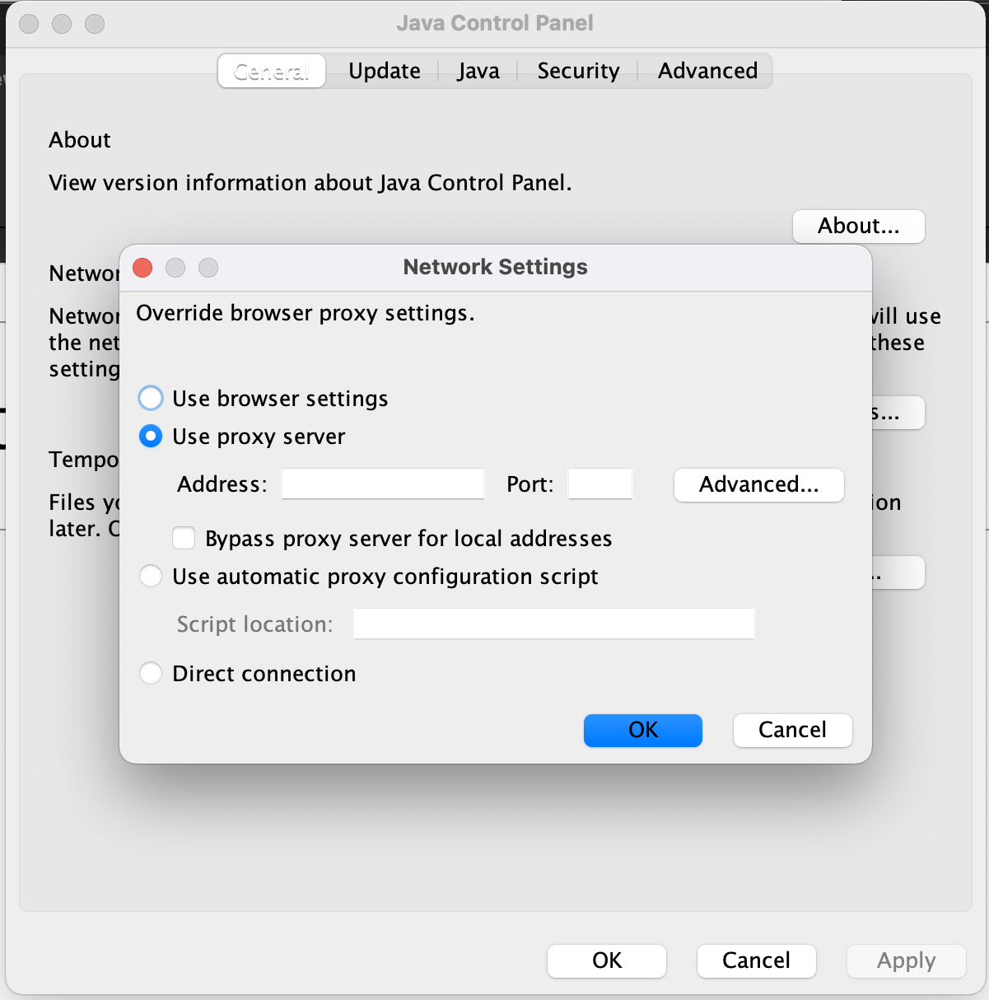
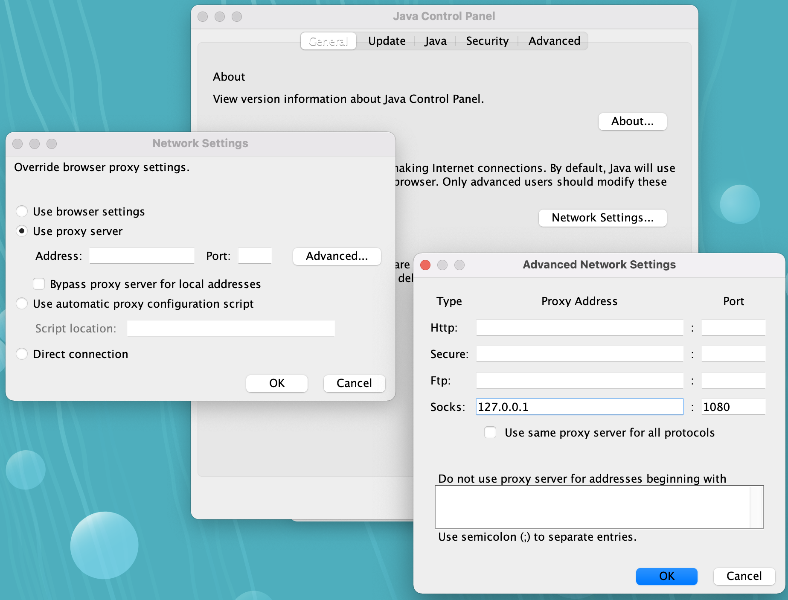

# How setup the lab
## topology

## note
Tested with paragon automation version 21.3

for version 21.3, it requires ceph.

Based on the [documentation](https://www.juniper.net/documentation/us/en/software/paragon-automation21.3/paragon-automation-installation-guide/topics/concept/paragon-install-system-reqs.html#paragon-automation-system-requirements__section_disk-partitions), it requires unformatted partition or disk for ceph storage.

Therefore for paragon automation installation on Juniper VMM, I have created another image (ubuntu-18.04.img or ubuntu-20.04.img), where it has one harddisk with the size of 300G, 250G has been allocated for base OS, and 50G is free unused disk space.

## Devices in the lab

- VMX : r1, r2, r3, r4, r5, r6, r7, and r8
- Linux client: c1 (to provide test traffic) (linux ubuntu)
- Bridge : br1 ( linux bridge between junos node to simulate link failure, delay and packet loss) (linux alpine)

- Kubernetes cluster for Paragon Automation
    - Control node : Linux, to run Paragon automation deployer (linux ubuntu)
    - Node0, Node1, Node2, Node3 : Linux, to run kubernetes cluster (linux ubuntu)

## Credential to access devices
- Ubuntu linux
    - user: ubuntu
    - password: pass01
- Alpine linux
    - user: ubuntu
    - password: pass01
- JUNOS VM
    - user: admin
    - password: pass01

## To create the lab topology and initial configuration of VMs
1. Go to directory [Paragon Lab](./)
2. Edit file [lab.yaml](./lab.yaml). Set the following parameters to choose which vmm server that you are going to use and the login credential:
    - vmmserver 
    - jumpserver
    - user 
    - adpassword
    - ssh_key_name ( please select the ssh key that you want to use, if you don't have it, create one using ssh-keygen and put it under directory **~/.ssh/** on your workstation )
3. If you want to add devices or change the topooogy of the lab, then edit file [lab.yaml](lab.yaml)
4. use [vmm.py](../../vmm.py) script to deploy the topology into the VMM. Run the following command from terminal

        ../../vmm.py upload  <-- to create the topology file and the configuration for the VMs and upload them into vmm server
        ../../vmm.py start   <-- to start the topology in the vmm server

5. Verify that you can access node **gw** using ssh (username: ubuntu,  password: pass01 ). You may have to wait for few minutes for node **gw** to be up and running
6. Run script [vmm.py](../../vmm.py) to send and run initial configuration on node **gw**. This will configure ip address on other interfaces (such ase eth1, eth2, etc) and enable dhcp server on node gw

        ../../vmm.py set_gw

7. Verify that you can access other nodes (linux and junos VM), such **control**, **node**, **node1**, etc. Please use the credential to login.

        ssh control

8. Run script [vmm.py](../../vmm.py) to send and run initial configuration on linux nodes. This script will also reboot the VM. So wait before you test connectivity into the VM

        ../../vmm.py set_host

9. Verify that you can access linux and junos VMs, such **control**, **node**, **node1**, without entering the password. You may have to wait for few minutes for the nodes to be up and running

        ssh control
        ssh pe1
        ssh pe2

10. from your workstation, run script [update1.sh](./install/update1.sh). this script will upload the necessary script into vm control, node0..node4, run it and reboot the VM.

## Uploading Paragon Automation installation file
1. if you are going to install Paragon automation version 21.3 or later, then you need create an empy partition on **node0**, **node1**, **node2**, and  **node3**. You can use this [update1.sh](install/update1.sh) to to automatically create empty partition, update file /etc/security/limits.conf, and /etc/sysctl.conf on those node. The script will reboot node0, node1, node2, and node3. 

2. If you have paragon automation installation file, upload it into node **control** ( Caution: The size of the installation (as for version 21.3) is around 14G, so it may take time to upload the file into node **control** from your workstation

        scp Paragon21.3.tar.gz control:~/
3. Alternatively, you can upload the installation file from Juniper internal server. To upload file from internal server, do the following steps
4. open ssh session into node **vmm**

        ssh vmm
5. on node **vmm**, edit file ~/.ssh/config, for entry **Host gw**, change the user from **root** to **ubuntu** and set the hostname/ip address accordingly

6. add the following entry into file ~/.ssh/config

        host gw
            Hostname 10.54.22.93 # this is the ip address of interface eth0 of node GW, change it accordingly
            user ubuntu

        host control
            user ubuntu
            ProxyCommand ssh -W 172.16.11.99:22 gw

    

7. The paragon automation installation file should be under directory /volume/download/docroot/software/pa/<version>
8. Upload the file into node **control**
    

## Installing Paragon Automation software
Please refer to the [installation guide](https://www.juniper.net/documentation/us/en/software/paragon-automation21.3/paragon-automation-installation-guide/index.html) for Paragon Automation software.

1. From your workstation, upload script [install_docker.sh](install/install_docker.sh)

        scp install/install_docker.sh control:~/

2. Open ssh session into node **control** and run script **install_docker.sh** to install docker (to allow the script to keep running, even when the ssh session is disconnected, run **tmux** command before it). the script will reboot node **control** automatically. 

        ssh control
        tmux
        ./install_docker.sh

3. Once node **control** is back online, open ssh session into it.
4. Extract Paragon installation file 

         tar xpvfz Paragon21.3.tar.gz

5. Run file **run** from paragon installation file  to initialize configuration directory **configdir**

        chmod +x Paragon21.3/run 
        ./Paragon21.3/run -c configdir init

    

6. Run file **run** from paragon installation to fill initial configuration (ip addresses of kubernetes nodes, and password)
        
        ./Paragon21.3/run -c configdir inv

7. Run file **run** from paragon installation to configure paragon parameter
        
        ./Paragon21.3/run -c configdir conf

8. Start Paragon automation installation process. The installation proccess may take up to 60 minutes to finish.

        tmux
        ./Paragon21.3/run -c configdir deploy
    
    

    

9. If installation fail, it just needed to be repeated, just rerun ./Paragon21.3/run -c configdir deploy

## Copying kubernetes config file
1. open ssh session into node0

        ssh node0

2. create directory ~/.kube

        mkdir ~/.kube

3. copy file /etc/kubernetes/admin.config into ~/.kube/config

        sudo cp /etc/kubernetes/admin.conf ./.kube/config
        sudo chown ubuntu:ubuntu .kube/config

## updating npatpw license
there is bug on Paragon 21.3 related to npatpw license on paragon automation. Do the following steps to fix it
1. open ssh session into **node0**

        ssh node0

2. Create file /var/tmp/npatpw. you can use this script [create_npatpw.sh](./install/create_npatpw.sh)

        cat > /var/tmp/npatpw <<EOF
        expire_date=6/7/2024
        usercount=5
        node_limit=250
        card=micro_service
        MAC=FF:EE:DD:CC:BB:AA
        customer=MICRO_SERVICE
        S-NS-PLNR-BSC=gWTqDmZKRnaQRVjARguWYW
        S-NS-PLNR-PRM=TWRhUihDeZLWDYFXDbiaTj
        S-NS-SDN-BSC=ZIVamtZDhiHQRVjARguWYW
        S-NS-SDN-STD=LDYYjugBUpZLSBGTOimXQn
        S-NS-SDN-PRM=gdPdcxcSjjXRYWYPDauiBD
        EOF

3. Copy file /var/tmp/npatpw to 

        sudo mv /etc/kubernetes/po/ns-common/npatpw ~/npatpw.backup
        sudo cp /var/tmp/npatpw  /etc/kubernetes/po/ns-common/npatpw

4. Run the following to update npatpw license on the kubernetes cluster

        kubectl -n northstar delete secret northstar-license
        kubectl -n northstar create secret generic northstar-license --from-file /etc/kubernetes/po/ns-common/npatpw
        kubectl -n northstar get secret northstar-license

## Accessing Web Interface of Paragon automation
1. From your workstation, open ssh session to node **proxy** and keep this session open if you need to access the web dashboard of Paragon Automation platform

        ssh -f -N proxy 

2. If you are using Firefox as web browser, set proxy with the following parameters
    - manual proxy configuration
    - SOCKS host : 127.0.0.1
    - PORT : 1080
    - type: SOCKS v4    
    

3. If you are using Chrome as web browser, install extension Foxy Proxy and configure it with the following parameters
    - manual proxy configuration
    - SOCKS host : 127.0.0.1
    - PORT : 1080
    - type: SOCKS v4    
    
    

4. Open http session to https://172.16.11.50, and login using default credential, user/password: admin/Admin123!, and change the password  
 
 
 

5. By default, no license is installed on Paragon Automation platform, and access to Paragon automation function, Pathfinder, Planner and Insight, are disabled. Get the license from [Agile Internal Licensing Portal](https://internal-license.juniper.net/nckt/)

6. Install the license into Paragon automation platform, then menu to access Paragon automation function, Pathfinder, Insight, and Planner, will be accessible

or you can use [this](install/paragon_automation.txt) 

7. To enable proxy on javaws to access access into Paragon Planner Desktop, from terminal run **javaws -viewer**, and set the proxy

7. Now you can explore the Paragon automation platform. You can start doing [initial setup](Initial_setup.md)

