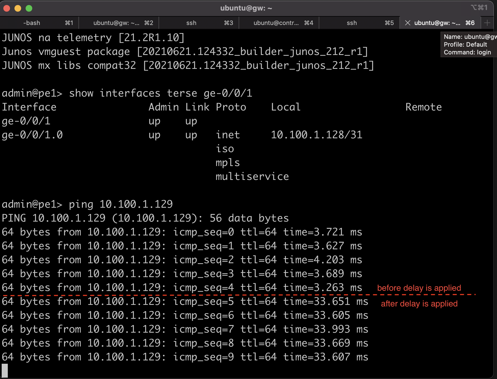
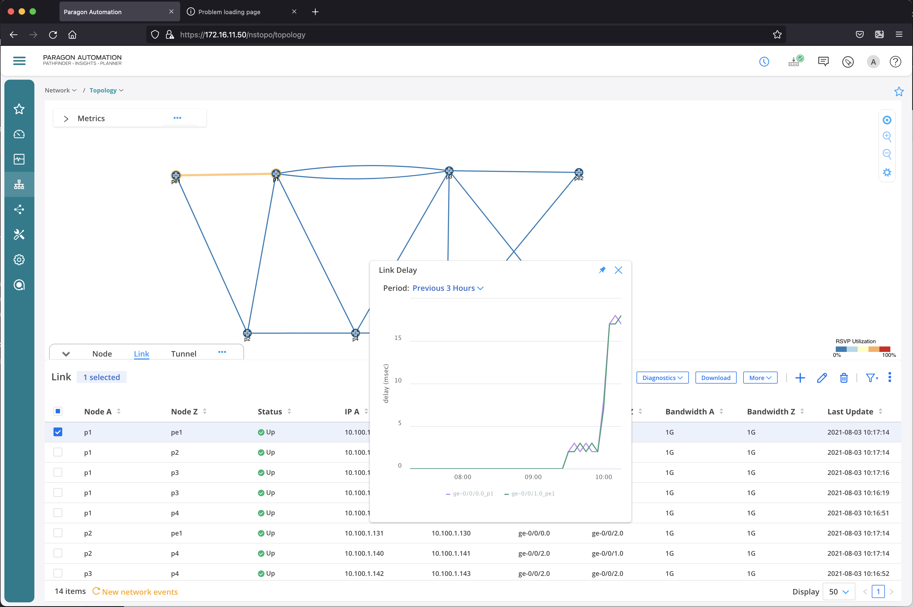

24. To add delay for link between PE1 and P1, open ssh session into node **br1**, and run script **add_delay.sh** to add the delay

    ssh br1
    ./add_delay eth1 30    <--- this is to add 30 ms delay between PE1 and P1

    

19. Wait for few minutes, then verify on  **Network** > **Topology** that delay information has been collected
    

20. To delete delay between PE1 and P1, on node **br1**, run the script **del_delay.sh**

    ssh br1
    ./del_delay eth1