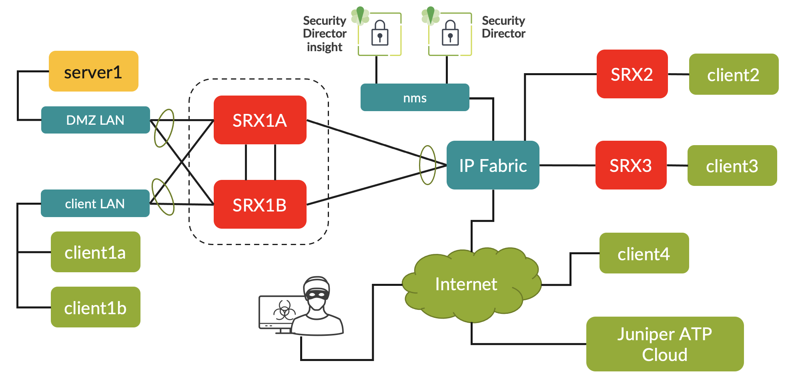
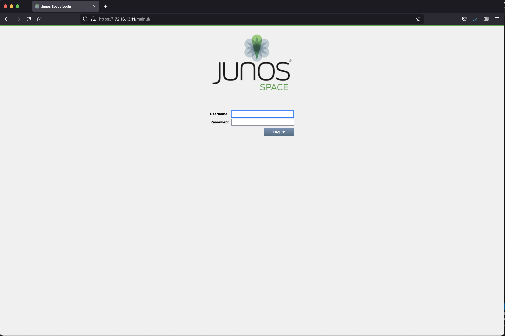
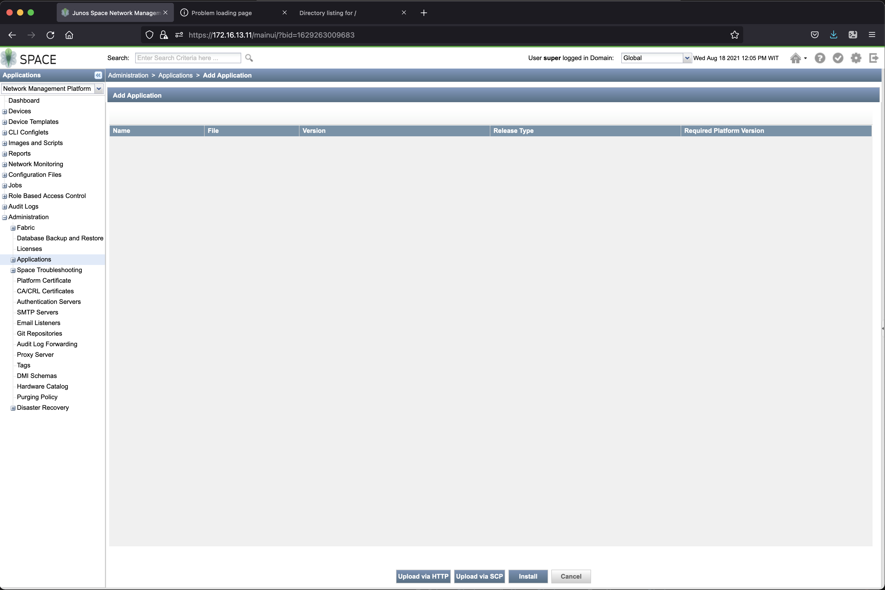
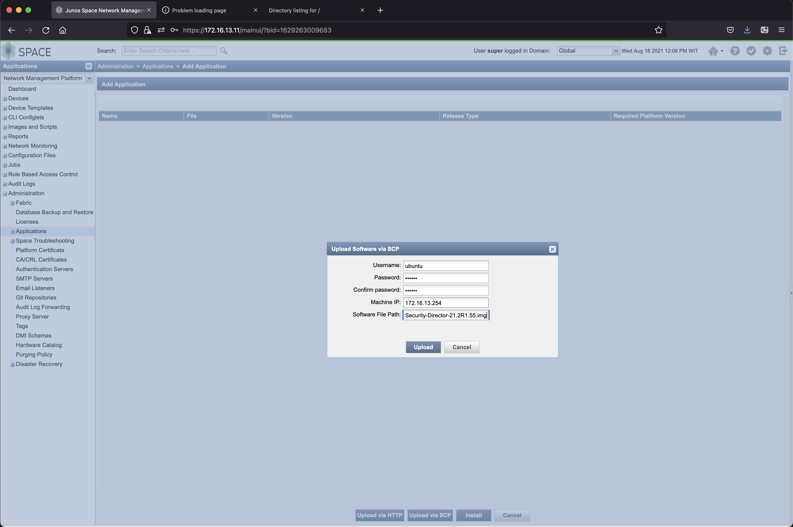
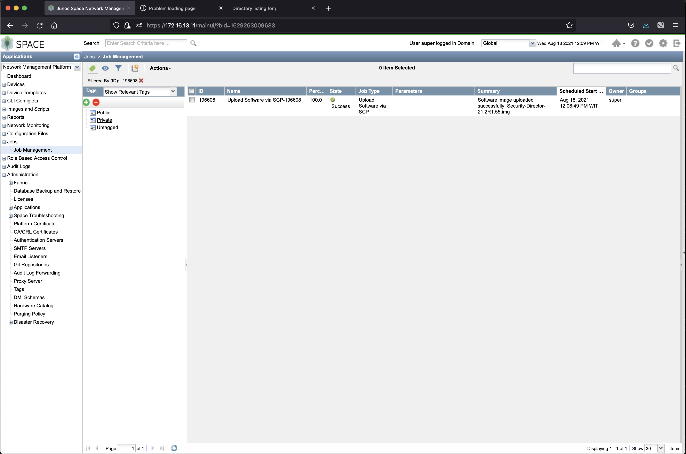
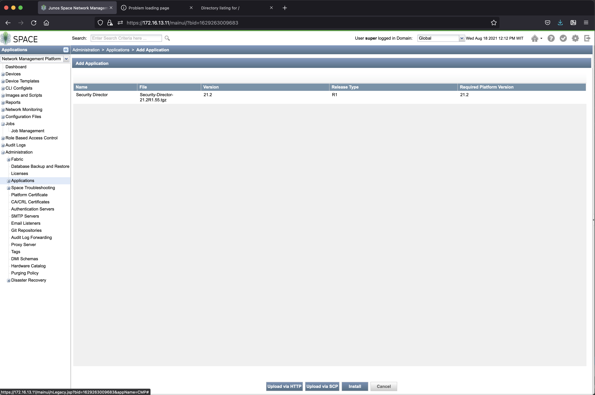
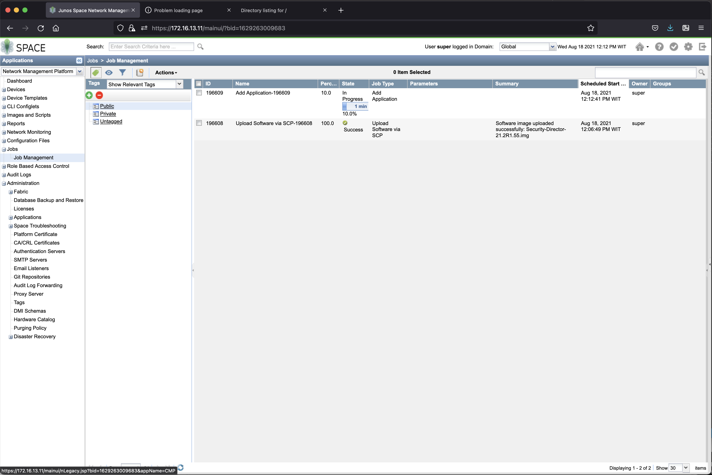
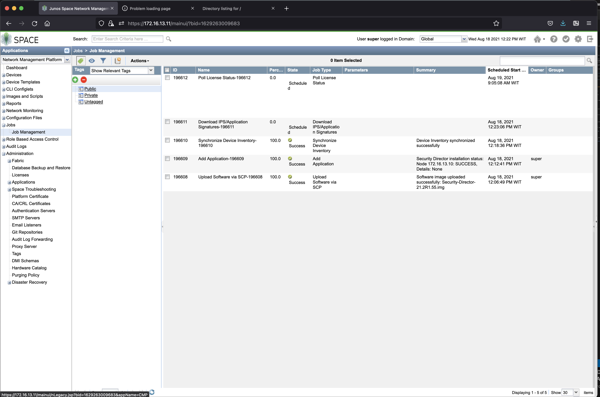

# How setup the lab
## topology
This is the topology of the lab

## Devices in the lab

- SRX : SRX1A and SRX1B (Cluster), SRX2 and SRX3
- Linux client: client1a, client1b, client2, client3, client4 (to provide test traffic) (linux ubuntu)
- Security Director 

## Credential to access devices
- Ubuntu linux
    - user: ubuntu
    - password: pass01
- JUNOS VM
    - user: admin
    - password: pass01

## To create the lab topology and initial configuration of VMs
1. Go to directory [Security Lab](./)
2. Edit file [lab.yaml](./lab.yaml). Set the following parameters to choose which vmm server that you are going to use and the login credential:
    - vmmserver 
    - jumpserver
    - user 
    - adpassword
    - ssh_key_name ( please select the ssh key that you want to use, if you don't have it, create one using ssh-keygen and put it under directory **~/.ssh/** on your workstation )
3. If you want to add devices or change the topooogy of the lab, then edit file [lab.yaml](lab.yaml)
4. use [vmm.py](../../vmm.py) script to deploy the topology into the VMM. Run the following command from terminal

        ../../vmm.py upload  <-- to create the topology file and the configuration for the VMs and upload them into vmm server
        ../../vmm.py start   <-- to start the topology in the vmm server

5. Add the content of file [tmp/ssh_config](tmp/ssh_config) into your ssh config file, ~/.ssh/config. If you have run the previous lab, please remove entries on file ~/.ssh/config from the previous lab (Any entries after "### the following lines are added by vmm-v3-script" must be deleted)

        cat tmp/ssh_config >> ~/.ssh/config

6. Verify that you can access node **gw** using ssh (username: ubuntu,  password: pass01 ). You may have to wait for few minutes for node **gw** to be up and running
7. Run script [vmm.py](../../vmm.py) to send and run initial configuration on node **gw**

        ../../vmm.py set_gw

8. Verify that you can access other nodes (linux and junos VM), such **server1**, **srx1a**, **srx2**, etc. Please use the credential to login.

        ssh server1

9. Run script [vmm.py](../../vmm.py) to send and run initial configuration on linux nodes. This script will also reboot the VM. So wait before you test connectivity into the VM

        ../../vmm.py set_host

10. Verify that you can access linux and junos VMs, such **server1**, **client1a**, **client1b**, without entering the password. You may have to wait for few minutes for the nodes to be up and running

        ssh server1
        ssh client1a
        ssh client2

## configuring SRX for site 1 (cluster firewall)
1. open ssh session into srx1a, set the cluster ID to 1 and as node 0

        ssh srx1a
        set chassis cluster cluster-id 1 node 0 reboot

2. open ssh session into srx1b, set the cluster ID to 1 and as node 1

        ssh srx1b
        set chassis cluster cluster-id 1 node 1 reboot

3. Wait until both SRX are back online
4. Verify that cluster is up and running

        show chassis cluster status
4. add the following into the srx1 cluster

        edit
        del interface fxp0
        set system host-name srx1
        set groups node0 interfaces fxp0 unit 0 family inet address 172.16.10.103/24
        set groups node1 interfaces fxp0 unit 0 family inet address 172.16.10.104/24
        set apply-groups "${node}" 
        set chassis cluster reth-count 8
        set chassis cluster redundancy-group 0 node 0 priority 200
        set chassis cluster redundancy-group 0 node 1 priority 100
        set chassis cluster redundancy-group 1 node 0 priority 100
        set chassis cluster redundancy-group 1 node 1 priority 200
        set chassis cluster redundancy-group 2 node 0 priority 200
        set chassis cluster redundancy-group 2 node 1 priority 100
        set interfaces fab0 fabric-options member-interfaces ge-0/0/0
        set interfaces fab1 fabric-options member-interfaces ge-7/0/0
        set interfaces ge-0/0/1 gigether-options redundant-parent reth0
        set interfaces ge-7/0/1 gigether-options redundant-parent reth0
        set interfaces reth0 redundant-ether-options redundancy-group 1
        set interfaces reth0 unit 0 family inet address 172.16.11.1/31
        set interfaces ge-0/0/2 gigether-options redundant-parent reth1
        set interfaces ge-7/0/2 gigether-options redundant-parent reth1
        set interfaces reth1 redundant-ether-options redundancy-group 1
        set interfaces reth1 unit 0 family inet address 172.16.13.1/24
        set interfaces ge-0/0/3 gigether-options redundant-parent reth2
        set interfaces ge-7/0/3 gigether-options redundant-parent reth2
        set interfaces reth2 redundant-ether-options redundancy-group 2
        set interfaces reth2 unit 0 family inet address 172.16.14.1/24
        commit

## Upload configuration into junos VM
1. the initial configuration for all junos devices can be found [here](config/junos/now)
2. You need to upload them into each junos VM in the lab, or you can use [this](config/upload_config.yaml) ansible playbook

        cd config/junos
        ansible-playbook upload_config.yaml
## Upload network configuration into linux VM
1. The network configuration of linux VMs can be found [here](config/host)
2. You need to upload them into directory /etc/netplan, or you can use [this script](config/host/upload_config_network.sh) to upload them into linux VMs

        cd config/host
        ./upload_config_network.sh

## BGP configuration for node **gw**
1. [This is](config/host/bgpd.conf) the bgp configuration for node **gw**, you need to upload this into directory /etc/frr/ and restart the bgp services

        scp config/host/bgpd.conf gw:~/
        ssh gw "sudo cp bgpd.conf /etc/frr ; sudo chown frr:frr /etc/frr/bgpd.conf; sudo systemctl restart frr"

## Setting IP Address of junospace appliance
1. Get the serial of junos space appliance

        irzan-mbp:seclab irzan$ ../../vmm.py get_serial jspace
        -----
        serial port of VM
        serial of jspace : sv8-pod-j22.englab.juniper.net 15257
        script run for 11 seconds

2. Open ssh session to the VMM server, and open telnet session to the serial port of junospace

        ssh vmm
        telnet sv8-pod-j22.englab.juniper.net 15257

3. Login into junos space appliance using user/password : admin/abc123, and change the password
4. Continue with the installation, and set the ip address of eth0, use 

        - ip address: 172.16.2.10
        - subnet mask: 255.255.255.0
        - gateway 172.16.2.1
        - DNS : 172.16.2.1
        - Configure a separate interface for device management? [y/N] n
        - Web UI IP address: 172.16.2.11
        - NTP : 172.16.2.1
        - NAT : disabled

5. Wait until the initialization process is finish

## Setting IP Address of Security Director Insight

1. Get the VGA port  of Security Director Insight appliance

        irzan-mbp:seclab irzan$ ../../vmm.py get_vga sdi
        get_vga , vm  sdi
        -----
        VGA port of sdi -> sv8-pod-j17.englab.juniper.net:5903
        script run for 7 seconds
        irzan-mbp:seclab irzan$

2. Open ssh session to node **gw** with port forwarding from 5900 to VGA Port of node **sdi**

        ssh -L 5900:sv8-pod-j17.englab.juniper.net:5903 gw

3. On your workstation, open VNC session to 127.0.0.1 port 5900
4. Login into Security director Insight with user/password: admin/abc123
5. Change the default password
6. Configure the network interface with the following parameter

        ip address: 172.16.2.12
        netmask : 255.255.255.0
        gateway : 172.16.2.1
        NTP : 172.16.2.1
        Log Collector : enabled

5. Wait until the initialization process is finish

## Accessing Web Interface of Junos Space/Security Director
1. From your workstation, open ssh session to node **proxy** and keep this session open if you need to access the web dashboard of Paragon Automation platform

        ssh proxy 

2. If you are using Firefox as web browser, set proxy with the following parameters
    - manual proxy configuration
    - SOCKS host : 127.0.0.1
    - PORT : 1080
    - type: SOCKS v4    
    

3. If you are using Chrome as web browser, install extension Foxy Proxy and configure it with the following parameters
    - manual proxy configuration
    - SOCKS host : 127.0.0.1
    - PORT : 1080
    - type: SOCKS v4    
    
    

4. Open http session to https://172.16.2.11 and login using default credential, user/password: super/juniper123, and change the password  
 

## Upload DMI schema into Junos Space
1. Download the DMI schema from https://dmi.juniper.net/dsg/. Choose the correct junos version that match with the junos device that you use in the lab
2. On the junospace dashboad, click Administration > DMI Schema , and click update schema
3. Select local (Tgz), and upload the tgz file that you've downloaded on step 1.
4. install the schema
5. Click on Jobs > Job Management to check the installation status of DMI schema

## Installing Security Director into junos space
1. The next few steps is to install security director into junos space.
2. Open SSH session into node **vmm**

        ssh vmm

3. The security director installation file should be under directory /volume/download/docroot/software/sd/<version> (in this example, the SD version is 21.2R1). Upload the file into node **gw** using scp

        cd /volume/download/docroot/software/sd/21.2R1
        scp Security-Director-21.2R1.55.img ubuntu@gw:~/

4. Open ssh session into node **gw**, and verify that the security director image is uploaded. 

5. Open junospace web dashboard, click Administration > Application, and click add application, and select upload via scp. Use the following information for the scp session 
- username : ubuntu
- password: pass01
- machine IP : 172.16.2.1
- file name : <filename of the security directory image, such as Security-Director-21.2R1.55.img> 

6. Click Jobs > Jobs Management, to verify that the software has been uploaded.

7. on junos space dashboard, click Administration > Application > Add, then you will see that Security director is ready to be installed.

8. Select the security directory software, and click install to start the installation process

9. Click Jobs > Jobs Management, to verify that the installation process has started and to check if it is finish. (it may takes time to finish)

## Adding logging director into security director
https://www.juniper.net/documentation/en_US/junos-space21.2/sd-insights/topics/reference/general/sd-insights-log-collector-adding.html

1. On Security director dashboard, click Administration > Logging Management > Logging Nodes, and click Create
2. Select Security Director Logging Node, and click next
3. Use the following parameter :
        name: SDI
        ip address: 172.16.2.12
        username : admin
        password: <password that you define on the previous step>

4. On Junos space dashboard , https://<js_ip>/mainui, select Administration > Application, right click Log Director and select Manage Application settings, and enable the followings:
- Enable SDI Log Collector Query format
- Integrated Log collector on space server 

Now you can play around with the lab

