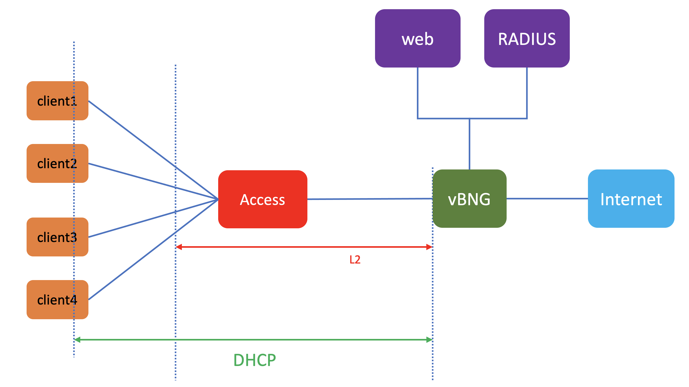

# How setup the vMX as WAG
## topology
This is the topology of the lab

## Devices in the lab

- VMX : access (access switch (for vlan)), vBNG as WAG 
- Radius Server
- webserver 

## Credential to access devices
- Ubuntu linux
    - user: ubuntu
    - password: pass01
- JUNOS VM
    - user: admin
    - password: pass01

## To create the lab topology and initial configuration of VMs
1. Go to directory [vbng_dhcp](./)
2. Edit file [lab.yaml](./lab.yaml). Set the following parameters to choose which vmm server that you are going to use and the login credential:
    - vmmserver 
    - jumpserver
    - user 
    - adpassword
    - ssh_key_name ( please select the ssh key that you want to use, if you don't have it, create one using ssh-keygen and put it under directory **~/.ssh/** on your workstation )
3. If you want to add devices or change the topooogy of the lab, then edit file [lab.yaml](lab.yaml)
4. use [vmm.py](../../vmm.py) script to deploy the topology into the VMM. Run the following command from terminal

        ../../vmm.py upload  <-- to create the topology file and the configuration for the VMs and upload them into vmm server
        ../../vmm.py start   <-- to start the topology in the vmm server

5. Verify that you can access node **gw** using ssh (username: ubuntu,  password: pass01 ). You may have to wait for few minutes for node **gw** to be up and running
6. Run script [vmm.py](../../vmm.py) to send and run initial configuration on node **gw**

        ../../vmm.py set_gw

7. Verify that you can access other nodes (linux and junos VM), such **control**, **node**, **node1**, etc. Please use the credential to login.

        ssh control

8. Run script [vmm.py](../../vmm.py) to send and run initial configuration on linux nodes. This script will also reboot the VM. So wait before you test connectivity into the VM

        ../../vmm.py set_host

9. Verify that you can access linux and junos VMs, such **control**, **node**, **node1**, without entering the password. You may have to wait for few minutes for the nodes to be up and running

        ssh webserver
        ssh radius

## Uploading Initial configuration into devices
1. open ssh session into node **radius**, and install freeradius server (if necessary, reboot node **radius**)

        sudo apt -y update 
        sudo apt -y upgrade
        sudo apt -y freeradius
        sudo reboot

2. Upload radius configuration from [this directory](./freeradius/)

        cd freeradius/
        scp authorize radius:~/
        scp clients.conf radius:~/
         
3. On node **radius**, copy radius configuration into its respective directory

        sudo cp authorize /etc/freeradius/3.0/mods-config/files/
        sudo cp clients.conf /etc/freeradius/3.0/

4. Restart freeradius services on node **radius**

        sudo systemctl enable freeradius
        sudo systemctl restart freeradius
        sudo systemctl status freeradius

5. Upload configuration into junos node **vbng** and **access**. The configuration are available [here](./junos_config). You can also use [ansible playbook](junos_config/upload_config.yaml) to upload the configuration

        cd node_configuration/junos_config
        ansible-playbook upload_config.yaml

6. Open ssh session into node **gw**, open access into FRR routing console
        
        sudo vtysh 

7. add the following configuratino FRR to enable bgp

        enable 
        config t
        router bgp 65100
        neighbor 172.16.12.2 remote-as 65200
        neighbor fc00:dead:beef:1::12:2 remote-as 65200
        !
        address-family ipv4 unicast
        network 0.0.0.0/0
        exit-address-family
        !
        address-family ipv6 unicast
        network ::/0
        neighbor fc00:dead:beef:1::12:2 activate
        exit-address-family
        !
        exit
        exit
        write mem

8. on node **vbng** or **gw**, verify that BGP peers are up

9. Now you can explore the WAG lab.
