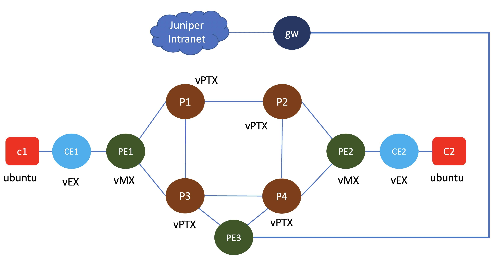

# Running vPTX, vMX and vEX

This script is to run vPTX, vMX and vEX

## Topology
The logical topology of the testbed is as follows :

## Notes on vPTX
information on vPTX can be found [here](https://junipernetworks.sharepoint.com/sites/plm/SitePages/Running-Virtual-PTX.aspx)

port et-0/0/0 on vPTX is used for management interface (re0:mgmt-0).

network ports start from et-0/0/1 

## Devices in the lab

- vPTX : P1, P2, P3, P4
- vMX : PE1, PE2
- vEX : CE1, CE2
- ubuntu: C1, C2

## Credential to access devices
- Ubuntu linux
    - user: ubuntu
    - password: pass01

- JUNOS VM
    - user: admin
    - password: pass01

# To create the lab topology and initial configuration of VMs
1. Go to directory [virtual_evo_mx_ex](./)
2. Edit file [lab.yaml](./lab.yaml). Set the following parameters to choose which vmm server that you are going to use and the login credential:
    - vmmserver 
    - jumpserver
    - user 
    - adpassword
    - ssh_key_name ( please select the ssh key that you want to use, if you don't have it, create one using ssh-keygen and put it under directory **~/.ssh/** on your workstation )
3. If you want to add devices or change the topooogy of the lab, then edit file [lab.yaml](lab.yaml)
4. use [vmm.py](../../vmm.py) script to deploy the topology into the VMM. Run the following command from terminal

        ../../vmm.py upload  <-- to create the topology file and the configuration for the VMs and upload them into vmm server
        ../../vmm.py start   <-- to start the topology in the vmm server

5. Add the content of file [tmp/ssh_config](tmp/ssh_config) into your ssh config file, ~/.ssh/config. If you have run the previous lab, please remove entries on file ~/.ssh/config from the previous lab (Any entries after "### the following lines are added by vmm-v3-script" must be deleted)

        grep -n '###' ~/.ssh/config <--- this command to get the beginning of the string in file ~/.ssh/config was added on the previous lab
        sed -i -e '220,$d' ~/.ssh/config    <--- this is to delete line 220 till the end. line 220 was available from previous command
        cat tmp/ssh_config >> ~/.ssh/config

6. Verify that you can access node **gw** using ssh (username: ubuntu,  password: pass01 ). You may have to wait for few minutes for node **gw** to be up and running
7. Run script [vmm.py](../../vmm.py) to send and run initial configuration on node **gw**

        ../../vmm.py set_gw

8. Verify that you can access other nodes (linux and junos VM), such **gw**, **pe1**, etc. Please use the credential to login.

        ssh c1
        ssh c2
        ssh pe1

9. Run script [vmm.py](../../vmm.py) to send and run initial configuration on linux nodes. This script will also reboot the VM. So wait before you test connectivity into the VM

        ../../vmm.py set_host
10. Run script [vmm.py](../../vmm.py) to send and run initial configuration on vEX and vPTX nodes. This will set initial configurationi through serial console, and upload configuration for nodes vEX and vPTX

        ../../vmm.py init_junos

11. Run script[load_config.sh](load_config.sh) to load configuration on vEX and vPTX nodes

        ./load_config.sh

        
12. Verify that you can access linux and junos VMs, such  **gw**, **p1**, **pe1**, etc., without entering the password. You may have to wait for few minutes for the nodes to be up and running

        ssh gw
        ssh desktop
        ssh spine1
        ...

13. Now you can test different scenario on the lab

## Lab exercise

You can refer to [this document](config/README.md) for lab exercise

